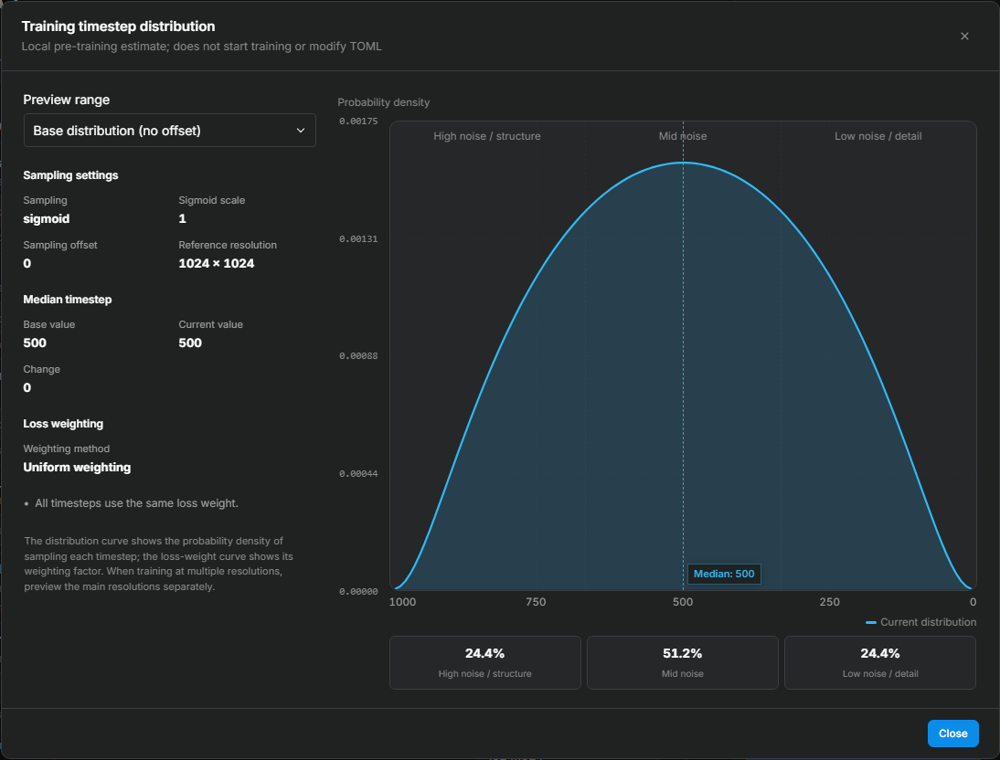

<div align="center">

# lora-scripts-anima

_✨ Multi-backend LoRA Training Tool: Anima, SDXL, and Krea 2 ✨_

A local GUI for LoRA training. Anima / SDXL use [kohya-ss/sd-scripts](https://github.com/kohya-ss/sd-scripts) (in `vendor/sd-scripts/`), while **Krea 2 LoRA** uses [kohya-ss/musubi-tuner](https://github.com/kohya-ss/musubi-tuner).

</div>

<p align="center">
  <a href="https://github.com/amenorira/lora-scripts-anima" style="margin: 2px;">
    
  </a>
  <a href="https://raw.githubusercontent.com/amenorira/lora-scripts-anima/main/LICENSE" style="margin: 2px;">
    
  </a>
</p>

<p align="center">
  <a href="https://github.com/amenorira/lora-scripts-anima/blob/main/README.md">中文</a>
</p>

A training-core registry keeps each backend isolated; **LyCORIS** is an optional adapter backend mounted through `lycoris.kohya`.

### Supported Model Types

| Training Type | Base Model |
|---------------|------------|
| LoRA | SDXL |
| **LoRA** | **Anima** (Qwen3 + T5 dual encoder) |
| **LoRA** | **Krea 2 RAW DiT** (musubi-tuner) |

> ℹ️ Krea 2 requires both latent and Qwen3-VL text-encoder caches before training. The UI verifies that they are complete and still match the images, captions, and models before a run can start.

> ℹ️ The `vendor/sd-scripts/` engine supports SD3 / FLUX / HunyuanImage / Lumina and more, but the current UI does not yet provide training entry points for them.

## Feature Overview

- **Training WebUI** — An all-in-one workspace with a LoRA training form, TOML configuration preview, configuration import/export, and training history
- **Pre-training previews** — Timestep distribution, learning-rate curve, and matrix structure modals computed locally; [see the next section](#pre-training-previews)
- **LyCORIS adapter panel** — LoCon / LoHa / LoKr with algorithm-aware parameters, a selectable kernel backend (auto / Triton / TileLang / compile / Torch), LoRA+ support, and Anima training-scope refinement
- **Many optimizers** — AdamW, Lion, Prodigy, CAME, StableAdamW, Adafactor, ScheduleFree, Adan, AdEMAMix, Muon, plus the bundled LoRA-RITE and the experimental LoRA-Muon, each with its own defaults and constraint hints
- **Real-time Hardware Monitor** — GPU utilization, VRAM, and temperature; CPU and RAM usage; Chart.js charts, TensorBoard integration, and live logs
- **Native Tag Editor** — Built-in image tag editor with batch find-and-replace, deduplication, sorting, cleanup, and more
- **Tagger Workspace** — WD EVA02-Large, WD ViT-Large, CL Tagger, and Camie Tagger with single-image inspection, category thresholds, and batch caption output; AI tagging connects to any vision API speaking OpenAI-compatible (Chat Completions / Responses) or Anthropic Messages protocols
- **EmoSens Adaptive Optimizer** — Built-in EmoSens v3.9 with better convergence for Anima DiT training
- **Internationalization (i18n)** — Chinese and English UI with browser-language detection and a persistent language preference
- **Three themes** — Light, dark, and ComfyUI themes, with auto-follow system preference or manual toggle
- **Backend Connectivity Indicator** — Real-time frontend-backend connection status with disconnect duration
- **Slow Remote Connection Compatibility** — Same-origin realtime transport, a weak-network thumbnail queue, and versioned browser caching reduce the effect of preview requests on live status delivery

<a name="pre-training-previews"></a>

## Pre-training Previews

### Timestep distribution

Open **View timestep distribution** under the sampling field to inspect sampling density, loss weighting, and high / mid / low noise shares. Switch between base and overall training distributions, compare median timesteps, and hover to read curve values. See the [timestep guide](docs/parameters/timesteps.en-US.md).



### Learning-rate curve

Open **View learning-rate curve** under the schedule field to inspect warmup, decay, restarts, and rates at individual steps. The sidebar shows the effective rate and warmup steps for the selected DiT or text-encoder component. Optimizers that manage their own schedule display the relevant explanation. See the [optimizer guide](docs/parameters/optimizers.en-US.md).


### Matrix structure

For Anima training, open **Structure preview** under **Training network module**. The diagram reflects actual network construction for LoRA / LoCon, LoHa, and LoKr. Switch between attention, MLP, and other modules to inspect tensor shapes, effective rank / alpha, scaling, matching layer counts, and parameter statistics.

The entry also shows the **estimated weight-file size**, updating with the algorithm, rank, training scope, and save precision. Fake tensors make this possible without loading base-model weights or starting training. The estimate includes saved tensors and the safetensors index, and is not a VRAM estimate. See the [matrix structure and file-size guide](docs/parameters/matrix-preview.en-US.md).


## Project Structure

```
lora-scripts-anima/
├── vendor/sd-scripts/          ← Anima / SDXL training engine (pinned upstream snapshot)
├── vendor/musubi-tuner/        ← Krea 2 core (pinned upstream snapshot)
├── vendor/lycoris/             ← LyCORIS adapter backend (pinned upstream snapshot)
├── vendor/emo_optimizer/       ← EmoSens adaptive optimizer
├── vendor/lora_muon/           ← LoRA-Muon experimental optimizer
├── backend/                    ← FastAPI backend
│   ├── server/                 ← API core (routes, state, proxy)
│   ├── training/               ← Training engine wrapper (adapter, field registry, supervisor)
│   ├── monitor/                ← Training monitor (GPU/system/logs/preview/history)
│   ├── tageditor/              ← Native tag editor
│   ├── tagger/                 ← Tagging module (WD / CL / Camie / AI endpoints)
│   └── gui.py                  ← Internal GUI entry (called by launch scripts)
├── frontend/                   ← Alpine.js SPA frontend
├── config/                     ← Local configuration and autosaves
├── docs/                       ← Parameter guides and preview screenshots
├── tools/                      ← Bootstrap, installation and runtime tools; developer scripts in tools/dev/
├── start.bat / start.sh        ← Launch scripts
└── requirements.txt            ← Single authoritative dependency list (backend and training cores share it; torch is installed by the launcher)
```

## Usage

### Prerequisites

- **Python**: 64-bit Python 3.12 (the project baseline; prebuilt dependencies and the setup flow target this version)
- **Git**: used to download and update the project; Windows ZIP installs can set it up on first launch
- **PyTorch 2.12.1 + CUDA 13.0**: installed automatically by the startup scripts for RTX 30/40/50 series
- **NVIDIA driver R580 or newer**: the minimum driver version for CUDA 13.0

> **Windows users do not need to preinstall Python.** On the first run, `start.bat` searches for 64-bit Python 3.12 and skips Microsoft Store placeholders.
>
> If only Python 3.13/3.14 is installed, the launcher can install the official Python 3.12 side by side for the current user. It does not remove newer versions or change the default Python. Downloads show progress, size, speed, and ETA; silent installer stages show an activity spinner.
>
> **Linux users** must install 64-bit Python 3.12. Most Python installations include `venv` support; install a separate package such as `python3.12-venv` only if a distribution such as Ubuntu or Debian reports that it is missing.
>
> If the project already contains an incompatible `venv` created with another Python version, remove or rename only the project's `venv` folder, then rerun the launcher for your platform.

| GPU Series | Automatically Installed PyTorch | CUDA |
|------------|:-------------------------------:|:----:|
| RTX 30 (Ampere) | 2.12.1 | 13.0 |
| RTX 40 (Ada) | 2.12.1 | 13.0 |
| RTX 50 (Blackwell) | 2.12.1 | 13.0 |

After updating the project, existing older `venv` installations (including Torch 2.10 + cu130) upgrade on the next launch to PyTorch 2.12.1 + cu130 and torchvision 0.27.1. Installed xformers moves to 0.0.35, and Triton to the 3.7 series. bitsandbytes retains its CUDA 13 compatibility check, and ONNX Runtime GPU stays at 1.27.0. Optional packages are not added if absent.

Machines without an NVIDIA GPU still receive the complete GPU dependency environment and can run the GUI. Training itself requires an NVIDIA GPU.

> **Krea 2 shared environment**: Krea 2 and sd-scripts use the project's main `venv` and the same CUDA-enabled PyTorch build. The root `requirements.txt` is the single authoritative dependency list and pins the shared stack to `transformers 4.57.6` / `tokenizers 0.22.2`; installation never reads requirement files inside `vendor/`.
>
> Normal startup performs only a fast metadata check. When the versions match, it does not rerun pip, uninstall or reinstall packages, or import the full Krea 2 runtime. A complete import check runs after dependency synchronization and during Krea 2 preflight. No upstream dependency file under `vendor/` is modified.

> A legacy `venv/cores/musubi` is no longer read, written, or deleted automatically. After confirming that the project's main `venv` can train correctly, you can remove the legacy directory manually to reclaim disk space.

### Windows: Download ZIP (beginner-friendly)

1. On GitHub, choose **Code → Download ZIP**, fully extract it, and double-click `start.bat`.
2. If `.git` is missing, the bootstrap asks to install Git for Windows and repair the folder as an updateable repository; choose the recommended option.
3. Repair fetches the latest `main`. Source files that would be replaced are first saved to `bootstrap-backups/<timestamp>.zip`. The process excludes `venv`, models, outputs, caches, logs, and the entire user `config` directory, so they are never overwritten or cleaned.
4. After the source files are synchronized, the bootstrap restarts once, creates `venv`, and installs the training dependencies.

A Git installation or repository-repair failure only produces a warning and does not block the trainer. Python or core dependency failures stop startup with a bilingual error.

### Clone with Git

```sh
git clone https://github.com/amenorira/lora-scripts-anima.git
cd lora-scripts-anima
```

### Quick Start

| Platform | Install + Launch |
|----------|-----------------|
| Windows | `.\start.bat` |
| Linux | `bash start.sh` |

First launch automatically creates a virtual environment and installs all dependencies. The GUI opens at [http://127.0.0.1:12333](http://127.0.0.1:12333).

### Realtime and Slow Remote Connections

All HTTP requests and realtime connections are same-origin with the current page. The trainer does not configure SSH, port forwarding, proxies, cloud-specific logic, or an extra realtime port.

- `/ws/realtime` carries only compact JSON state, progress, log increments, and hardware data. Commands, images, files, and metadata remain HTTP requests.
- The sidebar shows “Backend connected” only after it receives both the WebSocket `ready` message and a realtime snapshot. Two seconds without valid realtime data produces “Realtime data delayed”; the status changes to “Backend disconnected” only after the socket closes and the health probe also fails.
- A backend restart creates a new instance ID. The page clears task, progress, log, curve, and hardware data from the old instance and explicitly marks the previous in-memory task state as unknown. This version does not scan for or take over leftover training processes.
- **UI Settings → Slow connection compatibility** is enabled by default. It shows the complete sample list for the current run or history record, loads thumbnails one at a time at low priority, and pauses those background requests while realtime data is delayed. Versioned thumbnails can stay in the browser cache for 24 hours; opening the original image remains an explicit user action.

### Updating later

After ZIP repair or `git clone`, right-click an empty area inside the project folder:

- Choose Windows **Open in Terminal**, then run `git pull`; or
- Choose **Git Bash Here**, then run `git pull`. On Windows 11 it may appear under **Show more options**.

The repository allows fast-forward-only pulls. If tracked source files were edited manually, `git pull` stops and asks you to handle the local changes instead of overwriting them.

## Training Parameter Guides

Detailed training parameter documentation lives in `docs/parameters/`:

- [LoRA+ Guide](docs/parameters/lora-plus.en-US.md): how LoRA+ works, ratio selection, optimizer compatibility, and evaluation
- [Optimizer Selection and Parameter Guide](docs/parameters/optimizers.en-US.md): optimizer comparison, learning rate and weight decay starting points, dataset-based selection
- [Timestep Guide](docs/parameters/timesteps.en-US.md): flow-matching timestep sampling, loss weighting, and the distribution preview
- [AdaLN Modulation Guide](docs/parameters/adaln.en-US.md): what the modulation layers do, upstream defaults, and when enabling them helps
- [Matrix Structure and File Size](docs/parameters/matrix-preview.en-US.md): actual module shapes, parameter counts, training scope, and saved-weight estimates

## Program Arguments

| Parameter | Type | Default | Description |
|-----------|------|---------|-------------|
| `--host` | str | "127.0.0.1" | Server hostname |
| `--port` | int | 12333 | Server port |
| `--listen` | bool | false | Enable listening mode (allow external access) |
| `--skip-prepare-environment` | bool | false | Do not check or repair dependencies at startup |
| `--skip-prepare-onnxruntime` | bool | false | Skip the onnxruntime-gpu install check only |
| `--disable-tensorboard` | bool | false | Do not launch the bundled TensorBoard with the GUI |
| `--tensorboard-host` | str | "127.0.0.1" | TensorBoard host |
| `--tensorboard-port` | int | 6006 | TensorBoard port |
| `--localization` | str | | Interface language and localization setting |
| `--dev` | bool | false | Developer mode |
| `--quiet` / `-q` | bool | false | Automatically install Python/venv dependencies; optional Git repair remains disabled |
| `--setup-git` | bool | false | Windows: non-interactively perform the recommended Git install/ZIP repair |
| `--skip-git-setup` | bool | false | Windows: suppress Git installation or repository-repair prompts for this launch |

## Flash Attention Acceleration

For Anima training, start with `attn_mode=torch`: native PyTorch SDPA selects available kernels, including built-in FlashAttention, without external `flash-attn`. `sdpa` is a compatibility alias for `torch`. `flash` calls the external extension and requires a wheel matching PyTorch/CUDA. Compare speed and VRAM usage using the same training configuration before choosing a backend.

External FlashAttention is user-managed: this project no longer downloads wheels, installs, or upgrades it. Install a build compatible with Python, PyTorch, CUDA, and your GPU in the project `venv`, restart, then select Anima's `flash` or Krea2's `flash_attn`. Missing or unimportable extensions produce a warning and fall back to native SDPA. Existing packages are not automatically uninstalled.

## EmoSens Adaptive Optimizer

The bundled EmoSens v3.9 lives in `vendor/emo_optimizer/`.

### Recommended Settings

| Training Type | Learning Rate | Scheduler | max_grad_norm |
|---------------|:------------:|:---------:|:-------------:|
| SDXL LoRA | 1.0 | constant | 0 |
| Anima LoRA (DiT) | 0.1 | constant | 0 |

Select `EmoSens` from the optimizer dropdown in the training form.

## TOML Configuration Import and Export

- **Export**: Download the current TOML configuration from the training preview panel
- **Import**: Load a TOML file and apply supported fields to the matching training form

## Environment Management

The GUI **Environment** tab provides:
- Python / PyTorch / CUDA version info
- core status for sd-scripts, the LyCORIS adapter backend, and musubi-tuner
- musubi-tuner Krea 2 shared-runtime status (shared CUDA-enabled PyTorch and dependency-version alignment)
- Flash Attention installation status with one-click install
- Candidate wheel list preview

## Development & Testing

Run the complete test suite (the tests use the standard-library unittest and need no extra installation; Node.js and Git must be on PATH; they do not affect the training runtime):

```
.\venv\Scripts\python.exe -m unittest discover -s tests -t .
# Linux: ./venv/bin/python -m unittest discover -s tests -t .
```

Tests are grouped by feature. The common entrypoint also runs standalone JavaScript tests. See [tests/README.md](tests/README.md) for test groups and commands, and [tools/README.md](tools/README.md) for tool responsibilities.

## Acknowledgements

- [kohya-ss/sd-scripts](https://github.com/kohya-ss/sd-scripts) — Anima / SDXL training engine
- [kohya-ss/musubi-tuner](https://github.com/kohya-ss/musubi-tuner) — Krea 2 training core
- [Akegarasu/lora-scripts](https://github.com/Akegarasu/lora-scripts) — Early design reference

## License

This project is released under the [MIT License](LICENSE). Third-party components under `vendor/` keep their original licenses (Apache-2.0 / MIT).
