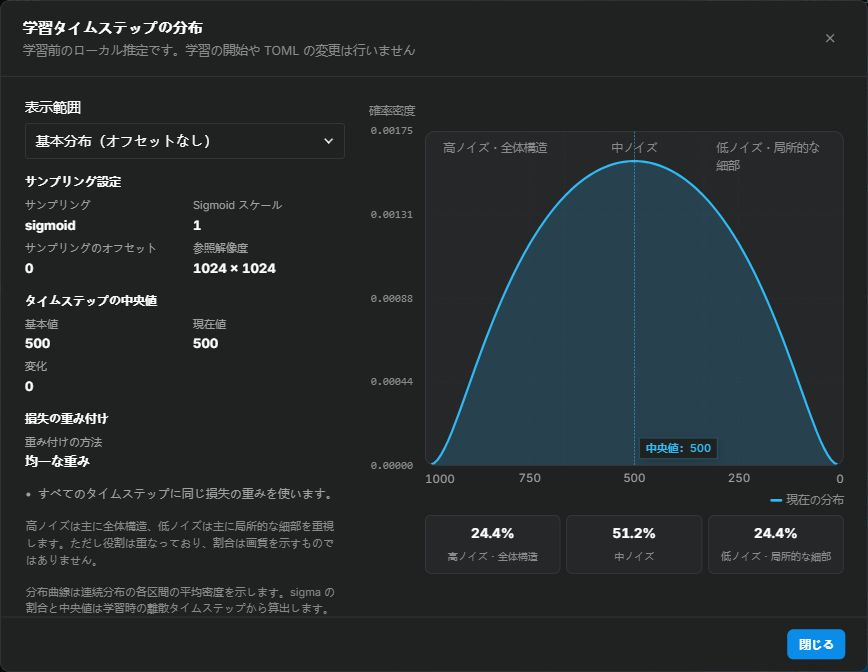
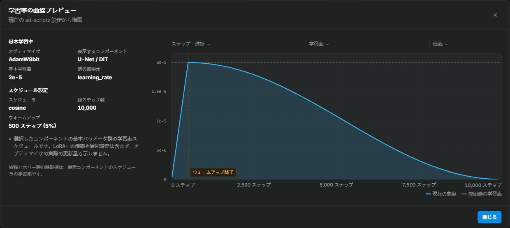
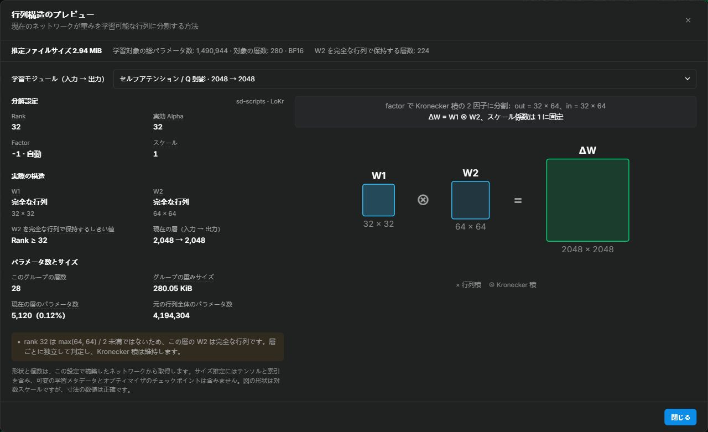

<div align="center">

# lora-scripts-anima

_✨ 複数の学習エンジンに対応した LoRA ツール：Anima、SDXL、Krea 2 ✨_

ローカルで動作する LoRA 学習用 GUI です。Anima / SDXL には [kohya-ss/sd-scripts](https://github.com/kohya-ss/sd-scripts)（`vendor/sd-scripts/`）、**Krea 2 LoRA** には [kohya-ss/musubi-tuner](https://github.com/kohya-ss/musubi-tuner) を使用します。

</div>

<p align="center">
  <a href="https://github.com/amenorira/lora-scripts-anima" style="margin: 2px;">
    
  </a>
  <a href="https://raw.githubusercontent.com/amenorira/lora-scripts-anima/main/LICENSE" style="margin: 2px;">
    
  </a>
</p>

<p align="center">
  <a href="https://github.com/amenorira/lora-scripts-anima/blob/main/README.md">中文</a> ·
  <a href="https://github.com/amenorira/lora-scripts-anima/blob/main/README-en.md">English</a>
</p>

学習エンジンのレジストリによって各バックエンドを分離しています。**LyCORIS** は `lycoris.kohya` を通じて利用するオプションのアダプターバックエンドです。

### 対応モデル

| 学習方式 | ベースモデル |
|----------|--------------|
| LoRA | SDXL |
| **LoRA** | **Anima**（Qwen3 + T5 のデュアルエンコーダー） |
| **LoRA** | **Krea 2 RAW DiT**（musubi-tuner） |

> ℹ️ Krea 2 では、学習前に latent と Qwen3-VL テキストエンコーダー出力の両方をキャッシュする必要があります。学習開始前に、キャッシュが揃っているか、画像・キャプション・モデルと一致しているかを GUI が確認します。

> ℹ️ `vendor/sd-scripts/` の学習エンジン自体は SD3 / FLUX / HunyuanImage / Lumina などにも対応していますが、現在の UI にはこれらのモデルの学習画面はありません。

## 主な機能

- **学習 WebUI** — LoRA 学習フォーム、TOML 設定プレビュー、設定のインポート・エクスポート、学習履歴をまとめたワークスペース
- **学習前のプレビュー** — タイムステップ分布、学習率曲線、行列構造をローカルで計算して表示する 3 種類のダイアログ。[次の節を参照](#pre-training-previews)
- **LyCORIS アダプターパネル** — LoCon / LoHa / LoKr に対応し、アルゴリズムに応じたパラメータを表示。カーネルバックエンド（auto / Triton / TileLang / compile / Torch）の選択、LoRA+、Anima の学習範囲の詳細設定に対応
- **豊富なオプティマイザー** — AdamW、Lion、Prodigy、CAME、StableAdamW、Adafactor、ScheduleFree、Adan、AdEMAMix、Muon などに加え、内蔵の LoRA-RITE と実験的な LoRA-Muon を提供。各オプティマイザーの既定値と制約を表示
- **リアルタイムのハードウェア監視** — GPU 使用率・VRAM・温度、CPU・RAM 使用率を表示。Chart.js のグラフ、TensorBoard、リアルタイムログを統合
- **内蔵タグエディター** — 画像のタグを編集し、一括検索・置換、重複除去、並べ替え、クリーンアップなどを実行
- **タグ付けワークスペース** — WD EVA02-Large、WD ViT-Large、CL Tagger、Camie Tagger、[PixAI Tagger v1.0](https://huggingface.co/pixai-labs/pixai-tagger-v1.0) を統合。画像単位の確認、カテゴリ別のしきい値、一括キャプション出力に対応。PixAI はローカルの PyTorch で推論し、スタイルタグに対応。初回のダウンロードは約 1.95 GB。AI タグ付けでは OpenAI 互換（Chat Completions / Responses）または Anthropic Messages プロトコルの画像対応 API を利用可能
- **EmoSens 適応型オプティマイザー** — Anima DiT 学習での収束を改善する EmoSens v3.9 を内蔵
- **多言語対応（i18n）** — 中国語・英語・日本語の UI と内蔵ガイド。ブラウザーの言語を自動検出し、選択した言語を保存
- **3 種類のテーマ** — ライト、ダーク、ComfyUI。システム設定への追従と手動切り替えに対応
- **バックエンド接続状態の表示** — 接続状態と切断からの経過時間をリアルタイムで表示
- **低速なリモート接続への対応** — 同一オリジンのリアルタイム通信、低速回線向けのサムネイルキュー、バージョン付きのブラウザーキャッシュにより、プレビュー取得が状態更新に与える影響を軽減

<a name="pre-training-previews"></a>

## 学習前のプレビュー

### タイムステップ分布

学習タイムステップのサンプリング設定で **「タイムステップ分布を表示」** を開くと、確率密度、損失の重み、高・中・低ノイズの割合を確認できます。基本分布と学習全体の分布を切り替えてタイムステップの中央値を比較し、グラフにカーソルを合わせて値を読み取れます。詳しくは[タイムステップガイド](docs/parameters/timesteps.ja-JP.md)を参照してください。



### 学習率曲線

学習率スケジュールの設定から学習率のプレビューを開くと、ウォームアップ、減衰、リスタート、各学習ステップの学習率を確認できます。サイドバーには選択した DiT / テキストエンコーダーの実効学習率とウォームアップステップ数を表示します。スケジュールを自動管理するオプティマイザーには、その動作の説明を表示します。詳しくは[オプティマイザーガイド](docs/parameters/optimizers.ja-JP.md)を参照してください。



### 行列構造

Anima 学習では、学習ネットワークモジュールの設定から **「構造プレビュー」** を開けます。実際のネットワーク構築結果に基づき、LoRA / LoCon、LoHa、LoKr の行列の組み合わせを表示します。Attention、MLP などのモジュールを切り替え、層ごとの形状、実効 rank / alpha、スケーリング、該当する層数、パラメータ数を確認できます。

同じ場所に **推定重みファイルサイズ** も表示され、アルゴリズム、rank、学習範囲、保存精度に応じて自動更新されます。仮想テンソルを使用するため、ベースモデルの読み込みや学習の開始は不要です。推定には保存テンソルと safetensors のインデックスを含みますが、VRAM 使用量を表すものではありません。詳しくは[行列構造とファイルサイズのガイド](docs/parameters/matrix-preview.ja-JP.md)を参照してください。



## プロジェクト構成

```
lora-scripts-anima/
├── vendor/sd-scripts/          ← Anima / SDXL 学習エンジン（固定した上流スナップショット）
├── vendor/musubi-tuner/        ← Krea 2 学習エンジン（固定した上流スナップショット）
├── vendor/lycoris/             ← LyCORIS アダプターバックエンド（固定した上流スナップショット）
├── vendor/emo_optimizer/       ← EmoSens 適応型オプティマイザー
├── vendor/lora_muon/           ← 実験的な LoRA-Muon オプティマイザー
├── backend/                    ← FastAPI バックエンド
│   ├── server/                 ← API コア（ルーティング、状態、プロキシ）
│   ├── training/               ← 学習エンジンのラッパー（パラメータ変換、フィールドレジストリ、プロセス管理）
│   ├── monitor/                ← 学習監視（GPU、システム、ログ、プレビュー、履歴）
│   ├── tageditor/              ← 内蔵タグエディター
│   ├── tagger/                 ← タグ付けモジュール（WD / CL / Camie / PixAI / AI API）
│   └── gui.py                  ← GUI の内部エントリーポイント（起動スクリプトから呼び出し）
├── frontend/                   ← Alpine.js SPA フロントエンド
├── config/                     ← ローカル設定と自動保存
├── docs/                       ← パラメータガイドとプレビュー画像
├── tools/                      ← 起動・インストール・実行ツール。開発用スクリプトは tools/dev/
├── start.bat / start.sh        ← 起動スクリプト
└── requirements.txt            ← プロジェクト全体で共通の依存関係一覧（torch は起動時に別途インストール）
```

## 使い方

### 必要な環境

- **Python**：64 ビット版 Python 3.12（プロジェクトの基準バージョン。ビルド済みの依存パッケージとインストール手順はこのバージョンを対象とします）
- **Git**：プロジェクトのダウンロードと更新に使用。Windows の ZIP 版では初回起動時に自動インストール可能
- **PyTorch 2.12.1 + CUDA 13.0**：起動スクリプトが自動インストール。RTX 30/40/50 シリーズに対応
- **NVIDIA ドライバー R580 以降**：CUDA 13.0 が必要とする最低ドライバーバージョン

> **Windows では Python の事前インストールは不要です。** 初回の `start.bat` 実行時に 64 ビット版 Python 3.12 を探し、Microsoft Store の Python プレースホルダーは除外します。
>
> Python 3.13/3.14 しかインストールされていない場合は、案内に従って公式の Python 3.12 を現在のユーザー向けに追加できます。既存の Python の削除や、既定の Python の変更は行いません。ダウンロード中は進捗、サイズ、速度、残り時間を表示し、サイレントインストール中は処理中のアニメーションを表示します。
>
> **Linux では** 64 ビット版 Python 3.12 を自分でインストールしてください。通常は `venv` の作成機能も含まれています。Ubuntu / Debian などで機能不足のエラーが出る場合のみ、対応パッケージ（例：`python3.12-venv`）を追加してください。
>
> 別の Python バージョンで作成した互換性のない `venv` がプロジェクト内にある場合は、プロジェクト内の `venv` フォルダーだけを削除または名前変更し、使用する OS の起動スクリプトを再実行してください。

| GPU シリーズ | 自動インストールされる PyTorch | CUDA |
|--------------|:-----------------------------:|:----:|
| RTX 30（Ampere） | 2.12.1 | 13.0 |
| RTX 40（Ada） | 2.12.1 | 13.0 |
| RTX 50（Blackwell） | 2.12.1 | 13.0 |

プロジェクトの更新後、旧バージョンの `venv`（Torch 2.10 + cu130 を含む）は次回起動時に PyTorch 2.12.1 + cu130 と torchvision 0.27.1 に自動更新されます。インストール済みの xformers は 0.0.35、Triton は 3.7 系に更新されます。外部 FlashAttention はインストールされたまま残りますが、学習プロセスでは読み込みません。bitsandbytes の CUDA 13 互換性チェックは継続し、ONNX Runtime GPU は 1.27.0 のままです。未インストールのオプションライブラリは自動追加しません。

NVIDIA GPU がない PC にも GPU 用の依存環境を一式インストールし、GUI を起動できます。ただし、学習には NVIDIA GPU が必要です。

> **Krea 2 の共有環境**：Krea 2 と sd-scripts はプロジェクトのメイン `venv` と同じ CUDA 版 PyTorch を使用します。ルートの `requirements.txt` がプロジェクト全体の唯一の依存関係一覧で、共有パッケージを `transformers 5.17.0` / `tokenizers 0.23.1` に固定します。インストール時に `vendor/` 内の依存関係ファイルは読み込みません。
>
> 通常の起動では、高速なメタデータ確認のみを行います。バージョンが一致していれば pip の再実行、パッケージの削除・再インストール、Krea 2 の実行環境全体のインポートは行いません。依存関係の同期後と Krea 2 の学習前チェック時には、完全なインポート検証を実行します。`vendor/` 内の上流の依存関係ファイルは変更しません。

> 旧バージョンの `venv/cores/musubi` は読み書きせず、自動削除もしません。メイン `venv` で正常に学習できることを確認した後、不要になった旧ディレクトリを手動で削除してディスク容量を空けられます。

### Windows：ZIP をダウンロード（初心者向け）

1. GitHub で **Code → Download ZIP** を選び、すべて展開してから `start.bat` をダブルクリックします。
2. `.git` がない場合は、Git for Windows のインストールと、更新可能なリポジトリへの修復を確認する画面が出ます。推奨の選択肢を選んでください。
3. 修復時には最新の `main` を取得します。置き換え対象のソースファイルは、先に `bootstrap-backups/<日時>.zip` に保存します。`venv`、モデル、出力、キャッシュ、ログ、ユーザー設定を含む `config` ディレクトリ全体は同期対象から除外し、上書きや削除は行いません。
4. ソースの同期後、起動処理を一度再実行してから `venv` を作成し、学習用の依存パッケージをインストールします。

Git のインストールやリポジトリの修復に失敗しても学習ツールの起動は続行し、次回起動時に再試行できます。Python または必須の依存パッケージのインストールに失敗した場合は停止し、二言語のエラーを表示します。

### Git でクローン

```sh
git clone https://github.com/amenorira/lora-scripts-anima.git
cd lora-scripts-anima
```

### クイックスタート

| OS | インストールと起動 |
|----|--------------------|
| Windows | `.\start.bat` |
| Linux | `bash start.sh` |

初回起動時に仮想環境を作成し、依存パッケージを自動インストールします。起動後、GUI が [http://127.0.0.1:12333](http://127.0.0.1:12333) で自動的に開きます。

### リアルタイム通信と低速なリモート接続

TensorBoard は GUI と同じ公開 URL を使用します。既定では `http://127.0.0.1:12333/tensorboard/` にアクセスでき、別のウィンドウでも直接開けます。埋め込みページは現在のページのドメイン、プロトコル、ポートを使うため、SSH では GUI のポートだけを転送すれば利用できます。ローカル側のポートはサーバー側と異なっていても構いません。ターミナルにはサーバー側のアドレスを表示し、SSH のローカル転送ポートは自動検出できません。

TensorBoard の子プロセスはサーバーのループバックアドレスでのみ待ち受け、内部ポートは既定で自動割り当てします。`--listen` を指定しても TensorBoard を個別に外部公開しません。旧引数 `--tensorboard-host` は廃止され、指定しても無視します。`--tensorboard-port` は内部ポートの指定にのみ使用します。起動中は待機表示を出し、TensorBoard の準備完了後にアクセス先をまとめて表示します。失敗時には警告を表示して GUI の起動を続行します。詳細ログは `logs/tensorboard.log` に保存します。

HTTP リクエストとリアルタイム接続は、常に現在のページと同一オリジンです。SSH、ポート転送、プロキシ、クラウド固有の設定、追加のリアルタイム通信用ポートは自動設定しません。

- `/ws/realtime` は小さな JSON の状態、進捗、ログ差分、ハードウェア情報のみを送信します。コマンド、画像、ファイル、メタデータには引き続き HTTP を使用します。
- サイドバーは WebSocket の `ready` メッセージとリアルタイムのスナップショットを受信した後に接続中と表示します。有効なデータが 2 秒間届かなければリアルタイムデータの遅延を表示し、接続が閉じてヘルスチェックも失敗した場合にバックエンド未接続と表示します。
- バックエンドの再起動でインスタンス ID が変わります。ページは旧インスタンスのタスク、進捗、ログ、曲線、ハードウェア情報を消去し、以前のメモリー内のタスク状態が不明であることを表示します。現在のバージョンは残存する学習プロセスの検出や引き継ぎを行いません。
- **UI 設定の低速接続向け互換性設定**は既定で有効です。現在の実行または履歴のサンプル一覧をすべて表示し、サムネイルを低優先度のキューで 1 件ずつ読み込みます。リアルタイムデータが遅延している間は読み込みを一時停止します。バージョン付きサムネイルはブラウザーに 24 時間キャッシュできます。元画像はクリックしたときに読み込みます。

### 更新方法

ZIP 版のリポジトリ修復または `git clone` の完了後、プロジェクトフォルダーの何もない場所を右クリックし、次のいずれかを実行します。

- Windows の **「ターミナルで開く」** を選び、`git pull` を実行する。
- **Git Bash Here** を選び、`git pull` を実行する。Windows 11 では **「その他のオプションを確認」** 内にある場合があります。

更新は fast-forward のみ許可します。ソースを手動で変更した場合は `git pull` が停止し、ローカルの変更への対応を求めます。自動で上書きはしません。

## 学習パラメータガイド

学習パラメータの詳細は `docs/parameters/` にあります。

- [LoRA+ ガイド](docs/parameters/lora-plus.ja-JP.md)：仕組み、倍率の選択、オプティマイザーとの互換性、評価方法
- [オプティマイザー選択とパラメータガイド](docs/parameters/optimizers.ja-JP.md)：オプティマイザーの比較、学習率・weight decay の初期設定、データセットに応じた選択
- [タイムステップガイド](docs/parameters/timesteps.ja-JP.md)：flow matching のタイムステップサンプリング、損失の重み、分布プレビュー
- [AdaLN モジュレーション層ガイド](docs/parameters/adaln.ja-JP.md)：モジュレーション層の役割、上流の既定動作、有効化が適する学習
- [行列構造とファイルサイズのガイド](docs/parameters/matrix-preview.ja-JP.md)：実際のモジュール形状、パラメータ数、学習範囲、保存サイズの推定

## 起動引数

| 引数 | 型 | 既定値 | 説明 |
|------|----|--------|------|
| `--host` | str | "127.0.0.1" | サーバーのホスト名 |
| `--port` | int | 12333 | サーバーのポート |
| `--listen` | bool | false | 外部からのアクセスを許可 |
| `--skip-prepare-environment` | bool | false | 起動時の依存環境の確認・修復を省略 |
| `--skip-prepare-onnxruntime` | bool | false | onnxruntime-gpu のインストール確認のみ省略 |
| `--disable-tensorboard` | bool | false | GUI と同時に内蔵 TensorBoard を起動しない |
| `--tensorboard-port` | int | 0 | TensorBoard の内部ポート。0 は自動割り当て。通常は設定不要 |
| `--localization` | str | | UI の言語とローカライズ設定 |
| `--dev` | bool | false | 開発者モード |
| `--quiet` / `-q` | bool | false | Python / venv の依存パッケージを自動インストール。オプションの Git 修復は既定で実行しない |
| `--setup-git` | bool | false | Windows：推奨の Git インストール / ZIP リポジトリ修復を非対話で実行 |
| `--skip-git-setup` | bool | false | Windows：今回の起動では Git インストールやリポジトリ修復の確認を表示しない |

## Attention の高速化

Anima の既定値は `torch`、Krea2 は `sdpa` です。PyTorch 標準の SDPA が内蔵 FlashAttention を含む適切な高速化カーネルを自動選択するため、外部の `flash-attn` は不要です。

旧設定の `flash` / `flash_attn` は標準の SDPA に自動変換します。プロジェクトの実行プロセスは外部 FlashAttention を読み込みません。既存のパッケージは venv に残し、自動更新や削除は行いません。互換性のない旧パッケージによる読み込み警告も繰り返し表示しません。PyTorch 内蔵の高速化には影響しません。

## EmoSens 適応型オプティマイザー

内蔵の EmoSens v3.9 は `vendor/emo_optimizer/` にあります。

### 推奨設定

| 学習方式 | 学習率 | スケジューラー | max_grad_norm |
|----------|:------:|:--------------:|:-------------:|
| SDXL LoRA | 1.0 | constant | 0 |
| Anima LoRA（DiT） | 0.1 | constant | 0 |

学習フォームのオプティマイザーの一覧から `EmoSens` を選択すると利用できます。

## TOML 設定のインポート・エクスポート

- **エクスポート**：学習ページのパラメータプレビューから現在の TOML 設定をダウンロード
- **インポート**：TOML ファイルを読み込み、対応する学習方式のフォームに有効なフィールドを反映

## 環境管理

GUI の **「環境」** タブで次の情報や機能を利用できます。

- Python / PyTorch / CUDA のバージョン情報
- sd-scripts、LyCORIS アダプターバックエンド、musubi-tuner の状態
- musubi-tuner Krea 2 の共有実行環境の状態（sd-scripts と共有する CUDA 版 PyTorch、依存パッケージのバージョン統一状況）
- Flash Attention のインストール状態の確認とワンクリックインストール
- インストール候補の wheel 一覧のプレビュー

## 開発とテスト

テスト全体を実行するには、次のコマンドを使用します。テストは標準ライブラリの unittest を使用し、追加パッケージは不要です。Node.js と Git が PATH に必要ですが、これらは開発用で、学習の実行環境には影響しません。

```
.\venv\Scripts\python.exe -m unittest discover -s tests -t .
# Linux: ./venv/bin/python -m unittest discover -s tests -t .
```

テストは `tests/` にあり、学習、監視、環境、タグ付け、アプリケーション、フロントエンドに分類されています。共通の実行コマンドには独立した JavaScript テストも含まれます。開発用スクリプトは `tools/dev/` にあります。`tools/` には起動処理やバックエンドが使用する実行ツールも含まれます。

## 謝辞

- [kohya-ss/sd-scripts](https://github.com/kohya-ss/sd-scripts) — Anima / SDXL 学習エンジン
- [kohya-ss/musubi-tuner](https://github.com/kohya-ss/musubi-tuner) — Krea 2 学習エンジン
- [Akegarasu/lora-scripts](https://github.com/Akegarasu/lora-scripts) — 初期設計の参考

## ライセンス

本プロジェクトは [MIT ライセンス](LICENSE) で公開しています。`vendor/` 内のサードパーティーコンポーネントは、それぞれ元のライセンス（Apache-2.0 / MIT）を保持します。
