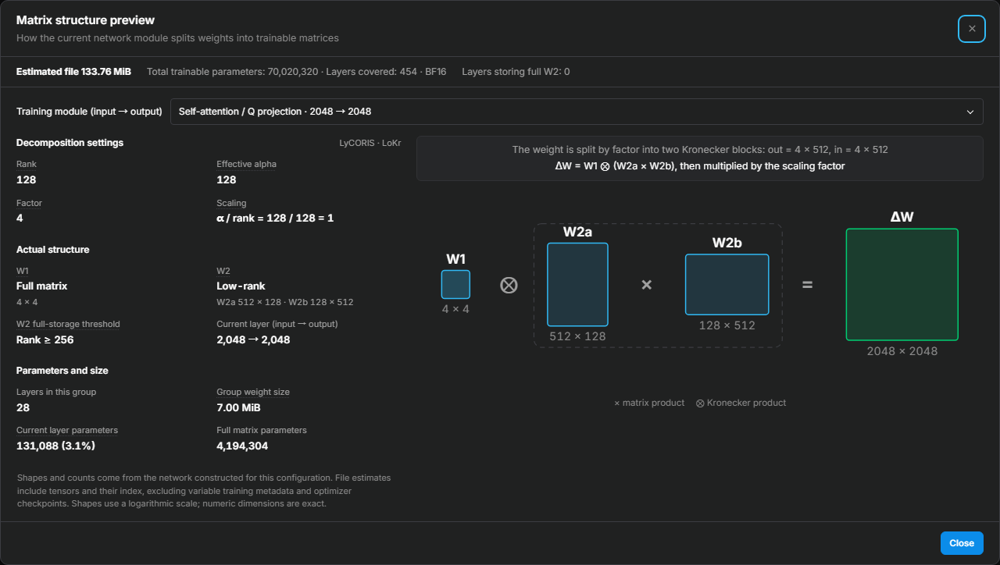

# Matrix Structure and File Size

For Anima training, open **Structure preview** under **Training network module** to inspect the adapter matrices constructed by the current settings. The entry also shows the estimated weight-file size, making it easier to compare rank, algorithms, and training scopes.

<!-- doc-anchor: overview -->
## Inspect actual modules

The preview uses the training network constructors with fake tensors. It does not load base-model weights or start training. It currently supports native Anima LoRA / LoHa / LoKr and LyCORIS LoCon / LoHa / LoKr.

- **Module selection:** inspect included input projections, self-attention, cross-attention, MLP, and other modules. Repeated layers with matching structures are grouped with their counts.
- **Matrix structure:** inspect the original weight dimensions, saved tensor shapes, and how LoRA low-rank products, LoHa Hadamard products, or LoKr Kronecker products combine.
- **Effective settings:** inspect the selected module's actual rank, alpha, scaling, and the effects of Full Matrix, both-side decomposition, and rs_lora. Constructors may change the decomposition based on layer dimensions; the diagram reflects the resulting structure.
- **Parameter counts:** distinguish the selected module's count from network totals. Training scope, AdaLN, LLM adapter, and text-encoder settings affect which modules are included.

Estimates update automatically when form settings change. Reopen the preview to inspect the latest result. The screenshot uses LyCORIS LoKr, rank/alpha 128, factor 4, and the `attn-mlp` scope for illustration, not as a recommended recipe.

<!-- doc-anchor: file-size -->
## How file size is estimated

The estimate counts the tensors actually saved by the adapter at the selected save precision, then adds the safetensors tensor-index header. `fp16` / `bf16` use 2 bytes per element and `float` uses 4. Saved non-trainable tensors such as alpha are included, so file size is not simply the trainable parameter count multiplied by bytes per element.

This is an estimate of the **LoRA weight file**, excluding the base model, optimizer state, training caches, and sample images. It is not a VRAM estimate. Training metadata adds more bytes, and other save formats can have different container overhead. The final file is authoritative.

To compare settings, hold the algorithm and scope fixed while changing rank, or hold rank fixed while comparing scopes. Algorithms such as LoKr can switch between full matrices and low-rank factors, so file size does not always grow linearly with rank. Unsupported or failed constructions display an estimation error instead of falling back to a generic formula.
