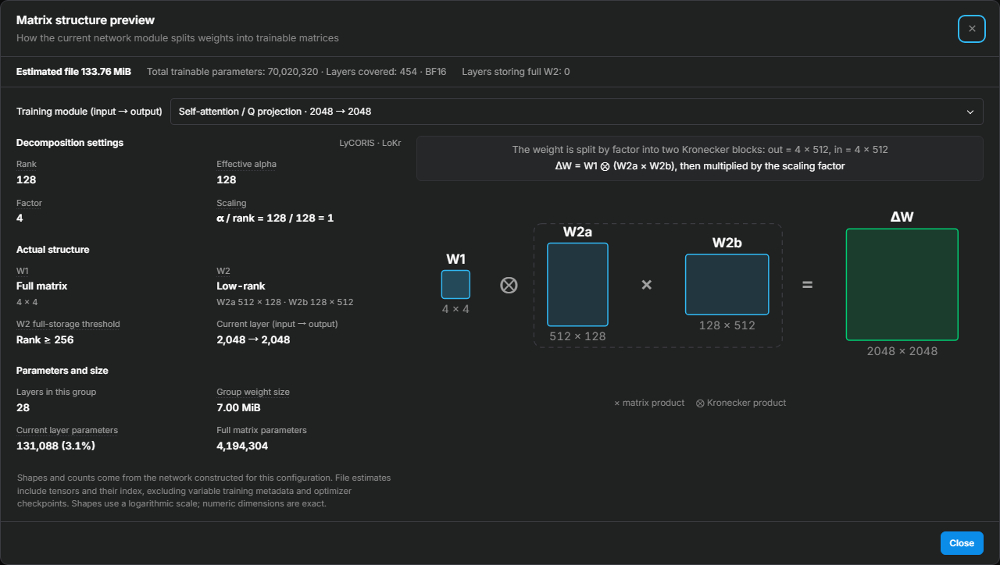

# Matrix Structure and File Size

For Anima training, open **Structure preview** under **Training network module** to inspect the adapter matrices constructed by the current settings. The entry also shows the estimated weight-file size, making it easier to compare rank, algorithms, and training scopes.

<!-- doc-anchor: overview -->
## Inspect actual modules

The preview uses the training network constructors with fake tensors. It does not load base-model weights or start training. It currently supports native Anima LoRA / LoHa / LoKr and LyCORIS LoCon / LoHa / LoKr.

| Preview item | Meaning |
| --- | --- |
| Input and output dimensions | Number of features entering and leaving the original layer |
| Saved matrix shapes | Tensors trained and saved by the adapter, not the full base-model weights |
| Rank, Alpha, and scale | Values actually used by the selected module, not merely entered in the form |
| Parameter count | Number of trainable values in the adapter, useful for comparing configuration sizes |
| File size | An estimate based on saved tensors, precision, and packaging, not training memory |

<!-- doc-anchor: file-size -->
## How file size is estimated

The estimate counts the tensors actually saved by the adapter at the selected save precision, then adds the safetensors tensor-index header. `fp16` / `bf16` use 2 bytes per element and `float` uses 4. Saved non-trainable tensors such as alpha are included, so file size is not simply the trainable parameter count multiplied by bytes per element.

This is an estimate of the **LoRA weight file**, excluding the base model, optimizer state, training caches, and sample images. It is not a VRAM estimate. Training metadata adds more bytes, and other save formats can have different container overhead. The final file is authoritative.

To compare settings, hold the algorithm and scope fixed while changing rank, or hold rank fixed while comparing scopes. LoKr changes its file-size growth pattern when it switches from low-rank factors to full matrices. Check the resulting shapes and estimate after each change.

Unsupported configurations and construction failures display an estimation error.
