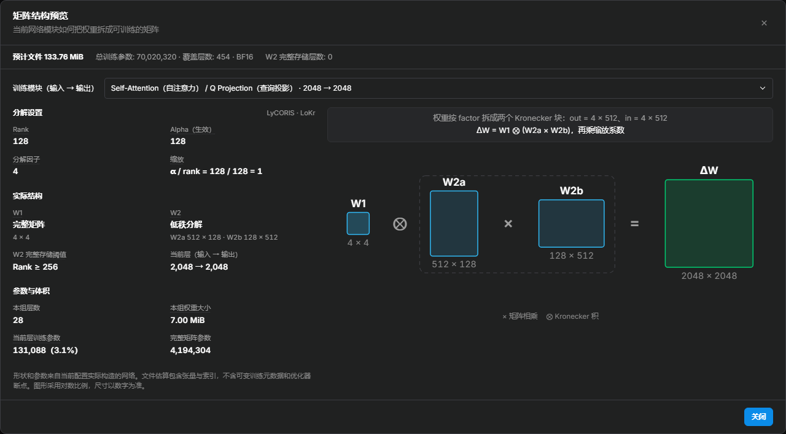

# 矩阵结构与文件大小

Anima 训练中，在“训练网络模块”下点击“结构预览”，可查看当前配置实际构造出的适配器矩阵。入口旁同时显示预计权重文件大小，便于比较 rank、算法和训练范围对输出体积的影响。

<!-- doc-anchor: overview -->
## 查看实际模块

预览根据训练时使用的网络构造器和虚拟张量生成，不加载底模权重，也不启动训练。当前支持 Anima 的原生 LoRA / LoHa / LoKr，以及 LyCORIS 的 LoCon / LoHa / LoKr。

- **模块选择**：切换输入投影、自注意力、交叉注意力、MLP 等已纳入训练的模块；相同结构的重复层合并展示，并显示匹配数量。
- **矩阵结构**：显示原始权重的输入输出维度、实际保存的矩阵形状，以及 LoRA 低秩乘积、LoHa Hadamard 积或 LoKr Kronecker 积的组合关系。
- **生效参数**：查看所选模块的实际 rank、alpha 和缩放，以及 Full Matrix、双边分解、rs_lora 等设置的生效结果。构造器可能根据层尺寸调整分解方式，图中以实际结构为准。
- **参数统计**：区分所选模块的参数量与整个网络的汇总。训练范围、AdaLN、LLM adapter 和文本编码器设置都会影响哪些模块参与统计。

修改训练表单后，估算会自动更新；重新打开预览可检查最新结果。截图使用 LyCORIS LoKr、rank/alpha 128、factor 4 和 `attn-mlp` 范围，仅用于演示，不是推荐训练配方。

<!-- doc-anchor: file-size -->
## 文件大小如何估算

估算遍历适配器实际保存的张量，按保存精度计算数据大小，再加上 safetensors 的张量索引头。`fp16` / `bf16` 每个元素占 2 字节，`float` 占 4 字节；保存的 alpha 等非训练张量也会计入，因此文件大小不等于“可训练参数量 × 字节数”。

显示的是 **LoRA 权重文件的估算大小**，不包含底模、优化器状态、训练缓存和样本图片，也不表示训练所需显存。训练元数据会带来额外体积；如果选择其他保存格式，其封装开销也可能不同，应以最终文件为准。

比较配置时，可固定算法和范围改变 rank，或固定 rank 比较不同训练范围。LoKr 等算法存在完整矩阵与低秩分解之间的切换，文件大小不一定随 rank 线性增长。构造不受支持或失败时，界面会显示估算失败，不会用通用公式替代实际结果。
