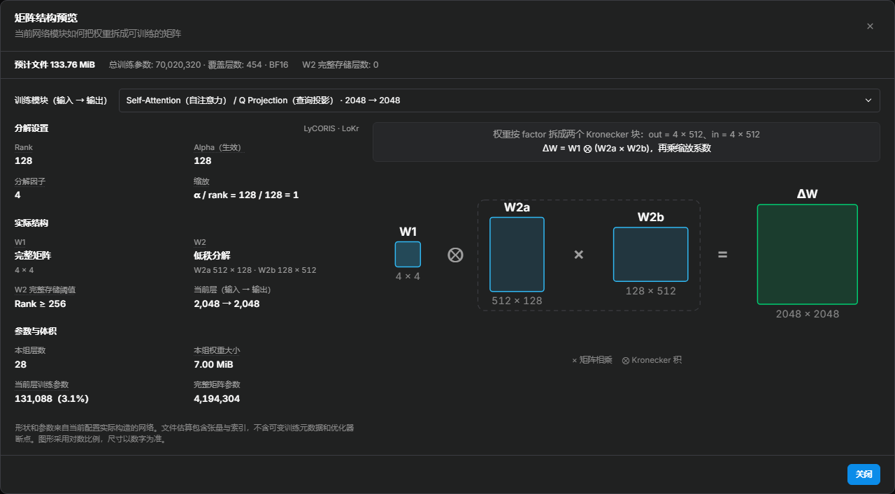

# 矩阵结构与文件大小

Anima 训练中，在“训练网络模块”下点击“结构预览”，可查看当前配置实际构造出的适配器矩阵。入口旁同时显示预计权重文件大小，便于比较 rank、算法和训练范围对输出体积的影响。

<!-- doc-anchor: overview -->
## 查看实际模块

预览根据训练时使用的网络构造器和虚拟张量生成，不加载底模权重，也不启动训练。当前支持 Anima 的原生 LoRA / LoHa / LoKr，以及 LyCORIS 的 LoCon / LoHa / LoKr。

| 预览内容 | 说明 |
| --- | --- |
| 输入与输出维度 | 原层接收和输出的特征数量 |
| 保存的矩阵形状 | 适配器实际训练和保存的张量，不是完整底模权重 |
| rank、Alpha 与缩放 | 当前模块实际使用的值，不只看表单输入 |
| 参数量 | 适配器包含多少可训练数值，用于比较配置规模 |
| 文件大小 | 由保存张量、保存精度和文件封装估算，不是训练显存 |

<!-- doc-anchor: file-size -->
## 文件大小如何估算

估算遍历适配器实际保存的张量，按保存精度计算数据大小，再加上 safetensors 的张量索引头。`fp16` / `bf16` 每个元素占 2 字节，`float` 占 4 字节；保存的 alpha 等非训练张量也会计入，因此文件大小不等于“可训练参数量 × 字节数”。

显示的是 **LoRA 权重文件的估算大小**，不包含底模、优化器状态、训练缓存和样本图片，也不表示训练所需显存。训练元数据会带来额外体积；如果选择其他保存格式，其封装开销也可能不同，应以最终文件为准。

比较配置时，固定算法和训练范围，只改变 rank；或固定 rank，只改变训练范围。LoKr 从低秩分解切换为完整矩阵时，文件大小会改变增长规律，因此修改后应重新查看矩阵形状和估算值。

不支持的配置或构造失败会显示估算失败。
