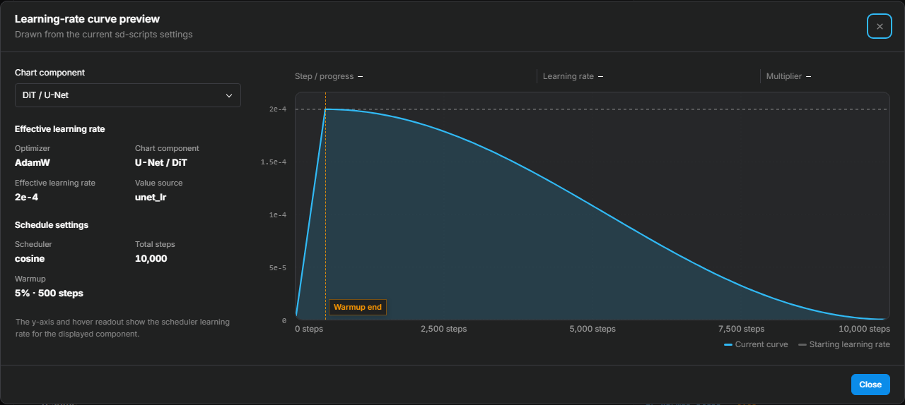

# Optimizer Selection and Parameter Guide

> For most Anima / SDXL LoRA training, start with **AdamW8bit** and build a baseline first. Once that baseline is stable, there is usually no need to switch optimizers.
>
> If your sources vary a lot in style and quality, try **CAME** as a comparison. If the log shows reproducible gradient spikes, or your LoRA trainable weights are FP16/BF16, try **StableAdamW**.

The optimizer affects convergence speed, VRAM use, and numerical stability, but it is usually not the deciding factor in character fidelity. When few-shot character training goes wrong, inspect the data, captions, repeats, learning rate, and stopping point first.

This guide distinguishes "what the papers and implementations actually say" from "engineering starting points for Anima." The paper results and library defaults for CAME, Lion, and Schedule-Free do not translate directly into optimal configurations for Anima LoRA. The official Anima model card recommends Anima-Base, training only the DiT blocks, rank 32, and starting around `2e-5`. This trainer uses `rank=32, alpha=32` as its engineering starting point; `alpha=32` in particular is a project choice that still needs validation on your dataset. These starting values do not apply to Krea 2 training, whose optimizer baselines differ (Schedule-Free, for example, starts at `0.0025`).

<!-- doc-anchor: quick-choice -->
## Choosing an optimizer

| Training situation | Suggested start | Why |
| --- | --- | --- |
| First time, or no clear stability problem | AdamW8bit | Well-understood settings and low state VRAM; easy to compare with common configs |
| Mixed DMM cards, art, screenshots, and effect images | Start with AdamW8bit, then compare CAME | CAME's internal clipping may stabilize updates, but it won't flag low-quality images |
| Clear, reproducible loss or gradient spikes | Check the data and LR first, then compare StableAdamW | StableAdamW mainly steadies updates; it does not guarantee better image quality |
| LoRA trainable weights are FP16/BF16 | StableAdamW | `kahan_sum` helps most when parameter updates run at low precision |
| Not enough VRAM for optimizer state | AdamW8bit; if still tight, PagedAdamW8bit | Paging changes memory scheduling; host-device transfers may slow training |
| Want less learning-rate tuning | Prodigy | Requires a base LR of `1.0`; this project does not support LoRA+ with it |
| Want to compare matrix-orthogonalized updates | Muon | Keep the AdamW baseline LR and change only the optimizer first |
| Want to test matrix optimization designed for LoRA factors | LoRA-Muon | Compare it with AdamW8bit under fixed conditions; calibrate the LR separately |
| Want to compare matrix-preconditioned updates | SOAP | Keep the AdamW baseline LR first; worth more on compact LoKr than on plain LoRA |

For few-shot character training, comparing **AdamW8bit, CAME, and StableAdamW** is a reasonable start. Change one major variable per comparison, or you cannot attribute the result.

<!-- doc-anchor: optimizer-type -->
## Available optimizers

| Optimizer | Primary purpose | Restrictions |
| --- | --- | --- |
| AdamW | Full-precision AdamW baseline | Uses more optimizer-state VRAM than the 8-bit builds |
| AdamW8bit | Everyday default | Small tensors keep FP32 state by design |
| PagedAdamW8bit | When the regular 8-bit optimizer still does not fit | Only difference is paging; transfers between CPU and GPU may slow training |
| StableAdamW | Gradient spikes, low-precision LoRA weights | Uses more state VRAM than AdamW8bit; does not prevent overfitting |
| Lion | Symbolic-momentum optimizer for comparison | Works with a different LR range; tune it separately |
| Lion8bit | Lion with less state VRAM | Needs its own LR sweep |
| PagedLion8bit | Lion8bit that also needs paging | Paging does not improve quality and may slow training |
| Prodigy | Optimizer-estimated update scale | Base LR must be `1.0`; not supported with LoRA+ here |
| ProdigyPlusScheduleFree | Testing internal schedules and combinations | External scheduler and warmup are ignored; benefits on short few-shot runs are uncertain |
| Automagic3 | Experimental adaptive scheme | Test only against a solid baseline; requires gradient accumulation of 1; fp16 mixed precision and multi-GPU are not supported |
| AdaFactor | Very tight optimizer memory | Relative-step mode takes over the LR and restricts LoRA+ |
| CAME | Comparison when source images mix and update scale varies | Uses three betas and internal RMS clipping |
| AdamWScheduleFree | Testing AdamW without an external scheduler | Supports internal warmup, but this project leaves `warmup_steps=0`; not a first choice for short runs |
| EmoSens | Experimental optimizer | Requires gradient accumulation of 1; fp16 mixed precision and multi-GPU are not supported; LoRA+ not supported |
| Muon | Momentum orthogonalization for two-dimensional LoRA matrices | Anima LoRA only; uses PyTorch's native implementation; compare it with AdamW8bit under identical conditions |
| LoRA-Muon | Spectral low-rank optimization designed for standard LoRA factor pairs | Supports only `anima-lora` with `networks.lora_anima`; incompatible with LoRA+ and LyCORIS networks such as LoKr and LoHa; requires separate learning-rate calibration |
| Adan | Comparison when you want features to form in fewer steps | Converges more aggressively; set the LR below the AdamW baseline; uses three betas |
| AdEMAMix | Comparison for long runs or visibly noisy gradients | Benefit of the slow moving average is uncertain in short runs; alpha and ramp lengths should match the training length |
| AdEMAMix8bit | AdEMAMix when optimizer-state memory is tight | Differs from the full-precision version mainly in state quantization |
| LoRA-RITE | Trying an update rule designed for LoRA's structure | Anima LoRA and standard LoRA structure only; no LoRA+; uses its own clipping, `max_grad_norm` (global gradient clipping threshold) locks to 0 |
| SOAP | Comparing a matrix-preconditioned update against AdamW | The library's default preconditioning dimension makes Anima's long axes very expensive, so this project ships a smaller default; the authors' gains are reported for larger batches, with no public comparison on few-shot small-batch runs |

Memory notes above refer only to optimizer state. Peak usage also depends on resolution, rank, batch size, cache, and preview generation.

<!-- doc-anchor: stable-comparison -->
## AdamW8bit, CAME, StableAdamW: how they differ

**AdamW8bit is the baseline.** It uses little state memory, is well understood, and makes it easy to isolate your learning rate, step count, and data issues. Use it unless you have a specific stability or memory concern.

**CAME uses factorized state with internal RMS clipping.** When card art, screenshots, and illustrations differ widely in quality and composition, compare it with AdamW8bit. CAME acts on parameter updates; it does not judge image quality. Companion characters, text, effects, and bad captions still have to be handled at data preparation time.

**StableAdamW caps unusually large parameter updates.** It supports the standard LR schedulers, warmup, `max_grad_norm`, and LoRA+. This project keeps the Anima AdamW baseline: `lr=2e-5`, `betas=(0.9, 0.99)`, `eps=1e-8`, `weight_decay=0`. The SDXL UI baseline remains `1e-4`. It is not an 8-bit optimizer, so its state memory is usually larger than AdamW8bit.

When a baseline run is already stable and previews look fine, StableAdamW's added value is usually small. Its job is to stabilize updates, not to fix a broken dataset.

<!-- doc-anchor: parameters -->
## Parameter reference

<!-- doc-anchor: learning-rate -->
### Learning rate

When training Anima DiT blocks only, start from the engineering baselines below. The official Anima evidence covers rank 32 and roughly `2e-5`; the other numbers and `alpha=32` are ported heuristics, not measurements on Anima. Learning-rate numbers are not on one shared scale across optimizers: AdamW uses elementwise first/second-moment scaling, while LoRA-Muon applies its rate directly to a whitened matrix-sign update. Therefore the same `2e-5`, `1e-4`, or `1e-3` does not imply the same parameter step and should not be copied across optimizers literally.

| Optimizer | Anima engineering starting point | Source and meaning |
| --- | ---: | --- |
| AdamW / AdamW8bit / PagedAdamW8bit | `2e-5` | Official Anima rank-32 baseline; 8-bit and paged builds keep the same LR semantics |
| StableAdamW | `2e-5` | Same scale as AdamW first; isolate the stabilized updates |
| Muon (`match_rms_adamw`) | `2e-5` | Matches AdamW update RMS by matrix size; this is not an Anima-tuned optimum |
| LoRA-Muon | `0.02` | An experimental Anima starting point chosen by this project. The paper reports `0.1` as the best tested value in a TinyShakespeare Transformer sweep; that result is not an Anima recommendation |
| CAME | `1.5e-5` | CAME's own guidance is roughly `0.5`–`0.9`× AdamW; this is a ported start, not an Anima-tuned optimum |
| Adan | `1e-5` | Larger effective step than AdamW at the same LR; start at `0.5`× the baseline |
| AdEMAMix / AdEMAMix8bit | `2e-5` | The paper keeps Adam-scale learning rates; 8-bit keeps the same LR semantics |
| LoRA-RITE | `1e-4` | Paper's best values were ~20× Adam's; in our small-sample runs `2e-4` stayed smooth and `5e-4` ran hot |
| SOAP | `2e-5` | The update is an Adam-normalized step in a rotated basis, so the scale matches AdamW; this is not an Anima-tuned optimum |
| Lion / Lion8bit / PagedLion8bit | `5e-6` | Lion's guidance is roughly `3`–`10`× smaller than AdamW |
| AdamWScheduleFree | `1e-4` | Schedule-Free guidance often `1`–`10`× higher than the base optimizer; treated as experimental on Anima |
| Prodigy / ProdigyPlus | `1.0` | D-adaptation scale; not comparable to `2e-5` |
| AdaFactor relative step | Controlled by the optimizer | With relative step off, Anima manual mode starts at `2e-5` |
| Automagic3 / EmoSens | `1e-4` / `0.1` | Internal dynamic-LR baseline values, not ordinary fixed LR |

The Lion `5e-6` simply applies the paper's rule of thumb — roughly 3–10× smaller than AdamW. The paper also recommends scaling weight decay up by roughly 3–10×, which this project does not adopt, so this is not the complete official Lion recipe.

SDXL keeps its own generic baselines: `1e-4` for AdamW/StableAdamW, `1e-4` for CAME, `2e-5` for Lion, `3e-4` for AdamWScheduleFree. When you switch model type or optimizer, the UI only replaces recommended values you have not edited manually; imported and custom values stay as they are.

`network_alpha / network_dim` scales the LoRA branch. The upstream sd-scripts `1e-4` example assumes effectively `alpha=1` and explicitly says to lower or re-validate LR when raising it, so do not apply that example literally to this project's default `rank=32, alpha=32`.

When a character locks in, colors bleed, or prompt adherence drops too early, lower the learning rate or reduce training steps. When the model underlearns, confirm the trigger word and useful step count before nudging the LR up. Lion's usable LR range is different from AdamW's; test it on its own.

LoRA-Muon requires its own learning-rate calibration. This project uses `0.02` as an experimental Anima starting point, not as a known optimum. For the first comparison, keep the dataset, seed, rank, alpha, scheduler, and step count fixed, and test values below and above `0.02` by multiplicative steps. Use short previews to reject ranges that clearly underfit, run hot, or become unstable, then refine around the better interval. The paper's `0.1` result comes from a TinyShakespeare language-model experiment and should not be used as the Anima default.

<!-- doc-anchor: scheduler-warmup -->
### LR scheduler and warmup

AdamW, AdamW8bit, StableAdamW, Lion, CAME, Muon, and LoRA-Muon run under the external scheduler. New Anima configurations default to `constant`, matching the upstream Anima examples and removing one variable from short runs. With the default `num_cycles=1`, `cosine_with_restarts` never actually restarts; restarts only occur when `num_cycles` is greater than 1. Existing hand-made configs keep working; to test warmup, `constant_with_warmup` is the simple option, and keep it under `5%` of total optimizer steps first.

AdamWScheduleFree and ProdigyPlus manage their own schedule, so the UI forces the external scheduler to constant. AdamWScheduleFree's internal warmup is separate from `lr_warmup_steps`; ProdigyPlusScheduleFree exposes no comparable warmup setting.

Open **View learning-rate curve** under the schedule field to inspect warmup, decay, and restarts. The sidebar shows the selected component's effective learning rate and warmup steps. When training both the DiT and text encoder, switch components to inspect their curves separately. Check the estimation notice when total steps are not yet known. The curve represents scheduler output, not the optimizer's internal adaptive update magnitude.

<!-- doc-anchor: betas -->
### Momentum parameters (betas)

Keep the defaults unless you have a reason to change them:

- AdamW family: usually `0.9, 0.999`
- StableAdamW, Lion: usually `0.9, 0.99`
- CAME: three betas required

Higher betas smooth updates but respond slower to new gradients. In practice tune LR before betas.

<!-- doc-anchor: eps -->
### Numerical stabilizer (eps)

`eps` keeps denominators from magnifying small numbers. StableAdamW defaults to `1e-8`; PyTorch Muon defaults to `1e-7`. Unless samples show reproducible numerical issues, leave it.

<!-- doc-anchor: weight-decay -->
### Weight decay

For the optimizers covered here, this trainer starts AdamW, AdamW8bit, and PagedAdamW8bit at `weight_decay=0.01`, and CAME, StableAdamW, Muon, and LoRA-Muon at `weight_decay=0`. PyTorch Muon itself defaults to `0.1`; this trainer explicitly overrides it to `0` as a LoRA starting point, and the field remains editable.

Character LoRA capacity is limited; avoid aggressive weight decay without side-by-side evidence. Testing `weight_decay=0` on AdamW8bit is a single-variable experiment: keep data, steps, and everything else unchanged.

The upstream pytorch-optimizer library defaults to `weight_decay=0.01`; this trainer explicitly overrides it with `weight_decay=0`. That is a deliberate choice, not a missing field.

<!-- doc-anchor: muon-options -->
### Muon options

Muon first accumulates gradient momentum, then approximately orthogonalizes updates for two-dimensional matrices. AdamW scales individual elements with second-moment statistics, while Muon focuses more on the direction of the whole matrix update. For LoRA, it processes `lora_down` and `lora_up` separately. This can change convergence speed and the learned update directions, but it does not guarantee better final images than AdamW8bit.

Muon keeps one momentum state per parameter instead of the two states used by full-precision AdamW, but performs extra matrix multiplications on every step. Actual memory use and speed still depend on matrix sizes, rank, batch size, and the attention backend.

#### Update scale

- **Learning rate** (`learning_rate`, Anima default `2e-5`): Directly controls update size. Values that are too high can cause rapid overfitting, noisy loss, or unstable updates; values that are too low learn slowly. With the default scaling, an AdamW baseline is a useful starting point for comparison.
- **Learning-rate scaling** (`adjust_lr_fn`, default `match_rms_adamw`): `match_rms_adamw` can reuse the learning rate and weight decay from an AdamW recipe, making it suitable for isolating optimizer differences. `original` scales updates by matrix aspect ratio and usually needs separate learning-rate calibration; equal learning rates do not produce equal update scales across different matrix shapes.
- **Weight decay** (`weight_decay`, default `0`): Higher values shrink the LoRA factors further. This may reduce overfitting or may weaken character learning. PyTorch Muon defaults to `0.1`; the trainer explicitly passes the value shown in the UI.

#### Momentum

- **Momentum coefficient** (`momentum`, default `0.95`): Higher values produce smoother updates but respond more slowly to new gradients; lower values are more sensitive to the current batch.
- **Nesterov momentum** (`nesterov`, enabled by default): Controls how the current gradient and momentum history are combined before orthogonalization. Disabling it changes the optimization path rather than just performance.

#### Orthogonalization

- **Iteration count** (`ns_steps`, default `5`): More iterations improve the orthogonalization approximation and increase per-step compute. Fewer iterations reduce compute but change the update. The UI accepts values up to `99`.
- **Iteration coefficients** (`ns_coefficients`, default `3.4445, -4.775, 2.0315`): Define the polynomial used by the Newton-Schulz iteration. Other values can degrade the approximation or cause numerical problems and are mainly useful in controlled experiments.
- **Numerical stabilizer** (`eps`, default `1e-7`): Prevents division by very small values during normalization. It rarely affects normal training and is mainly relevant when investigating reproducible NaNs or abnormal amplification.

For a first comparison, swap AdamW8bit for Muon and keep data, rank, alpha, scheduler, step count, and learning rate unchanged. Once the run is stable, test LR or weight decay separately. Changing the NS coefficients and iteration count together makes the result difficult to interpret; adjust one at a time.

<!-- doc-anchor: lora-muon-options -->
### LoRA-Muon options

#### How it differs from Muon

A LoRA module contains two factors, `lora_down` and `lora_up`. The model sees their composed weight update:

\[
\Delta W = \text{lora\_up}\times\text{lora\_down}
\]

Many different factor values can represent the same `ΔW`. For example, multiplying one factor by two and dividing the other by two leaves the composed update unchanged.

Standard Muon treats `lora_down` and `lora_up` as separate parameter matrices and independently computes momentum and orthogonalized updates for each one. As a result, changing how the same `ΔW` is distributed between the two factors can change the update applied to the composed weight.

LoRA-Muon instead starts from the geometry of the composed low-rank weight update and maps that update back to the two factors. It is not a Muon configuration option; it is a separate optimizer derived for LoRA's factorized structure. For factors satisfying the paper's full-column-rank assumption, its ideal weight-space update is gauge-invariant: invertibly transformed factor pairs representing the same `ΔW` induce the same composed update. The implementation approximates that theoretical update with Gram regularization, finite matrix iterations, and numerical safeguards.

| Comparison | Muon | LoRA-Muon |
| --- | --- | --- |
| Optimization target | Each LoRA factor independently | The low-rank weight update formed by the factor pair |
| `lora_down` / `lora_up` | Updated separately | Used as a matched pair |
| Equivalent factor transformations | Can change the induced weight-space update | Under the theoretical assumptions, the ideal update is invariant to equivalent factor representations |
| Main matrix operations | Momentum and matrix orthogonalization | Gram inverse roots, whitening, matrix sign, and factor coupling |
| Learning-rate scale | `match_rms_adamw` can approximately match AdamW update RMS | Requires separate calibration; AdamW values do not transfer directly |
| Optimizer state | One first-moment state per parameter | One first-moment state per LoRA factor; no second-moment state |

This structure does not guarantee that LoRA-Muon will outperform AdamW8bit or Muon on every dataset. The paper evaluates TinyShakespeare Transformer language models and does not provide direct Anima or diffusion-LoRA results.

#### How an update is computed

Each optimizer step roughly follows this sequence:

1. Compute an exponential moving average of the gradient for each LoRA factor.
2. Compute an inverse square root of the opposite factor's Gram matrix and use it to rescale the current factor's directions. This rescaling is referred to as whitening.
3. Apply the matrix-sign operation to the whitened momentum, followed by the second Gram inverse-root factor required by the update.
4. Use the learning rate `η` as the overall first-order weight-space update budget and split that budget evenly between the two factor directions.

The paper calls `η` the trust-region radius. It bounds the spectral norm of the first-order composed weight update; it is not a maximum elementwise change for either `lora_down` or `lora_up`.

#### Parameter reference

| Parameter | Passed as | Default | Accepted values | Effect and recommendation |
| --- | --- | ---: | --- | --- |
| `learning_rate` | Top-level training field; passed to the constructor as `lr` | Anima automatic recommendation: `0.02`; constructor: `0.1` | Finite number `≥ 0` | Controls the overall update scale. Tune this first; do not copy an AdamW learning rate directly |
| `weight_decay` | Common UI field; ultimately passed as an optimizer argument | `0` | Finite number `≥ 0`; also requires `learning_rate * weight_decay < 1` | Uses the paper's split decoupled decay rule. Keep it at `0` unless a controlled comparison supports changing it |
| `momentum` | `optimizer_args` | `0.9` | `0 ≤ momentum < 1` | Exponential moving average of gradients. Higher values are smoother but react more slowly |
| `ns_steps` | `optimizer_args` | `8` | Integer `1–8` | Number of Polar Express / Newton–Schulz matrix-sign iterations. Lower values reduce compute but give a coarser approximation |
| `inv_sqrt_steps` | `optimizer_args` | `7` | Integer `1–7` | Number of Gram inverse-root iterations. Normally leave it at the default |
| `msign_eps` | `optimizer_args` | `1e-20` | Finite number `≥ 0` | Division-by-zero guard used during matrix-sign normalization |
| `inv_sqrt_eps` | `optimizer_args` | `1e-5` | Finite number `≥ 0` | Regularizes Gram matrices when they are singular or nearly singular |
| `inv_sqrt_gamma` | `optimizer_args` | `1.001` | Finite number `> 0` | Damping used by the inverse-root iteration. Leave it unchanged unless investigating a numerical problem |
| `gauge_rebalance` | `optimizer_args` | `false` | `true` / `false` | Periodically balances the scales of the two factors. This is a conditioning operation, not an overfitting regularizer |
| `gauge_rebalance_alpha` | `optimizer_args` | `1.0` | `0 < alpha ≤ 1` | Damping exponent for rebalancing. Values closer to `1` apply a more complete adjustment. Relevant only when rebalancing is enabled |
| `gauge_rebalance_interval` | `optimizer_args` | `1` | Integer `≥ 1` | Number of optimizer steps between rebalancing operations |
| `gauge_power_steps` | `optimizer_args` | `2` | Integer `≥ 1` | Number of power iterations used to estimate factor spectral norms |
| `max_grad_norm` | Top-level trainer field; not a LoRA-Muon constructor argument | Anima automatic recommendation: `0` | `≥ 0` | Global L2 gradient clipping before `optimizer.step`; `0` disables it. This step is not part of the paper's algorithm |

For most users, `learning_rate` is the only parameter that needs initial tuning. Keep `momentum=0.9`, `ns_steps=8`, `inv_sqrt_steps=7`, and the numerical safeguards at their defaults. Leave `gauge_rebalance` disabled unless you specifically want to test factor-scale conditioning.

AdamW and LoRA-Muon both multiply a completed update by a learning rate, but they construct that update differently. AdamW uses elementwise second-moment scaling; LoRA-Muon uses Gram whitening and matrix-sign normalization. Their numerical learning-rate scales are therefore not directly comparable.

This project automatically recommends `0.02` under the Anima configuration as an experimental starting point, not as a known optimum or a result established by the paper. The paper reports `0.1` as the best tested value in its TinyShakespeare Transformer sweep and does not evaluate downstream fine-tuning. It should not be treated as the default for Anima.

#### Related network settings and compatibility

`network_dim` and `network_alpha` are network settings, not LoRA-Muon constructor arguments, and they do not need to be equal:

- `network_dim` sets the LoRA rank.
- `network_alpha / network_dim` sets the forward scale of the LoRA branch.
- `alpha=dim` only makes the forward scale equal to `1`; LoRA-Muon does not require it.
- Each module must provide a complete `lora_down` and `lora_up` pair with matching rank dimensions.

When LoRA-Muon is selected, the Anima UI recommends `dim=16, alpha=16` for fields that the user has not edited. This is a resource-oriented project default that reduces parameter count, momentum state, and Gram-matrix compute. It does not establish that rank 16 produces better final results than rank 32, and it does not overwrite manual, imported, or saved values.

The current implementation has the following compatibility limits:

- It supports only `model_train_type=anima-lora` with `network_module=networks.lora_anima`.
- It is incompatible with LoRA+ because split parameter groups break complete `lora_down → lora_up` pairing.
- It does not support LyCORIS structures such as LoKr, LoHa, or DoRA.
- It supports Linear LoRA and the Conv LoRA shapes used by Anima.
- Matrix operations for FP16/BF16 parameters are performed in FP32 and written back to the original parameter dtype; no separate `dtype` option is required.
- Standard sd-scripts learning-rate schedulers remain supported. LoRA-Muon does not take ownership of the scheduler or warmup.

<!-- doc-anchor: adan-options -->
### Adan options

Adan tracks the difference between consecutive gradients on top of Adam's first/second moments and uses it for a lookahead-style update. In practice it converges more aggressively: features form in fewer steps, but overfitting and overshoot can also set in earlier. The paper's evidence comes from mid-length vision and language-model training, not small-data LoRA.

- **Learning rate** (Anima default `1e-5`): Adan's effective step is larger than AdamW's at the same LR. Try 0.3–1× the AdamW baseline (`2e-5`); do not copy the high rates from the paper's pretraining tasks.
- **Betas** (default `0.98, 0.92, 0.99`): control the gradient average, the gradient-difference average, and the squared-gradient statistics respectively.
- **Epsilon** (default `1e-8`): same semantics as AdamW.
- **Weight decay** (default `0.01`) and **decoupled toggle** (`weight_decouple`, default on): weight decay gently shrinks weights toward zero every step, keeping LoRA weights from growing without bound. With decoupling on, the shrink is applied proportionally before the parameter update — the same as AdamW; the library default scales the whole parameter after the update instead. At the default `0.01` the difference is tiny; keeping it on matches the semantics of AdamW recipes shared by others.
- Adan's own `max_grad_norm` argument stays `0` here; gradient clipping is handled by the `max_grad_norm` field (labeled global gradient clipping threshold in the UI).

<!-- doc-anchor: ademamix-options -->
### AdEMAMix options

AdEMAMix keeps two gradient moving averages: a fast one (β1=0.9) and a slow one (β3=0.9999). The update is fast average + alpha × slow average. The paper's premise is that gradients thousands of steps old remain useful, with evidence mainly from long language-model runs. For the short runs typical of LoRA, the slow average may smooth timestep-sampling gradient noise, or it may keep early directions alive for too long — confirm with a controlled comparison.

- **Slow-EMA mixing strength** (`alpha`, default `5.0`): how much the slow average contributes; `0` falls back to a single moving average.
- **Ramp steps** (`t_alpha`, `t_beta3`, empty by default): ramp alpha from 0 and β3 from β1 to their targets over this many steps; the paper uses the total training steps. When left empty, the trainer fills in the estimated total steps at launch; `0` disables the ramp.
- **Betas** (default `0.9, 0.999, 0.9999`) and **epsilon** (default `1e-8`): same semantics as AdamW. `weight_decay` (default `0.01`) folds decay × current weight into every update, so its strength scales with the learning rate; with this trainer's default constant schedule it behaves as a fixed strength.
- The 8-bit variant stores all three states quantized, at roughly a quarter of the full-precision memory; tensors smaller than 4096 elements stay unquantized, which is expected.

<!-- doc-anchor: lorarite-options -->
### LoRA-RITE options

LoRA-RITE is one of the few optimizers designed specifically for LoRA's factorized structure. Plain optimizers update the two low-rank factors A and B separately, but the same LoRA update can be represented by infinitely many equivalent (A, B) pairs, and plain optimizers produce different actual updates for different representations. LoRA-RITE removes this arbitrariness with unmagnified gradients and matrix preconditioning on the low-rank side. The paper's evidence comes from language models (Gemma, mT5); there are no published results for diffusion LoRA yet, so compare it against AdamW8bit under identical conditions first.

- **Learning rate** (Anima default `1e-4`): update magnitudes differ from the Adam family; in the paper's experiments LoRA-RITE's best learning rate was about 20× Adam's. Compare within `5e-5`–`2e-4`; in this project's 4-image, 40-step stability runs, `1e-4` and `2e-4` were smooth while `5e-4` showed clear loss spikes.
- **Betas** (default `0.9, 0.999`): the usual two.
- **Epsilon** (default `1e-6`): note the semantics — this is a root epsilon, squared internally before use; do not carry over the Adam-style `1e-8`.
- **Gradient clip threshold** (`clip_unmagnified_grad`, default `1.0`): suppresses the effect of occasional gradient spikes on the update; the default is sufficient in most cases. The norm is measured after removing the scaling induced by the LoRA factors. When this optimizer is selected, the UI's `max_grad_norm` (global gradient clipping threshold) locks to `0` and this setting takes over; `0` disables clipping.
- Limits: Anima LoRA only; standard LoRA structure only (LyCORIS LoHa, LoKr, DoRA, etc. are not applicable); incompatible with LoRA+ (grouped learning rates break the A/B pairing assumption).
- Cold-start note: with the usual zero-initialized up matrix, the first few steps mostly update the up matrix and the down matrix joins a few steps later. This is expected behavior, not a stall.

<!-- doc-anchor: soap-options -->
### SOAP options

The name comes from the paper's own definition, **ShampoO with Adam in the Preconditioner's eigenbasis**. The update has three parts: estimate a set of rotated axes from gradient statistics, project the gradient into that basis, run an Adam-style adaptive update there, then project back. This lets it express correlation between parameter directions, which AdamW's elementwise scaling cannot do. The paper and the reference implementation are mainly evaluated on whole-model training, and the authors note the gains show up more clearly at larger batch sizes; whether few-shot LoRA at small batch benefits as well needs its own comparison.

- **Learning rate** (Anima default `2e-5`): start from the AdamW baseline. The library default `3e-3` is a whole-model training scale and should not be carried over.
- **Betas** (default `0.95, 0.95`): two values. The second one also drives the preconditioner's moving average unless you set that separately. It differs from AdamW's `0.9, 0.999`, so a comparison against AdamW also changes the history length of the second-moment state.
- **Epsilon** (default `1e-8`): added after the square root of the squared-gradient state, same semantics as AdamW.
- **Weight decay** (default `0`): the library default is `0.01`; this project keeps its own `0` and writes it into the config explicitly. The implementation always uses decoupled, non-fixed decay, so there is no switch for it.
- **Gradient clipping**: SOAP has no internal clipping, so the `max_grad_norm` field (global gradient clipping threshold) applies as usual. Its default of `1.0` matches sd-scripts' own default, so it is not written to the config, and nothing is locked for SOAP.
- **Max preconditioned dimension** (`max_precondition_dim`, default `256`): only axes no longer than this value get a matrix preconditioner; longer axes fall back to elementwise scaling. This is the knob that drives memory: the statistics grow with the square of the axis length (about 2 MiB for a 512-wide axis and 8 MiB for 1024), and the library default of `10000` would build huge statistics for Anima's 2048 and 8192 axes. At the default, compact LoKr factors (`32×32`, `64×64`, `256×32`) are preconditioned on both sides while plain LoRA keeps only its rank axis.
- **Preconditioner refresh interval** (`precondition_frequency`, default `10`): how many steps pass between recomputations of the basis; `1` recomputes every step and is the most expensive.
- **Preconditioner moving average** (`shampoo_beta`, empty by default): decay coefficient of the preconditioner itself; when left empty it follows the second beta.
- **Normalize update magnitude** (`normalize_gradient`, off by default), **bias correction** (`correct_bias`, on by default), and **precondition 1-D parameters** (`precondition_1d`, off by default): the matching library switches. The 1-D option only has an effect when there are 1-D trainable parameters, such as normalization weights when `train_norm` is on.
- SOAP's first update only builds the preconditioner state and does not change any weight; effective updates start on the second step. That is normal behavior of this implementation, not a stall.

<!-- doc-anchor: gradient-clipping -->
### Global gradient clipping (max_grad_norm)

`max_grad_norm=1` is the common start; `0` disables it. StableAdamW works with it normally.

Combining `percentile_clipping=95` with a smaller `max_grad_norm` can clip the same update twice. Without log evidence, keep just one gentler clip.

<!-- doc-anchor: percentile-clipping -->
### Percentile clipping

Applies only to AdamW8bit, PagedAdamW8bit, Lion8bit, and PagedLion8bit.

- `100`: off, and the default
- `99`: a gentle experimental comparison
- `95`: a stronger experimental comparison, only after confirming actual gradient outliers

`99` and `95` are engineering starting points without Anima LoRA validation. This feature follows recent gradient-norm work and does not judge image quality. If clipping is too aggressive, rare but genuine updates from unusual outfits, expressions, or compositions can be weakened too.

<!-- doc-anchor: min-8bit-size -->
### Minimum 8-bit tensor size

Default `4096`; tensors stay FP32 below this size.

In low-rank runs with suspected small-tensor issues, test `16384`: more of the adapter receives FP32 optimizer state for a small VRAM increase. This does not change the precision of the model parameters themselves.

<!-- doc-anchor: stableadamw-options -->
### StableAdamW-only options

`kahan_sum=True` reduces rounding error with compensated summation, mainly for cases where the LoRA trainable weights themselves are FP16/BF16. The project leaves LoRA trainable weights at FP32 under `mixed_precision=bf16`; only `full_bf16` converts them. Without `full_bf16`, Kahan summation usually makes little difference.

`weight_decouple=True` runs the AdamW-style decoupled decay. With `weight_decay=0` this switch has no effect, but keep it on so the setting behaves correctly if you later raise weight decay.

<!-- doc-anchor: came-clipping -->
### CAME's internal clipping

`came_clip_threshold` clips the RMS of CAME's internal updates, default `1.0`. It is distinct from the global `max_grad_norm`; keep the default and tune only if spikes recur under fixed conditions.

<!-- doc-anchor: schedulefree-warmup -->
### Schedule-Free warmup

AdamWScheduleFree uses its internal `warmup_steps`, so the external `lr_warmup_steps` turns off. Schedule-Free upstream recommends warmup; this project leaves the internal `warmup_steps=0` because a long fixed warmup would consume a significant fraction of short few-shot runs. `1e-4` is an experimental starting point without thorough Anima validation, not an official optimum.

<!-- doc-anchor: stochastic-rounding -->
### Stochastic rounding

Stochastic rounding reduces the drift from low-precision updates that consistently round in the same direction. ProdigyPlus carries the library default; this trainer adds no separate switch. It is a numerical detail, not data augmentation.

<!-- doc-anchor: loraplus -->
### LoRA+

LoRA+ works with most optimizers, including Muon and Automagic3. The exceptions are Prodigy, ProdigyPlus, EmoSens, LoRA-RITE, and LoRA-Muon (LoRA+'s grouped learning rates are incompatible with LoRA-RITE's A/B pairing and LoRA-Muon's joint update path); AdaFactor requires relative step to be turned off first.

After switching optimizers, reassess the LoRA+ ratio. The ratio scales the effective LR of one LoRA parameter group; it offers no quality benefit on its own.

<!-- doc-anchor: scenarios -->
## By dataset type

<!-- doc-anchor: one-image -->
### A lone illustration

For Anima, start AdamW8bit at `1e-5`–`2e-5` and save checkpoints more frequently. SDXL follows its own separate baseline. The biggest risk here is imprinting a single pose and composition; StableAdamW can only level update spikes, not synthesize profiles, backs, or expressions.

<!-- doc-anchor: few-shot -->
### 2–5 images, few-shot

Run the AdamW8bit baseline first. Compare CAME at identical steps when the source images differ in quality, and add StableAdamW when the loss or gradient spikes. Fancy internal schedules rarely have enough steps in short runs to show an effect.

<!-- doc-anchor: galgame -->
### Galgame expression sets

Compositions are usually rigid here, and AdamW8bit often suffices. Correct expression captions matter more than an optimizer swap, and the fixed background or standing pose should not become baked into the identity. If expressions are badly unbalanced, add one CAME comparison.

<!-- doc-anchor: dmm-mixed -->
### DMM cards, effects, companion characters mixed

Remove or correctly caption companion characters, text, watermarks, effects, and the different forms, then compare AdamW8bit and CAME. If the log still shows instability, add a StableAdamW comparison. No optimizer can figure out which character in an image is the intended subject; that has to come from captions and data curation.

<!-- doc-anchor: mixed-quality -->
### Mixed-quality inputs

Remove blur, compressed screenshots, duplicated crops, and consecutive Live2D frames first. For images you must keep, control their influence through captions, grouping, and repeats. Comparing CAME is fine; with 8-bit optimizers test `percentile_clipping=99` first, hold off on `95`.

<!-- doc-anchor: outfits-forms -->
### Multiple outfits and forms

This scenario depends on accurate outfit/form tags and sane grouped sampling more than the optimizer. AdamW8bit, CAME, and StableAdamW all work; evaluate costume control, identity retention, and form mixing, not just how crisp one preview looks.

<!-- doc-anchor: style-lora -->
### Style LoRAs

Start with AdamW8bit there too. Generalization depends mostly on subject coverage and captions that separate content from style. StableAdamW can absorb a bad batch, but heavy clipping can also dilute rare stylistic traits.

<!-- doc-anchor: vram -->
### When memory is tight

Use AdamW8bit or Lion8bit first, and switch to paging only when there is confirmed memory pressure. When paging actually engages, the CPU–GPU state transfer can make the run slower. Keep `min_8bit_size` at `4096` to avoid quantizing many tiny tensors for negligible memory savings.

<!-- doc-anchor: starting-configs -->
## Conservative starting configs

| Use | Optimizer and parameters | Other settings |
| --- | --- | --- |
| Anima general baseline | AdamW8bit, LR from the table above, `weight_decay=0.01` | constant scheduler, `max_grad_norm=1`, default rank/alpha, DiT only |
| Anima mixed-source comparison | CAME, LR from the table above, otherwise defaults | constant, `max_grad_norm=1`; validate with a fixed condition |
| Anima gradient-spike comparison | StableAdamW, LR from the table above, keep project stability defaults | Kahan on, constant, `max_grad_norm=1` |
| Anima LoRA-Muon experiment | LoRA-Muon, LR from the table above, otherwise defaults | constant, `max_grad_norm=0`, start with the UI-recommended rank/alpha; change only the LR first |
| Anima Lion experiment | Lion or Lion8bit, LR from the table above | constant; not the full official Lion recipe |
| Gentle 8-bit clipping | AdamW8bit with baseline params, `percentile_clipping=99` | nothing else changes |

If you see overfitting, reduce steps, repeats, or LR first; on underfitting, check trigger words and the effective step count; on logged spikes, locate the offending batch before trying clipping or StableAdamW.

<!-- doc-anchor: troubleshooting -->
## Troubleshooting by symptom

| Symptom | Check first | Optimizer action worth trying |
| --- | --- | --- |
| Loss plateaus but previews are poor | Data, captions, preview prompt, checkpoint timing | Usually not an optimizer switch |
| Isolated, reproducible loss or gradient spikes | The batch, its images, the LR | Compare StableAdamW, or test `percentile_clipping=99` alone |
| NaN / Inf appears | Stop immediately; check LR, precision settings, bad data, and resume points | Only after those are ruled out, compare StableAdamW; do not mask a persistent problem with clipping |
| Optimizer state overflows memory | Confirm the peak is state, not resolution, batch, or preview | Use 8-bit first, paged only if still tight |
| Pose, background, or outfit memorized quickly | Steps, repeats, LR, data duplication | Reduce LR or shorten training; switching optimizers rarely fixes this |
| Character traits never quite get learned | Trigger word, captions, useful steps, rank, targets | After checking those, raise the LR a bit |

<!-- doc-anchor: ab-testing -->
## A/B

1. Fix the dataset, captions, the seed, the base model, VAE, rank/alpha, batch, and total steps.
2. Fix the preview prompt, sampler settings, and generation seed.
3. Anima comparisons use the matching engineering start from the LR table above. That compares the full default recipes; to isolate optimizer-alone differences, run an equal-LR experiment.
4. Compare checkpoints at the same step count, and record gradient norm, peak VRAM, and wall-clock time for each run.
5. Judge on fidelity, costume control, pose/background binding, and prompt response, not just loss.

Use each optimizer's own engineering starting point for Muon and LoRA-Muon. If you want to compare their update rules directly, run a separate equal-LR experiment; do not treat `0.02` or `2e-5` as a universal conversion.

Always start each comparison from the same base model. Do not load state trained under one optimizer and then switch; momentum and state layouts are not interchangeable.

Prodigy and other optimizers on a different LR scale fall outside the single-variable comparison above. Tune each to a reasonable point first, then compare whole configurations, and phrase the conclusion as "this configuration suits this dataset" rather than crediting the optimizer alone.

Changing the optimizer, LR, rank, and step count at the same time makes the result uninformative. Even if it improves, you cannot see which change caused it.

<!-- doc-anchor: limits -->
## What the optimizers will not do

- CAME acts on gradients and optimizer state only; it will not automatically downweight low-quality images.
- StableAdamW mainly steadies updates; a stable baseline run may show almost no quality difference, so evaluate it honestly.
- Paged optimizers only change memory placement; there is no separate quality benefit, and real paging can slow the run.
- No optimizer alone prevents single-image memorization; stopping point, repeat counts, and data variety matter more.
- Since optimizers run in different LR ranges, equal LR is not automatically an equal comparison.

<!-- doc-anchor: faq -->
## Frequently asked questions

**Why is the learning rate replaced after I switch model type or optimizer?**

The UI replaces a recommended value only when it has not been manually edited. Manually adjusted values, imported configurations, and custom values are preserved.

**Why is the Prodigy learning rate locked to `1.0`?**

Prodigy is a D-adaptation-style adaptive optimizer that uses the learning rate as a scaling baseline. The sd-scripts documentation recommends setting it near `1.0`, so the UI locks it and explains why.

**Why is StableAdamW's weight decay `0` in the generated configuration?**

The package default is `0.01`. This trainer deliberately writes `weight_decay=0` to align the starting point with the AdamW baseline. It is an intentional override, not a missing parameter.

**Why was LoRA+ turned off after I switched optimizer?**

Prodigy, ProdigyPlus, and EmoSens cannot reliably preserve per-group learning rates, and AdaFactor owns the learning rate in its default relative-step mode. The UI turns LoRA+ off and shows the reason; backend validation also rejects incompatible combinations submitted through older presets or the API.

**When training goes wrong, should I change the optimizer or inspect the data first?**

Inspect the dataset, captions, repeats, learning rate, and stopping point first. Optimizers mainly affect convergence speed, state memory, and numerical stability; they are usually not the primary factor in character fidelity.

<!-- doc-anchor: evidence -->
## Evidence and references

Evidence-check date: **2026-08-05**. The code and model card links below are fixed to the commits checked.

**Implementation facts:** This project loads `pytorch_optimizer.StableAdamW` through the exact sd-scripts class path. In the installed `pytorch-optimizer 3.10.0`, its constructor defaults are `betas=(0.9,0.99)`, `eps=1e-8`, `weight_decay=0.01`, `weight_decouple=True`, `kahan_sum=True`. This project deliberately overrides `weight_decay=0`.

**Model and upstream basis:** The Anima model card recommends Anima-Base, DiT-only training, and rank 32 starting near `2e-5`, and does not fix `alpha=32`. The sd-scripts Anima document marks `1e-4` as an `alpha=1` example and requires re-lowering or validating LR when alpha goes up.

**Paper basis:** CAME, Lion, Prodigy, Schedule-Free, and LoRA+ papers explain their algorithms and report their tasks. CAME's `0.5`–`0.9`× and Lion's `1/3`–`1/10` LR rules are relative to AdamW official tuning; results on language models, classification, or other diffusion tasks do not directly rank image quality for Anima character LoRA.

**Experience-based judgments, test yourself:** CAME may suit mixed-source data, StableAdamW may tolerate spike batches. These are community and engineering heuristics; validate them with fixed-condition A/B tests on your own dataset.

**LoRA-Muon basis:** parameter semantics, defaults, and the paper reference in this section follow the vendored implementation and its source note (vendor/lora_muon/SOURCE.md).

References:

- [Anima model card at a fixed commit](https://huggingface.co/circlestone-labs/Anima/blob/f7382c4bf9d7ffe4ceea593a0adbb470c56dd79b/README.md)
- [sd-scripts Anima training docs at a fixed commit](https://github.com/kohya-ss/sd-scripts/blob/37a1cbbc5725ed2a3575506e7bd2001c9908ac92/docs/anima_train_network.md)
- [CAME official implementation and notes at a fixed commit](https://github.com/yangluo7/CAME/tree/e77c5c022eaf71f1efb82a1433032cdcd5c52610)
- [Lion official implementation and notes at a fixed commit](https://github.com/google/automl/tree/6a54c8741e7c3265d4547c4f35f47a0391122dc5/lion)
- [Schedule-Free official implementation and notes at a fixed commit](https://github.com/facebookresearch/schedule_free/tree/70785b53e778d0e872c0bbb75ff4ee54ee10c291)
- [Transformers cosine restart scheduler implementation at a fixed commit](https://github.com/huggingface/transformers/blob/71c6f699ac9b3f8fc42a6a3e9dc59034c349a678/src/transformers/optimization.py)
- [CAME: Confidence-guided Adaptive Memory Efficient Optimization](https://arxiv.org/abs/2307.02047)
- [Symbolic Discovery of Optimization Algorithms (Lion)](https://arxiv.org/abs/2302.06675)
- [Prodigy: An Expeditiously Adaptive Parameter-Free Learner](https://arxiv.org/abs/2306.06101)
- [The Road Less Scheduled](https://arxiv.org/abs/2405.15682)
- [LoRA+: Efficient Low-Rank Adaptation of Large Models](https://arxiv.org/abs/2402.12354)
- [Adan: Adaptive Nesterov Momentum Algorithm for Faster Optimizing Deep Models](https://arxiv.org/abs/2208.06677)
- [The AdEMAMix Optimizer: Better, Faster, Older](https://arxiv.org/abs/2409.03137)
- [LoRA Done RITE: Robust Invariant Transformation Equilibration for LoRA Optimization](https://arxiv.org/abs/2410.20625)
- [LoRA-RITE official implementation at a fixed commit](https://github.com/gkevinyen5418/LoRA-RITE/tree/d4186b6fedb39300d23c00ce0334db09719da9fc)
- [LoRA-Muon: Spectral Steepest Descent on the Low-Rank Manifold](https://arxiv.org/abs/2606.12921)
- [pytorch-optimizer implementation at a fixed commit](https://github.com/kozistr/pytorch_optimizer/tree/3d08fa02cb6617d4d12365ca0f7d643b72e8cbe8)
- [bitsandbytes optimizer implementation at a fixed commit](https://github.com/bitsandbytes-foundation/bitsandbytes/tree/a2b90e6eae31a958e6b4d85edf2cfb2b91e9ce29)
