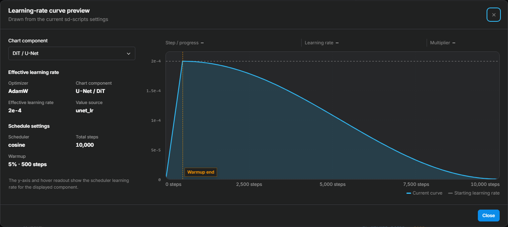

# Optimizer Selection and Parameter Guide

<!-- doc-anchor: quick-choice -->
## Choosing an optimizer

An optimizer updates model parameters from gradients. It mainly affects learning speed, memory use, and stability.

Start with AdamW8bit. Compare StableAdamW for update spikes, or a Paged variant when optimizer state does not fit in VRAM. After switching, use the learning-rate table below to choose a starting value.

| Main goal | Options to compare | What to inspect |
| --- | --- | --- |
| Establish a general baseline | AdamW8bit | Whether learning rate, duration, and data issues are easy to distinguish |
| Reduce optimizer-state memory | 8-bit; Paged variants when needed | Peak memory and transfer overhead |
| Handle update spikes or low-precision rounding | StableAdamW | Whether abnormal updates decrease, not just one final preview |
| Compare factored statistics and update clipping | CAME | Stability, speed, and generated results |
| Reduce manual step-size tuning | Prodigy family | Whether automatic estimates reach a useful range promptly |
| Compare matrix update methods | Muon, SOAP | Learning speed and additional computation |
| Compare methods designed for LoRA factors | LoRA-Muon, LoRA-RITE | Factor-pair compatibility and separately tuned learning rates |

<!-- doc-anchor: optimizer-type -->
## Available optimizers

| Optimizer | Primary purpose | Restrictions |
| --- | --- | --- |
| AdamW | Full-precision AdamW baseline | Uses more optimizer-state VRAM than the 8-bit builds |
| AdamW8bit | Everyday default | Small tensors keep FP32 state by design |
| PagedAdamW8bit | When the regular 8-bit optimizer still does not fit | Only difference is paging; transfers between CPU and GPU may slow training |
| StableAdamW | Gradient spikes, low-precision LoRA weights | Uses more state VRAM than AdamW8bit; does not prevent overfitting |
| Lion | Symbolic-momentum optimizer for comparison | Works with a different LR range; tune it separately |
| Lion8bit | Lion with less state VRAM | Needs its own LR sweep |
| PagedLion8bit | Lion8bit that also needs paging | Paging does not improve quality and may slow training |
| Prodigy | Optimizer-estimated update scale | Base LR must be `1.0`; not supported with LoRA+ here |
| ProdigyPlusScheduleFree | Automatic step-size estimation and internal scheduling | External scheduler and warmup are ignored; compare against an established baseline |
| Automagic3 | Experimental adaptive scheme | Test only against a solid baseline; requires gradient accumulation of 1; fp16 mixed precision and multi-GPU are not supported |
| AdaFactor | Very tight optimizer memory | Relative-step mode takes over the LR and restricts LoRA+ |
| CAME | Comparison when source images mix and update scale varies | Uses three betas and internal RMS clipping |
| AdamWScheduleFree | Testing AdamW without an external scheduler | Supports internal warmup, but this project leaves `warmup_steps=0`; not a first choice for short runs |
| EmoSens | Experimental optimizer | Requires gradient accumulation of 1; fp16 mixed precision and multi-GPU are not supported; LoRA+ not supported |
| Muon | Momentum orthogonalization for two-dimensional LoRA matrices | Anima LoRA only; uses PyTorch's native implementation; compare it with AdamW8bit under identical conditions |
| LoRA-Muon | Spectral low-rank optimization designed for standard LoRA factor pairs | Supports only `anima-lora` with `networks.lora_anima`; incompatible with LoRA+ and LyCORIS networks such as LoKr and LoHa; requires separate learning-rate calibration |
| Adan | Updates that incorporate changes between gradients | The project starts at half the AdamW learning rate; uses three betas |
| AdEMAMix | Comparison for long runs or visibly noisy gradients | Benefit of the slow moving average is uncertain in short runs; alpha and ramp lengths should match the training length |
| AdEMAMix8bit | AdEMAMix when optimizer-state memory is tight | Differs from the full-precision version mainly in state quantization |
| LoRA-RITE | Trying an update rule designed for LoRA's structure | Anima LoRA and standard LoRA structure only; no LoRA+; uses its own clipping, `max_grad_norm` (global gradient clipping threshold) locks to 0 |
| SOAP | Adam-style updates in a rotated coordinate system | Preconditioning adds memory and computation; the project caps preconditioned dimensions at `256` by default |

Memory notes above refer only to optimizer state. Peak usage also depends on resolution, rank, batch size, cache, and preview generation.

<!-- doc-anchor: stable-comparison -->
## AdamW8bit, CAME, StableAdamW: how they differ

**AdamW8bit is the baseline.** It uses little state memory, is well understood, and makes it easy to isolate your learning rate, step count, and data issues. Use it unless you have a specific stability or memory concern.

**CAME uses factorized state with internal RMS clipping.** Use it to compare state storage and update stabilization. Clean and caption mixed-source datasets first.

**StableAdamW limits unusually large updates.** It supports standard schedulers, warmup, `max_grad_norm`, and LoRA+. Anima starts at `lr=2e-5`, `betas=(0.9, 0.99)`, `eps=1e-8`, and `weight_decay=0`; SDXL starts at `1e-4`. It uses more state memory than AdamW8bit and is mainly useful for update stability problems.

<!-- doc-anchor: parameters -->
## Parameter reference

<!-- doc-anchor: learning-rate -->
### Learning rate

Learning rate controls update size. Higher values speed up learning but increase the risk of loss spikes, rigid compositions, and weaker prompt control. Lower values make smaller updates and need more training steps.

The table lists project starting values. Optimizers use different update scales and need separate learning-rate tuning; these defaults are not dataset-specific optima.

| Optimizer | Anima starting LR | Usage |
| --- | ---: | --- |
| AdamW / AdamW8bit / PagedAdamW8bit | `2e-5` | Official Anima rank-32 baseline; 8-bit and paged builds keep the same LR semantics |
| StableAdamW | `2e-5` | Same scale as AdamW first; isolate the stabilized updates |
| Muon (`match_rms_adamw`) | `2e-5` | Scales by matrix size to bring update RMS into AdamW's range |
| LoRA-Muon | `0.02` | Experimental start; tune independently. Constructor default: `0.1` |
| CAME | `1.5e-5` | Starts at `0.75`× the AdamW baseline |
| Adan | `1e-5` | Starts at `0.5`× AdamW; compare convergence separately |
| AdEMAMix / AdEMAMix8bit | `2e-5` | The paper keeps Adam-scale learning rates; 8-bit keeps the same LR semantics |
| LoRA-RITE | `1e-4` | Uses a different update scale from Adam; tune separately |
| SOAP | `2e-5` | Start comparisons from the AdamW baseline |
| Lion / Lion8bit / PagedLion8bit | `5e-6` | Lion's guidance is roughly `3`–`10`× smaller than AdamW |
| AdamWScheduleFree | `1e-4` | Schedule-Free guidance often `1`–`10`× higher than the base optimizer; treated as experimental on Anima |
| Prodigy / ProdigyPlus | `1.0` | D-adaptation scale; not comparable to `2e-5` |
| AdaFactor relative step | Controlled by the optimizer | With relative step off, Anima manual mode starts at `2e-5` |
| Automagic3 / EmoSens | `1e-4` / `0.1` | Internal dynamic-LR baseline values, not ordinary fixed LR |

The Lion `5e-6` simply applies the paper's rule of thumb — roughly 3–10× smaller than AdamW. The paper also recommends scaling weight decay up by roughly 3–10×, which this project does not adopt, so this is not the complete official Lion recipe.

SDXL keeps its own generic baselines: `1e-4` for AdamW/StableAdamW, `1e-4` for CAME, `2e-5` for Lion, `3e-4` for AdamWScheduleFree. When you switch model type or optimizer, the UI only replaces recommended values you have not edited manually; imported and custom values stay as they are.

`network_alpha / network_dim` scales the LoRA branch. The upstream sd-scripts `1e-4` example assumes effectively `alpha=1` and explicitly says to lower or re-validate LR when raising it, so do not apply that example literally to this project's default `rank=32, alpha=32`.

When a character locks in, colors bleed, or prompt adherence drops too early, lower the learning rate or reduce training steps. When the model underlearns, confirm the trigger word and useful step count before nudging the LR up. Lion's usable LR range is different from AdamW's; test it on its own.

<!-- doc-anchor: scheduler-warmup -->
### LR scheduler and warmup

AdamW, AdamW8bit, StableAdamW, Lion, CAME, Muon, and LoRA-Muon run under the external scheduler. New Anima configurations default to `constant`, matching the upstream Anima examples and removing one variable from short runs. With the default `num_cycles=1`, `cosine_with_restarts` never actually restarts; restarts only occur when `num_cycles` is greater than 1. Existing hand-made configs keep working; to test warmup, `constant_with_warmup` is the simple option, and keep it under `5%` of total optimizer steps first.

AdamWScheduleFree and ProdigyPlus manage their own schedule, so the UI forces the external scheduler to constant. AdamWScheduleFree's internal warmup is separate from `lr_warmup_steps`; ProdigyPlusScheduleFree exposes no comparable warmup setting.

Open **View learning-rate curve** under the schedule field to inspect warmup, decay, and restarts. The sidebar shows the selected component's effective learning rate and warmup steps. When training both the DiT and text encoder, switch components to inspect their curves separately. Check the estimation notice when total steps are not yet known. The curve represents scheduler output, not the optimizer's internal adaptive update magnitude.

| Setting | Main purpose | Risk when taken too far |
| --- | --- | --- |
| Momentum-related coefficients | Smooth short-term gradient fluctuations and use recent or long-term trends | Retaining history too long can slow adaptation |
| Weight decay | Limit continued growth of trainable weights | Excessive decay can prevent adequate fitting |
| Gradient clipping | Reduce occasional unusually large gradients | A very low threshold suppresses ordinary updates too |
| Numerical stability terms | Prevent excessive scaling from very small denominators | Large values alter adaptive scaling rather than simply making it safer |

Leave these settings at their defaults when training is stable. Tune learning rate and duration first.

<!-- doc-anchor: betas -->
### Momentum parameters (betas)

Keep the defaults unless you have a reason to change them:

- AdamW family: `0.9, 0.999`
- StableAdamW, Lion: `0.9, 0.99`
- CAME: `0.9, 0.999, 0.9999`

Higher betas retain history longer and respond more slowly; lower values follow recent gradients more closely. The statistics controlled by each beta vary by optimizer; see the individual sections.

<!-- doc-anchor: eps -->
### Numerical stabilizer (eps)

`eps` prevents very small denominators from amplifying updates. StableAdamW defaults to `1e-8`; PyTorch Muon to `1e-7`. Leave it unchanged unless investigating reproducible numerical errors.

<!-- doc-anchor: weight-decay -->
### Weight decay

For the optimizers covered here, this trainer starts AdamW, AdamW8bit, and PagedAdamW8bit at `weight_decay=0.01`, and CAME, StableAdamW, Muon, and LoRA-Muon at `weight_decay=0`. PyTorch Muon itself defaults to `0.1`; this trainer explicitly overrides it to `0` as a LoRA starting point, and the field remains editable.

Higher weight decay shrinks weights more strongly and can prevent target features from being learned. Lower values relax that constraint; `0` disables it. Start character LoRAs with the project default, then vary decay separately when comparing regularization strength.

<!-- doc-anchor: muon-options -->
### Muon options

Muon accumulates gradient momentum and approximately orthogonalizes updates for two-dimensional matrices. It processes `lora_down` and `lora_up` separately. Use it to compare how matrix-based updates affect learning speed and results.

Muon keeps one momentum state per parameter, compared with full-precision AdamW's two states, but adds matrix multiplications at each step. Record peak VRAM and time per step when comparing them.

#### Update scale

- **Learning rate** (`learning_rate`, Anima default `2e-5`): Directly controls update size. Values that are too high can cause rapid overfitting, noisy loss, or unstable updates; values that are too low learn slowly. With the default scaling, an AdamW baseline is a useful starting point for comparison.
- **Learning-rate scaling** (`adjust_lr_fn`, default `match_rms_adamw`): scales updates by matrix size so an AdamW learning rate is a useful starting point. Retune the rate after changing this rule.
- **Weight decay** (`weight_decay`, default `0`): Higher values shrink the LoRA factors further. This may reduce overfitting or may weaken character learning. PyTorch Muon defaults to `0.1`; the trainer explicitly passes the value shown in the UI.

#### Momentum

- **Momentum coefficient** (`momentum`, default `0.95`): Higher values produce smoother updates but respond more slowly to new gradients; lower values are more sensitive to the current batch.
- **Nesterov momentum** (`nesterov`, enabled by default): Controls how the current gradient and momentum history are combined before orthogonalization. Disabling it changes the optimization path rather than just performance.

#### Orthogonalization

- **Iterations** (`ns_steps`, default `5`): more iterations cost more computation. This approximation is not designed to converge to exact orthogonalization through unlimited iteration. Keep `5` for ordinary training; adjust it when comparing compute costs.
- **Iteration coefficients** (`ns_coefficients`, default `3.4445, -4.775, 2.0315`): Define the polynomial used by the Newton-Schulz iteration. Other values can degrade the approximation or cause numerical problems and are mainly useful in controlled experiments.
- **Numerical stabilizer** (`eps`, default `1e-7`): Prevents division by very small values during normalization. It rarely affects normal training and is mainly relevant when investigating reproducible NaNs or abnormal amplification.

For a first comparison, swap AdamW8bit for Muon and keep data, rank, alpha, scheduler, step count, and learning rate unchanged. Once the run is stable, test LR or weight decay separately. Changing the NS coefficients and iteration count together makes the result difficult to interpret; adjust one at a time.

<!-- doc-anchor: lora-muon-options -->
### LoRA-Muon options

A LoRA acts through the product of two factors. Scaling one factor up and the other down by the same amount preserves that product. Ordinary Muon updates the factors separately, so this distribution of scale can affect optimization.

LoRA-Muon processes the factors as a pair, with the aim of updating the weight change they jointly represent rather than treating each matrix in isolation. It requires separate learning rate tuning; it is not a LoRA switch within ordinary Muon.

#### Parameter reference

| Parameter | Passed as | Default | Accepted values | Effect and recommendation |
| --- | --- | ---: | --- | --- |
| `learning_rate` | Top-level training field; passed to the constructor as `lr` | Anima automatic recommendation: `0.02`; constructor: `0.1` | Finite number `≥ 0` | Controls the overall update scale. Tune this first; do not copy an AdamW learning rate directly |
| `weight_decay` | Common UI field; ultimately passed as an optimizer argument | `0` | Finite number `≥ 0`; also requires `learning_rate * weight_decay < 1` | Uses the paper's split decoupled decay rule. Keep it at `0` unless a controlled comparison supports changing it |
| `momentum` | `optimizer_args` | `0.9` | `0 ≤ momentum < 1` | Exponential moving average of gradients. Higher values are smoother but react more slowly |
| `ns_steps` | `optimizer_args` | `8` | Integer `1–8` | Number of Polar Express / Newton–Schulz matrix-sign iterations. Lower values reduce compute but give a coarser approximation |
| `inv_sqrt_steps` | `optimizer_args` | `7` | Integer `1–7` | Number of Gram inverse-root iterations. Normally leave it at the default |
| `msign_eps` | `optimizer_args` | `1e-20` | Finite number `≥ 0` | Division-by-zero guard used during matrix-sign normalization |
| `inv_sqrt_eps` | `optimizer_args` | `1e-5` | Finite number `≥ 0` | Regularizes Gram matrices when they are singular or nearly singular |
| `inv_sqrt_gamma` | `optimizer_args` | `1.001` | Finite number `> 0` | Damping used by the inverse-root iteration. Leave it unchanged unless investigating a numerical problem |
| `gauge_rebalance` | `optimizer_args` | `false` | `true` / `false` | Periodically balances the scales of the two factors. This is a conditioning operation, not an overfitting regularizer |
| `gauge_rebalance_alpha` | `optimizer_args` | `1.0` | `0 < alpha ≤ 1` | Damping exponent for rebalancing. Values closer to `1` apply a more complete adjustment. Relevant only when rebalancing is enabled |
| `gauge_rebalance_interval` | `optimizer_args` | `1` | Integer `≥ 1` | Number of optimizer steps between rebalancing operations |
| `gauge_power_steps` | `optimizer_args` | `2` | Integer `≥ 1` | Number of power iterations used to estimate factor spectral norms |
| `max_grad_norm` | Top-level trainer field; not a LoRA-Muon constructor argument | Anima automatic recommendation: `0` | `≥ 0` | Global L2 gradient clipping before `optimizer.step`; `0` disables it. This step is not part of the paper's algorithm |

For most users, `learning_rate` is the only parameter that needs initial tuning. Keep `momentum=0.9`, `ns_steps=8`, `inv_sqrt_steps=7`, and the numerical safeguards at their defaults. Leave `gauge_rebalance` disabled unless you specifically want to test factor-scale conditioning.

Start at `0.02` and compare multiplicative increases or decreases with data, rank, alpha, schedule, and step count fixed. Use short runs to exclude underlearning and loss spikes, then narrow the range.

#### Related network settings and compatibility

`network_dim` and `network_alpha` are network settings, not LoRA-Muon constructor arguments, and they do not need to be equal:

- `network_dim` sets the LoRA rank.
- `network_alpha / network_dim` sets the forward scale of the LoRA branch.
- `alpha=dim` only makes the forward scale equal to `1`; LoRA-Muon does not require it.
- Each module must provide a complete `lora_down` and `lora_up` pair with matching rank dimensions.

Selecting LoRA-Muon recommends `dim=16, alpha=16` for untouched Anima fields to reduce parameters, momentum state, and Gram-matrix computation. Manual, imported, and saved values are preserved.

The current implementation has the following compatibility limits:

- It supports only `model_train_type=anima-lora` with `network_module=networks.lora_anima`.
- It is incompatible with LoRA+ because split parameter groups break complete `lora_down → lora_up` pairing.
- It does not support LyCORIS structures such as LoKr, LoHa, or DoRA.
- It supports Linear LoRA and the Conv LoRA shapes used by Anima.
- Matrix operations for FP16/BF16 parameters are performed in FP32 and written back to the original parameter dtype; no separate `dtype` option is required.
- Standard sd-scripts learning-rate schedulers remain supported. LoRA-Muon does not take ownership of the scheduler or warmup.

#### Calculation details

| Term | Meaning here |
| --- | --- |
| Factor pairing | Processing the down and up matrices of the same LoRA together |
| Gram matrix | Describing the size and correlation of directions within a factor |
| Whitening | Using statistics from the other factor to adjust directional scales in the current update |
| Matrix-sign direction | Retaining matrix directions while reshaping singular-value scales; not taking the sign of each element |
| Factor rebalancing | Keeping equivalent factors from having very different magnitudes, as a numerical-conditioning measure |

#### How an update is computed

Each optimizer step roughly follows this sequence:

1. Compute an exponential moving average of the gradient for each LoRA factor.
2. Compute an inverse square root of the opposite factor's Gram matrix and use it to rescale the current factor's directions. This rescaling is referred to as whitening.
3. Apply the matrix-sign operation to the whitened momentum, followed by the second Gram inverse-root factor required by the update.
4. Use the learning rate `η` as the overall first-order weight-space update budget and split that budget evenly between the two factor directions.

The paper calls `η` the trust-region radius. It bounds the spectral norm of the first-order composed weight update; it is not a maximum elementwise change for either `lora_down` or `lora_up`.

<!-- doc-anchor: adan-options -->
### Adan options

Adan tracks both gradients and changes between consecutive gradients. For Anima, start at `1e-5` and tune against learning speed, loss stability, and the best checkpoint.

- **Betas** (default `0.98, 0.92, 0.99`): control the gradient average, the gradient-difference average, and the squared-gradient statistics respectively.
- **Epsilon** (default `1e-8`): same semantics as AdamW.
- **Weight decay** (`weight_decay`, default `0.01`) and **decoupled decay** (`weight_decouple`, on by default): when enabled, weights shrink by `1 − lr × weight_decay` before the update. When disabled, weights are divided by `1 + lr × weight_decay` after the update. Keep the defaults for ordinary training.
- Adan's own `max_grad_norm` argument stays `0` here; gradient clipping is handled by the `max_grad_norm` field (labeled global gradient clipping threshold in the UI).

<!-- doc-anchor: ademamix-options -->
### AdEMAMix options

AdEMAMix uses gradient trends from both shorter and longer time scales. Short-term trends respond quickly; long-term trends can smooth temporary fluctuations, but can also retain early directions that are no longer useful.

| Parameter | What it controls | Effect of increasing it |
| --- | --- | --- |
| `alpha` | Weight of the long-term trend | Gives that trend more influence without extending its decay time |
| Third beta | Retention of long-term history | Values closer to 1 retain history longer and respond more slowly |
| `t_alpha` | Steps used to ramp up the long-term weight | Reaches the target weight later |
| `t_beta3` | Steps used to change the history-retention coefficient | Reaches the target long-term memory length later |

This optimizer's `alpha` is a mixing weight, separate from network Alpha. Start short runs with the defaults; shorten the ramps if the long-term trend enters too late.

`alpha` defaults to `5.0`; `0` removes the slow average from the update. `t_alpha` and `t_beta3` are empty by default and use the estimated total steps at launch, unless the corresponding value is already supplied in custom optimizer arguments. Set either to `0` to disable its ramp, or a positive integer to set the ramp duration. Alpha starts at 0, and β3 starts at β1.

- **Betas** (default `0.9, 0.999, 0.9999`): control the short-term gradient average, squared-gradient average, and long-term gradient average. **Epsilon** defaults to `1e-8`. **Weight decay** defaults to `0.01` and scales with the learning rate.
- The 8-bit variant stores all three states quantized, at roughly a quarter of the full-precision memory; tensors smaller than 4096 elements stay unquantized, which is expected.

<!-- doc-anchor: lorarite-options -->
### LoRA-RITE options

LoRA-RITE uses gradients with factor scaling removed and low-rank matrix preconditioning to reduce sensitivity to equivalent A/B representations. Start Anima at `1e-4` and compare with AdamW8bit.

- **Learning rate** (Anima default `1e-4`): compare values within `5e-5`–`2e-4` initially. Higher rates learn faster; excessive rates cause loss spikes.
- **Betas** (default `0.9, 0.999`): the usual two.
- **Epsilon** (default `1e-6`): note the semantics — this is a root epsilon, squared internally before use; do not carry over the Adam-style `1e-8`.
- **Gradient clip threshold** (`clip_unmagnified_grad`, default `1.0`): suppresses the effect of occasional gradient spikes on the update; the default is sufficient in most cases. The norm is measured after removing the scaling induced by the LoRA factors. When this optimizer is selected, the UI's `max_grad_norm` (global gradient clipping threshold) locks to `0` and this setting takes over; `0` disables clipping.
- Limits: Anima LoRA only; standard LoRA structure only (LyCORIS LoHa, LoKr, DoRA, etc. are not applicable); incompatible with LoRA+ (grouped learning rates break the A/B pairing assumption).
- Cold-start note: with the usual zero-initialized up matrix, the first few steps mostly update the up matrix and the down matrix joins a few steps later. This is expected behavior, not a stall.

<!-- doc-anchor: soap-options -->
### SOAP options

SOAP uses correlations between gradient directions to choose a coordinate basis, applies Adam-style updates in that basis, then transforms the update back. It considers relationships between matrix directions rather than only scaling individual elements.

| Parameter | Default | Effect and tuning |
| --- | --- | --- |
| `max_precondition_dim` | `256` | Largest axis included in matrix preconditioning. Higher limits cost more memory and compute; lower limits leave more axes with elementwise scaling only |
| `precondition_frequency` | `10` | Steps between basis updates. Higher values save compute; lower values follow gradient changes sooner. `1` updates every step |
| `shampoo_beta` | Empty; uses the second beta | Higher values retain history longer and respond more slowly |
| `normalize_gradient` | Off | Normalizes the whole update tensor by its RMS |
| `correct_bias` | On | Corrects bias in averages initialized at zero |
| `precondition_1d` | Off | Preconditions one-dimensional parameters within the size limit, such as normalization weights enabled by `train_norm` |

- **Learning rate** (Anima default `2e-5`): start from the AdamW baseline. The library default `3e-3` is a whole-model training scale and should not be carried over.
- **Betas** (default `0.95, 0.95`): two values. The second one also drives the preconditioner's moving average unless you set that separately. It differs from AdamW's `0.9, 0.999`, so a comparison against AdamW also changes the history length of the second-moment state.
- **Epsilon** (default `1e-8`): added after the square root of the squared-gradient state, same semantics as AdamW.
- **Weight decay** (default `0`): the library default is `0.01`; this project keeps its own `0` and writes it into the config explicitly. The implementation always uses decoupled, non-fixed decay, so there is no switch for it.
- **Gradient clipping**: SOAP has no internal clipping, so the `max_grad_norm` field (global gradient clipping threshold) applies as usual. Its default of `1.0` matches sd-scripts' own default, so it is not written to the config, and nothing is locked for SOAP.
- Statistics and basis matrices use memory proportional to axis length squared. In FP32, the pair uses about 2 MiB for a 512-dimensional axis and 8 MiB for 1024. Keep the `256` limit for ordinary training to avoid large matrices for Anima's 2048- and 8192-dimensional axes.
- SOAP's first update only builds the preconditioner state and does not change any weight; effective updates start on the second step. That is normal behavior of this implementation, not a stall.

<!-- doc-anchor: prodigyplus-options -->
### ProdigyPlus options

The Prodigy family estimates step size during training, while the learning-rate field mainly acts as a multiplier. A displayed value of `1.0` therefore does not mean the same thing as an AdamW learning rate of `1.0`.

| Value | Meaning | Default and guidance |
| --- | --- | --- |
| `D` | Estimated step-size scale | Updated during training; inspect it in the logs |
| Learning-rate field | Multiplier used in step-size calculation | `1.0`; keep the default |
| `d0` | Initial step-size estimate | `1e-6`; normally leave unchanged |
| `d_coef` | Scale applied to step-size estimation | `1.0`; tune this first when adjusting automatic step size. Higher values raise the estimate |

ProdigyPlusScheduleFree also maintains averaged weights for evaluation and saving. Averaging reduces reliance on the very last training state, but newly learned changes can take time to appear in the saved result.

`schedulefree_c` defaults to `0`, which selects the original averaging rule. Among positive values, higher values respond faster to recent updates and lower values produce smoother averages. `0` is a fallback mode, not the lower end of that range.

The logged group learning rate, `D × lr`, and the actual parameter update are different measures. Check what a curve records, then inspect generated samples from several training stages to assess learning.

- **D growth limiter** (`d_limiter`, on by default): limits growth of the step-size estimate. With the default `d_coef=1`, `D` grows by at most about 19% per step. Test it off if growth is too slow, at the cost of greater exposure to one-step overestimates. SPEED uses its own limiter and ignores this setting.
- **Steps before D freezes** (`prodigy_steps`, default `0`): after this many steps `D` freezes at its current value and the estimation buffers are released. For the case where `D` has been verified and the second half should not change it; `0` keeps estimating throughout.
- **Bias correction and automatic warmup** (`use_bias_correction`, off by default): selects a RAdam variant with bias correction and automatic warmup, slowing adjustment of `D`. If `D` stops growing after enabling it, compare with it off.
- **SPEED estimator** (`use_speed`, off by default): raises `D` only when directional progress exceeds its previous peak. Uses less state and tolerates overall gradient rescaling. This is experimental; check stability when combining it with weight decay.
- **Cautious updates** (`use_cautious`, off by default): removes update components that disagree with the current gradient. This implementation masks the update directly, without a first-moment state. Enable it for a separate comparison of directional filtering.
- **Orthogonal gradient updates** (`use_orthograd`, off by default): uses only the gradient component orthogonal to the current weight direction. Enable it when testing this constraint.

- **Estimate D per parameter group** (`split_groups`, on by default): estimates step sizes separately for the text encoder and DiT. Disabling it gives all groups one shared estimate. Keep the default unless comparing global estimation.
- **Share an averaged D across groups** (`split_groups_mean`, off by default): requires `split_groups`. Uses the harmonic mean of group estimates, multiplied by each group's learning rate. Test it when a shared adaptive scale is desired. Small estimates pull the mean down; with this option off, each group estimates and uses its own `D`.
- **Factor second moments** (`factored`, on by default): approximates full second moments with row and column statistics to save memory. Compare full statistics by disabling it when investigating NaNs or stalled `D` growth.
- **Keep factored statistics in FP32** (`factored_fp32`, on by default): reduces half-precision statistics error. Disabling it saves memory only with half-precision gradients. Normally leave it on.
- **Scale weight decay with the learning rate** (`weight_decay_by_lr`, on by default): scales decay with the adaptive learning rate. Disabling it applies full decay at every step and can shrink weights excessively early in training. Normally leave it enabled.
- **Internal update scaling** (`use_stableadamw`, exposed as `prodigyplus_use_stableadamw`, on by default): limits updates by their RMS. This option, or `eps=None` for Adam-atan2, locks global gradient clipping to `0`. Compare it disabled when investigating abnormal adaptive step sizes.
- **Advanced options** (custom `optimizer_args`): `use_grams` and `use_adopt` are experimental update variants; `use_focus` targets noise at large step sizes and disables `factored` and Adam-atan2; `beta3` controls the moving average used to estimate `D` and defaults to √β2; `stochastic_rounding` affects BF16 weights only.

<!-- doc-anchor: gradient-clipping -->
### Global gradient clipping (max_grad_norm)

`max_grad_norm=1` is the common starting value; `0` disables clipping. Lower positive thresholds clip more strongly; higher thresholds allow larger gradients. StableAdamW supports it. LoRA-Muon recommends `0`; LoRA-RITE locks it to `0` and uses internal clipping.

Combining `percentile_clipping=95` with a smaller `max_grad_norm` can clip the same update twice. Without log evidence, keep just one gentler clip.

<!-- doc-anchor: percentile-clipping -->
### Percentile clipping

Applies only to AdamW8bit, PagedAdamW8bit, Lion8bit, and PagedLion8bit.

- `100`: off, and the default
- `99`: a gentle experimental comparison
- `95`: a stronger experimental comparison, only after confirming actual gradient outliers

Lower values clip more strongly. Test `99` when gradient spikes recur; aggressive clipping also weakens useful updates from rare outfits or expressions.

<!-- doc-anchor: min-8bit-size -->
### Minimum 8-bit tensor size (min_8bit_size)

Default `4096`; tensors stay FP32 below this size.

Higher thresholds keep more state in FP32 and use more VRAM; lower thresholds quantize more tensors. Test `16384` for small-tensor numerical issues in low-rank runs. This controls optimizer state only, not model parameter precision.

<!-- doc-anchor: stableadamw-options -->
### StableAdamW-only options

`kahan_sum=True` reduces rounding error with compensated summation, mainly for cases where the LoRA trainable weights themselves are FP16/BF16. The project leaves LoRA trainable weights at FP32 under `mixed_precision=bf16`; only `full_bf16` converts them. Without `full_bf16`, Kahan summation usually makes little difference.

`weight_decouple=True` runs the AdamW-style decoupled decay. With `weight_decay=0` this switch has no effect, but keep it on so the setting behaves correctly if you later raise weight decay.

<!-- doc-anchor: came-clipping -->
### CAME's internal clipping

`came_clip_threshold` defaults to `1.0` and is passed as the optimizer's `clip_threshold`. It clips the RMS of internal updates. Lower thresholds clip more strongly; higher thresholds relax clipping. It is separate from global `max_grad_norm`; adjust it when spikes recur.

<!-- doc-anchor: schedulefree-warmup -->
### Schedule-Free warmup

AdamWScheduleFree uses internal `warmup_steps`; external `lr_warmup_steps` is inactive. The project defaults to `0`, disabling warmup. Test a short internal warmup if early updates are unstable. Higher values extend the learning-rate ramp.

<!-- doc-anchor: stochastic-rounding -->
### Stochastic rounding

Stochastic rounding reduces the drift from low-precision updates that consistently round in the same direction. ProdigyPlus carries the library default; this trainer adds no separate switch. It is a numerical detail, not data augmentation.

### EmoSens v3.9.3

EmoSens adjusts the learning rate automatically as loss changes. Enter a multiplier in `learning_rate`: start with `0.1` for Anima LoRA or `1.0` for SDXL LoRA. The actual rate changes during training and is shown in the training logs.

**Common settings**

- **Stop-signal threshold** `stopcoef`: defaults to `0.04`. Suggests considering a stop when training has settled and recent average loss is at or below this value. Higher values make the hint easier to trigger. Values above `1` are allowed; `0` disables triggering.
- **Show convergence hints** `notify`: on by default. The log message `[READY TO STOP]` suggests considering a stop; it does not end training. Compare nearby saved models before deciding whether to stop. Turning this switch off only hides the message and does not affect training.
- **Enable shadow weights** `use_shadow`: off by default and usually unnecessary for ordinary training. Keeps an extra copy of the weights and blends it with the current weights when loss changes suddenly, using more GPU memory.

Other defaults match upstream: `betas=(0.9, 0.995)`, `eps=1e-8`, and `weight_decay=0.01`.

**Limitations**

Currently, use one GPU, gradient accumulation of `1`, and mixed precision set to `bf16` or `no`. Accumulation and fp16 change the loss value EmoSens reads, while multiple GPUs may calculate different learning rates. These combinations are therefore unsupported.

The form locks the scheduler and warmup settings; you do not need to configure them. Global gradient clipping is still available. EmoSens uses one learning rate for all trained parameters, so LoRA+ is unsupported and separate U-Net / DiT or text encoder rates do not change their actual rates. To train just one component, use the corresponding training switch.

**Version changes and resuming training**

The [v3.9.3 upstream code](https://github.com/muooon/EmoSens/blob/e2c7bb3293baeb339a2d4a21f21ccbdc0260d3be/optimizer/emosens.py) is copied unchanged. Compared with the previous v3.9.1 copy, there are no new parameters. The main change is the automatic learning-rate ceiling. Common multipliers `0.1` and `1.0` still have ceilings of `3e-4` and `3e-3`, respectively. Multipliers above `1` no longer raise the ceiling.

When resuming, keep the original learning-rate multiplier, convergence-hint setting, and shadow-weight setting. The saved state does not fully restore these settings. Resuming a state from an older version also uses the new ceiling rule.

<!-- doc-anchor: loraplus -->
### LoRA+

LoRA+ works with most optimizers, including Muon and Automagic3. The exceptions are Prodigy, ProdigyPlus, EmoSens, LoRA-RITE, and LoRA-Muon (LoRA+'s grouped learning rates are incompatible with LoRA-RITE's A/B pairing and LoRA-Muon's joint update path); AdaFactor requires relative step to be turned off first.

Recheck the LoRA+ ratio after switching optimizers. Automagic3 also requires the multiplied rate to stay between `min_lr` and `max_lr`. See Optimizers and schedulers in the LoRA+ guide for the full rules.

<!-- doc-anchor: scenarios -->
## By dataset type

<!-- doc-anchor: one-image -->
### A lone illustration

For Anima, start AdamW8bit at `1e-5`–`2e-5` and save checkpoints more frequently. SDXL follows its own separate baseline. The biggest risk here is imprinting a single pose and composition; StableAdamW can only level update spikes, not synthesize profiles, backs, or expressions.

<!-- doc-anchor: few-shot -->
### 2–5 images, few-shot

Run the AdamW8bit baseline first. Compare CAME when sources differ substantially, or StableAdamW when loss or gradients spike. Short runs may end before internal schedules have much effect.

<!-- doc-anchor: galgame -->
### Galgame expression sets

Compositions are usually rigid here, and AdamW8bit often suffices. Correct expression captions matter more than an optimizer swap, and the fixed background or standing pose should not become baked into the identity. If expressions are badly unbalanced, add one CAME comparison.

<!-- doc-anchor: dmm-mixed -->
### DMM cards, effects, companion characters mixed

Remove or correctly caption companion characters, text, watermarks, effects, and the different forms, then compare AdamW8bit and CAME. If the log still shows instability, add a StableAdamW comparison. No optimizer can figure out which character in an image is the intended subject; that has to come from captions and data curation.

<!-- doc-anchor: mixed-quality -->
### Mixed-quality inputs

Clean up blurred images, compressed screenshots, duplicate crops, and consecutive Live2D frames first. Control retained images through captions, grouping, and repeats. If gradient spikes remain, compare CAME or test `percentile_clipping=99` separately.

<!-- doc-anchor: outfits-forms -->
### Multiple outfits and forms

This scenario depends on accurate outfit/form tags and sane grouped sampling more than the optimizer. AdamW8bit, CAME, and StableAdamW all work; evaluate costume control, identity retention, and form mixing, not just how crisp one preview looks.

<!-- doc-anchor: style-lora -->
### Style LoRAs

Start with AdamW8bit there too. Generalization depends mostly on subject coverage and captions that separate content from style. StableAdamW can absorb a bad batch, but heavy clipping can also dilute rare stylistic traits.

<!-- doc-anchor: vram -->
### When memory is tight

Use AdamW8bit or Lion8bit first, and switch to paging only when there is confirmed memory pressure. When paging actually engages, the CPU–GPU state transfer can make the run slower. Keep `min_8bit_size` at `4096` to avoid quantizing many tiny tensors for negligible memory savings.

<!-- doc-anchor: starting-configs -->
## Conservative starting configs

| Use | Optimizer and parameters | Other settings |
| --- | --- | --- |
| Anima general baseline | AdamW8bit, LR from the table above, `weight_decay=0.01` | constant scheduler, `max_grad_norm=1`, default rank/alpha, DiT only |
| Anima mixed-source comparison | CAME, LR from the table above, otherwise defaults | constant, `max_grad_norm=1`; validate with a fixed condition |
| Anima gradient-spike comparison | StableAdamW, LR from the table above, keep project stability defaults | Kahan on, constant, `max_grad_norm=1` |
| Anima LoRA-Muon experiment | LoRA-Muon, LR from the table above, otherwise defaults | constant, `max_grad_norm=0`, start with the UI-recommended rank/alpha; change only the LR first |
| Anima Lion experiment | Lion or Lion8bit, LR from the table above | constant; not the full official Lion recipe |
| Gentle 8-bit clipping | AdamW8bit with baseline params, `percentile_clipping=99` | nothing else changes |

Training for too long can bind a character to repeated poses, backgrounds, or clothing. Judge shorter training by the actual number of parameter updates, not repeat counts alone.

| Condition | Effect of reducing repeats |
| --- | --- |
| Fixed epoch count | Usually reduces total image exposures and parameter updates |
| Fixed total step count | Does not directly reduce updates; may change bucketing, shuffling, or subset sampling |
| Repeats reduced for one subset only | May change that subset’s training weight relative to other subsets |

For a complete accumulation window, effective batch size is batch size × accumulation steps × GPU count. Keep batch and accumulation settings fixed in comparisons to avoid changing bucket tails and sample combinations.

To address overfitting, start by considering a shorter total run or a lower learning rate. Choose the stopping point by comparing generated samples from several saved checkpoints.

<!-- doc-anchor: troubleshooting -->
## Troubleshooting by symptom

| Symptom | Check first | Optimizer action worth trying |
| --- | --- | --- |
| Loss plateaus but previews are poor | Data, captions, preview prompt, checkpoint timing | Usually not an optimizer switch |
| Isolated, reproducible loss or gradient spikes | The batch, its images, the LR | Compare StableAdamW, or test `percentile_clipping=99` alone |
| NaN / Inf appears | Stop immediately; check LR, precision settings, bad data, and resume points | Only after those are ruled out, compare StableAdamW; do not mask a persistent problem with clipping |
| Optimizer state overflows memory | Confirm the peak is state, not resolution, batch, or preview | Use 8-bit first, paged only if still tight |
| Pose, background, or outfit memorized quickly | Steps, repeats, LR, data duplication | Reduce LR or shorten training; switching optimizers rarely fixes this |
| Character traits never quite get learned | Trigger word, captions, useful steps, rank, targets | After checking those, raise the LR a bit |

<!-- doc-anchor: ab-testing -->
## Controlled comparisons

1. Fix the dataset, captions, the seed, the base model, VAE, rank/alpha, batch, and total steps.
2. Fix the preview prompt, sampler settings, and generation seed.
3. Find a usable learning-rate range for each optimizer, starting from the table above. Vary only learning rate while keeping the other settings fixed.
4. Compare checkpoints at the same step count, and record gradient norm, peak VRAM, and wall-clock time for each run.
5. Judge on fidelity, costume control, pose/background binding, and prompt response, not just loss.

Start each optimizer run from the same base model. Do not treat another optimizer’s momentum state as interchangeable with the new optimizer’s state.

Prodigy, Muon, and LoRA-Muon use different update scales. Compare them with individually tuned rates and the same training budget; the result compares complete configurations.

<!-- doc-anchor: limits -->
## Scope

Optimizers process gradients. They do not identify incorrect captions or automatically downweight poor images. Address memorized poses and backgrounds through data variety and stopping point first.

<!-- doc-anchor: faq -->
## Frequently asked questions

**Why is the learning rate replaced after I switch model type or optimizer?**

The UI replaces a recommended value only when it has not been manually edited. Manually adjusted values, imported configurations, and custom values are preserved.

**Why is the Prodigy learning rate locked to `1.0`?**

Prodigy is a D-adaptation-style adaptive optimizer that uses the learning rate as a scaling baseline. The sd-scripts documentation recommends setting it near `1.0`, so the UI locks it and explains why.

**Why is StableAdamW's weight decay `0` in the generated configuration?**

The package default is `0.01`; the trainer explicitly overrides it to `0`. AdamW8bit still defaults to `0.01`. Use matching decay values when isolating optimizer differences.

**Why was LoRA+ turned off after I switched optimizer?**

Prodigy, ProdigyPlus, EmoSens, LoRA-RITE, and LoRA-Muon do not support LoRA+. AdaFactor requires both `relative_step` and `warmup_init` off. The UI explains the restriction, and the backend rejects incompatible combinations.

**When training goes wrong, should I change the optimizer or inspect the data first?**

Inspect the dataset, captions, repeats, learning rate, and stopping point first. Optimizers mainly affect convergence speed, state memory, and numerical stability; they are usually not the primary factor in character fidelity.

<!-- doc-anchor: evidence -->
## Evidence and references

Project defaults and compatibility are defined in `backend/training/optimizer_metadata.py`, `optimizer_contracts.py`, and `field_registry.py`. Algorithm details follow the implementations loaded from vendor and the venv. LoRA-Muon's source is documented in `vendor/lora_muon/SOURCE.md`. The papers explain the algorithms; pinned code links are retained as references:

- [Anima model card at a fixed commit](https://huggingface.co/circlestone-labs/Anima/blob/f7382c4bf9d7ffe4ceea593a0adbb470c56dd79b/README.md)
- [sd-scripts Anima training docs at a fixed commit](https://github.com/kohya-ss/sd-scripts/blob/37a1cbbc5725ed2a3575506e7bd2001c9908ac92/docs/anima_train_network.md)
- [CAME official implementation and notes at a fixed commit](https://github.com/yangluo7/CAME/tree/e77c5c022eaf71f1efb82a1433032cdcd5c52610)
- [Lion official implementation and notes at a fixed commit](https://github.com/google/automl/tree/6a54c8741e7c3265d4547c4f35f47a0391122dc5/lion)
- [Schedule-Free official implementation and notes at a fixed commit](https://github.com/facebookresearch/schedule_free/tree/70785b53e778d0e872c0bbb75ff4ee54ee10c291)
- [Transformers cosine restart scheduler implementation at a fixed commit](https://github.com/huggingface/transformers/blob/71c6f699ac9b3f8fc42a6a3e9dc59034c349a678/src/transformers/optimization.py)
- [CAME: Confidence-guided Adaptive Memory Efficient Optimization](https://arxiv.org/abs/2307.02047)
- [Symbolic Discovery of Optimization Algorithms (Lion)](https://arxiv.org/abs/2302.06675)
- [Prodigy: An Expeditiously Adaptive Parameter-Free Learner](https://arxiv.org/abs/2306.06101)
- [The Road Less Scheduled](https://arxiv.org/abs/2405.15682)
- [LoRA+: Efficient Low-Rank Adaptation of Large Models](https://arxiv.org/abs/2402.12354)
- [Adan: Adaptive Nesterov Momentum Algorithm for Faster Optimizing Deep Models](https://arxiv.org/abs/2208.06677)
- [The AdEMAMix Optimizer: Better, Faster, Older](https://arxiv.org/abs/2409.03137)
- [LoRA Done RITE: Robust Invariant Transformation Equilibration for LoRA Optimization](https://arxiv.org/abs/2410.20625)
- [LoRA-RITE official implementation at a fixed commit](https://github.com/gkevinyen5418/LoRA-RITE/tree/d4186b6fedb39300d23c00ce0334db09719da9fc)
- [LoRA-Muon: Spectral Steepest Descent on the Low-Rank Manifold](https://arxiv.org/abs/2606.12921)
- [pytorch-optimizer implementation at a fixed commit](https://github.com/kozistr/pytorch_optimizer/tree/3d08fa02cb6617d4d12365ca0f7d643b72e8cbe8)
- [bitsandbytes optimizer implementation at a fixed commit](https://github.com/bitsandbytes-foundation/bitsandbytes/tree/a2b90e6eae31a958e6b4d85edf2cfb2b91e9ce29)
