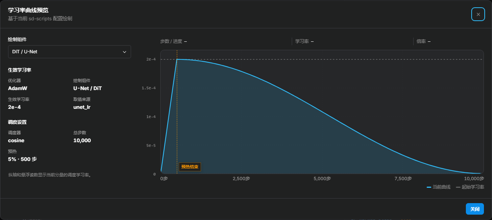

# 优化器选择与参数指南

> 大多数 Anima / SDXL LoRA 训练，建议先用 **AdamW8bit** 建立基准。基准训练稳定时，通常无需更换优化器。
>
> 数据来源和质量差异较大时，可以对比 **CAME**；日志中出现可复现的梯度尖峰，或 LoRA 可训练权重为 FP16/BF16 时，可以对比 **StableAdamW**。

优化器影响收敛速度、显存占用和数值稳定性，但通常不是人物还原度的首要决定因素。少图人物训练出现问题，应先检查数据、标注、重复次数、学习率和停止时机。

本文区分“实现与论文事实”和“Anima 工程起点”：CAME、Lion、Schedule-Free 的论文结果或库默认值，都不能直接当作 Anima LoRA 的最优配置。Anima 官方模型卡建议使用 **Anima-Base**、不训练 LLM Adapter、rank 32，并从 `2e-5` 附近小幅调整。本训练器以 `rank=32, alpha=32` 为工程起点，其中 `alpha=32` 是项目自己的选择，仍需要按数据集验证。Krea 2 训练不适用本文的起点值（其优化器基线不同，如 ScheduleFree 为 `0.0025`）。

<!-- doc-anchor: quick-choice -->
## 快速选择

| 训练情况 | 建议起点 | 说明 |
| --- | --- | --- |
| 首次训练，或没有明确的稳定性问题 | AdamW8bit | 参数习惯成熟、状态显存较低，便于和常见配置比较 |
| DMM 卡面、立绘、截图、特效图混合 | 先用 AdamW8bit，再对比 CAME | CAME 的内部裁剪可能改善更新稳定性，但它并不能辨别低质量图片 |
| 出现明显且可复现的 loss 或梯度尖峰 | 先排查异常图片和学习率，再对比 StableAdamW | StableAdamW 主要改善更新稳定性，不代表必然提高画质 |
| LoRA 可训练权重为 FP16/BF16 | StableAdamW | `kahan_sum` 主要在低精度参数更新中发挥作用 |
| 优化器状态显存不足 | AdamW8bit；仍不足时用 PagedAdamW8bit | Paged 版本改变内存调度方式；发生 CPU/GPU 数据交换时可能降低训练速度 |
| 想减少学习率调参 | Prodigy | 项目要求基础学习率为 `1.0` |
| 想比较矩阵正交化更新 | Muon | 先保持 AdamW 基线学习率，只更换优化器 |
| 想测试针对 LoRA 因子设计的矩阵优化 | LoRA-Muon | 与 AdamW8bit 固定条件对照；学习率需要单独校准 |
| 想比较矩阵预条件更新 | SOAP | 先保持 AdamW 基线学习率；紧凑 LoKr 比普通 LoRA 更值得试 |

少图人物训练可以优先比较 **AdamW8bit、CAME、StableAdamW**。对照时一次只改一个主要变量，否则无法判断差异来源。

<!-- doc-anchor: optimizer-type -->
## 当前可用优化器

| 优化器 | 主要用途 | 限制与注意事项 |
| --- | --- | --- |
| AdamW | 全精度 AdamW 基准 | 优化器状态显存比 8-bit 版本高 |
| AdamW8bit | 通用默认 | 小张量默认保留 FP32 状态，这是正常行为 |
| PagedAdamW8bit | 常规 8-bit 优化器仍放不下显存时 | 与 AdamW8bit 的区别只有分页；发生 CPU/GPU 数据交换时可能降低训练速度 |
| StableAdamW | 梯度尖峰、低精度 LoRA 权重 | 状态显存通常高于 AdamW8bit；不能防止过拟合 |
| Lion | 对比符号动量优化器 | 合理学习率范围与 AdamW 不同，需要重新调整 |
| Lion8bit | 降低 Lion 的状态显存 | 需要独立调整学习率 |
| PagedLion8bit | Lion8bit 同时需要分页时 | 分页不改善生成质量，并可能降低训练速度 |
| Prodigy | 由优化器估计更新尺度 | 基础学习率用 `1.0`；本项目不支持搭配 LoRA+ |
| ProdigyPlusScheduleFree | 用于试验内部调度及其组合特性 | 外部 scheduler 和 warmup 不生效，少图短训练中的收益不确定 |
| Automagic3 | 项目实验性自适应方案 | 建议在有明确基准时测试；要求梯度累积为 1、禁用 mixed_precision=fp16、仅支持单卡 |
| AdaFactor | 优化器状态显存紧张 | relative step 模式会接管学习率，并限制 LoRA+ |
| CAME | 数据来源混合、更新尺度波动较大时用作对照 | 使用三个 beta 和内部 RMS 裁剪 |
| AdamWScheduleFree | 测试不依赖外部 scheduler 的 AdamW | 支持内部 warmup，但本项目默认 `warmup_steps=0`；短训练不建议作为第一选择 |
| EmoSens | 项目实验性优化器 | 要求梯度累积为 1、禁用 mixed_precision=fp16、仅支持单卡，不支持 LoRA+ |
| Muon | 对二维 LoRA 矩阵执行动量正交化 | 仅 Anima LoRA 可用；当前使用 PyTorch 原生实现；建议与 AdamW8bit 做同条件对照 |
| LoRA-Muon | 针对标准 LoRA 因子分解的低秩谱下降优化器 | 仅支持 `anima-lora` 与 `networks.lora_anima`；不支持 LoRA+、LoKr、LoHa 等 LyCORIS 网络；学习率需要单独校准 |
| Adan | 想在相近步数内更快建立特征时对照 AdamW | 收敛更激进，学习率应低于 AdamW 基线；使用三个 beta |
| AdEMAMix | 长训练或梯度噪声明显时用作对照 | 短训练中慢速状态的收益不确定；alpha 与缓升步数需要和训练总长匹配 |
| AdEMAMix8bit | 使用 AdEMAMix 且优化器状态显存紧张时 | 与全精度版本的差异主要在状态量化 |
| LoRA-RITE | 试验专为 LoRA 结构设计的更新方式 | 仅 Anima LoRA、仅标准 LoRA 结构；不支持 LoRA+；自带梯度裁剪，`max_grad_norm`（全局梯度裁剪阈值）锁定为 0 |
| SOAP | 在 Adam 之外用梯度统计做矩阵预条件时对照 AdamW | 库默认的预条件维度会让 Anima 长轴占用大量显存，本项目改用更小的默认值；作者的收益说明面向较大 batch，少图小 batch 下尚无公开对照 |

表中的显存说明仅针对优化器状态。实际峰值还受分辨率、rank、batch、缓存和预览生成影响。

<!-- doc-anchor: stable-comparison -->
## AdamW8bit、CAME、StableAdamW 的区别

**AdamW8bit 适合做基准。** 状态显存低、用的人多、经验成熟，也便于区分学习率、步数和数据问题。没有明确的稳定性或显存问题时，优先用它。

**CAME 使用因子化状态和内部 RMS 裁剪。** 卡面、截图、立绘的画质和构图差异较大时，可作 AdamW8bit 的对照。CAME 处理的是参数更新，不会判断图片质量；伙伴角色、文字、特效和错误标注仍需在数据处理阶段解决。

**StableAdamW 限制异常大的参数更新。** 它支持常规学习率调度器、预热、`max_grad_norm` 和 LoRA+。本项目在 Anima 中沿用 AdamW 基线：`lr=2e-5`、`betas=(0.9, 0.99)`、`eps=1e-8`、`weight_decay=0`；SDXL 的界面起点仍为 `1e-4`。它不是 8-bit 优化器，状态显存通常高于 AdamW8bit。

基准训练的曲线和预览都正常时，StableAdamW 的额外收益可能较小，它的主要用途是改善更新稳定性。

<!-- doc-anchor: parameters -->
## 参数说明

<!-- doc-anchor: learning-rate -->
### 学习率（learning rate）

Anima 只训练 DiT 主干时，可从下面的工程起点开始。官方 Anima 依据只覆盖 rank 32 与约 `2e-5`；表中其他优化器数值和 `alpha=32` 属于迁移或项目选择。不同优化器的学习率不在同一数值尺度上：AdamW 依靠逐元素的一阶/二阶统计缩放，而 LoRA-Muon 将学习率直接作用于白化后的矩阵符号更新，因此相同的 `2e-5`、`1e-4` 或 `1e-3` 并不代表相同的实际参数步长，不能直接横向照搬。

| 优化器 | Anima 工程起点 | 依据与含义 |
| --- | ---: | --- |
| AdamW / AdamW8bit / PagedAdamW8bit | `2e-5` | Anima 官方模型卡的 rank 32 基线；8-bit 与分页不改变 LR 语义 |
| StableAdamW | `2e-5` | 先与 AdamW 同尺度，单独比较稳定化更新 |
| Muon (`match_rms_adamw`) | `2e-5` | 按矩阵尺寸匹配 AdamW 更新 RMS；尚不是 Anima 实测最优值 |
| LoRA-Muon | `0.02` | 本项目为 Anima 设置的实验性工程起点；论文仅在 TinyShakespeare 小型 Transformer 扫参中报告最佳测试值 `0.1`，该结果不能直接视为 Anima 的推荐值 |
| CAME | `1.5e-5` | CAME 官方建议用 AdamW 的 `0.5`～`0.9` 倍；这是迁移起点，不是 Anima 实测最优值 |
| Adan | `1e-5` | 实际步长大于同学习率的 AdamW，按基线的 `0.5` 倍起步 |
| AdEMAMix / AdEMAMix8bit | `2e-5` | 论文沿用 Adam 量级的学习率；8-bit 不改变学习率语义 |
| LoRA-RITE | `1e-4` | 论文中最优值约为 Adam 的 20 倍；本项目小样本实测 `2e-4` 平稳、`5e-4` 出现过热 |
| SOAP | `2e-5` | 更新是旋转坐标系中的 Adam 归一化步，量级与 AdamW 同尺度；尚不是 Anima 实测最优值 |
| Lion / Lion8bit / PagedLion8bit | `5e-6` | Lion 官方建议 LR 比 AdamW 小约 `3`～`10` 倍 |
| AdamWScheduleFree | `1e-4` | 官方建议常比基准优化器高 `1`～`10` 倍；Anima 缺少充分验证，按实验方案使用 |
| Prodigy / ProdigyPlus | `1.0` | D-adaptation 缩放基准，不能与 `2e-5` 直接比较 |
| AdaFactor relative step | 由优化器接管 | 关闭 relative step 后，Anima 手动模式从 `2e-5` 开始 |
| Automagic3 / EmoSens | `1e-4` / `0.1` | 算法内部动态 LR 的基准值，不是普通固定 LR |

Lion 的 `5e-6` 只沿用了官方给出的“LR 比 AdamW 小约 3～10 倍”这一比例。官方还建议同时把 weight decay 增大 3～10 倍，本项目未沿用，因此这不是完整的官方 Lion 配方。

SDXL 保留独立的通用起点：AdamW/StableAdamW 为 `1e-4`、CAME 为 `1e-4`、Lion 为 `2e-5`、AdamWScheduleFree 为 `3e-4`。切换模型类型或优化器时，界面只替换尚未手动修改的推荐值；导入的配置和自定义值保持原样。

`network_alpha / network_dim` 会缩放 LoRA 分支。上游 sd-scripts 的 `1e-4` 示例对应 `alpha=1`，并明确说明提高 alpha 时应重新降低或验证 LR；因此不能把这个示例直接套到本项目默认的 `rank=32, alpha=32`。

人物过早出现构图僵化、串色或提示词响应下降时，可以降低学习率或减少训练步数。学习不足时，先确认触发词和有效训练步数，再小幅提高学习率。Lion 的合理学习率范围与 AdamW 不同，需要单独测试。

LoRA-Muon 的学习率需要独立校准。`0.02` 是本项目为 Anima 提供的实验性工程起点，不代表已知最优值。首次比较时，应固定数据、seed、rank、alpha、scheduler 和总步数，以 `0.02` 为中心按倍数向下和向上测试；先用短程预览排除明显学习不足、过热或不稳定的范围，再围绕较好的区间加密测试。论文中的 `0.1` 来自 TinyShakespeare 小型语言模型实验，不应直接作为 Anima 默认值。

<!-- doc-anchor: scheduler-warmup -->
### 学习率调度器与预热（scheduler 和 warmup）

AdamW、AdamW8bit、StableAdamW、Lion、CAME、Muon 和 LoRA-Muon 都使用外部学习率调度器。Anima 新配置默认用 `constant`，以匹配上游 Anima 示例，并减少短训练中的额外变量。`cosine_with_restarts` 在默认 `num_cycles=1` 时不会在训练中途重启，只有 cycles 大于 1 才会周期重启。已有的手动配置可以继续使用；想测试预热，可改用 `constant_with_warmup`，并把预热步数控制在总优化器步数的 `5%` 以内。

AdamWScheduleFree 和 ProdigyPlusScheduleFree 自己管理调度，界面会把外部调度器固定为 constant。AdamWScheduleFree 的内部预热与 `lr_warmup_steps` 是两回事；ProdigyPlusScheduleFree 没有暴露对应的可调预热参数。

在“学习率变化方式”下点击“查看学习率曲线”，可检查预热、衰减和重启的实际形状。侧栏显示当前组件的生效学习率与预热步数；同时训练 DiT 和文本编码器时，可切换组件查看各自曲线。总步数尚未确定时，请留意预览中的估算提示。曲线表示调度器输出，不预测优化器内部的自适应更新幅度。

<!-- doc-anchor: betas -->
### 动量参数（betas）

没有明确的调整依据时，保留默认值：

- AdamW 系列：通常是 `0.9, 0.999`
- StableAdamW、Lion：通常是 `0.9, 0.99`
- CAME：需要三个 beta

beta 越高，更新越平滑，但对新梯度的响应越慢。常规调优优先调整学习率，而不是 beta。

<!-- doc-anchor: eps -->
### 数值稳定项（eps）

`eps` 防止分母过小导致数值放大。StableAdamW 默认 `1e-8`；PyTorch Muon 默认 `1e-7`。没有可复现的数值问题时，不建议修改。

<!-- doc-anchor: weight-decay -->
### 权重衰减（weight decay）

对本文重点介绍的优化器，本训练器提供以下起点：AdamW、AdamW8bit 和 PagedAdamW8bit 为 `0.01`；CAME、StableAdamW、Muon 与 LoRA-Muon 为 `0`。PyTorch Muon 自身默认 `0.1`，本训练器为 LoRA 起步显式覆盖为 `0`，用户仍可修改。

人物 LoRA 容量有限，没有对照结果时不宜使用较大的权重衰减。想为 AdamW8bit 测试 `weight_decay=0`，应把它当作单独的参数实验，保持数据、步数和其他设置不变。

StableAdamW 库默认 `weight_decay=0.01`，本训练器会明确写出 `weight_decay=0` 覆盖它。这是有意设置，不是参数缺失。

<!-- doc-anchor: muon-options -->
### Muon 参数

Muon 先累积梯度动量，再把二维矩阵的更新做近似正交化。AdamW 按元素的二阶统计缩放更新，Muon 更关注整个矩阵的更新方向。对 LoRA 来说，它会分别处理 `lora_down` 和 `lora_up`；可能改变收敛速度和学习到的方向，但不保证最终画质优于 AdamW8bit。

Muon 每个参数只维护一组动量状态，少于全精度 AdamW 的两组状态，但每一步会增加矩阵乘法。实际显存和速度仍取决于矩阵大小、rank、batch 和注意力实现。

#### 更新幅度

- **学习率**（`learning_rate`，Anima 默认 `2e-5`）：直接控制更新幅度。过高时可能很快过拟合、loss 波动或更新不稳定；过低时学习缓慢。使用默认缩放时可从 AdamW 基线开始比较。
- **学习率缩放**（`adjust_lr_fn`，默认 `match_rms_adamw`）：`match_rms_adamw` 可沿用 AdamW 配方的学习率和权重衰减，适合比较两种优化器本身的差异。`original` 按矩阵长宽比缩放更新，通常需要单独确定学习率；不同形状的矩阵在相同学习率下并不具有相同的实际更新幅度。
- **权重衰减**（`weight_decay`，默认 `0`）：数值增大会使 LoRA 因子进一步收缩，可能抑制过拟合，也可能削弱角色学习。PyTorch Muon 的库默认值为 `0.1`，本训练器会显式传入界面中的值。

#### 动量

- **动量系数**（`momentum`，默认 `0.95`）：数值越高，更新越平滑，但对新梯度的响应越慢；数值越低，对当前 batch 越敏感。
- **Nesterov 动量**（`nesterov`，默认开启）：决定正交化前如何组合当前梯度和历史动量。关闭后会改变优化轨迹，不是单纯的性能开关。

#### 正交化

- **迭代次数**（`ns_steps`，默认 `5`）：次数越多，正交化近似越充分，单步计算量也越高；减少次数可以降低计算量，但会改变更新结果。界面允许的上限为 `99`。
- **迭代系数**（`ns_coefficients`，默认 `3.4445, -4.775, 2.0315`）：决定 Newton-Schulz 迭代使用的多项式。其他取值可能降低近似效果或带来数值问题，主要用于受控实验。
- **数值稳定项**（`eps`，默认 `1e-7`）：防止归一化时除数过小。它通常不影响正常训练，主要用于排查可复现的 NaN 或异常放大。

第一次比较建议只把 AdamW8bit 换成 Muon，保持数据、rank、alpha、scheduler、步数和学习率不变。确认训练稳定后，再单独测试学习率或 weight decay。同时修改 NS 系数和迭代次数会让结果难以解释，建议一次只调整一个。

<!-- doc-anchor: lora-muon-options -->
### LoRA-Muon 参数

#### 它与 Muon 有什么不同

一个 LoRA 模块包含 `lora_down` 和 `lora_up` 两个因子。模型实际使用的是二者合成的权重更新：

\[
\Delta W = \text{lora\_up}\times\text{lora\_down}
\]

同一个 `ΔW` 可以由许多不同的因子数值表示。例如，把一侧放大 2 倍、另一侧缩小到一半，合成结果仍然不变。

普通 Muon 会把 `lora_down` 和 `lora_up` 当作两张独立矩阵，分别计算动量和正交化更新。因子之间怎样分配尺度，可能因此影响最终作用到 `ΔW` 上的更新。

LoRA-Muon 从合成权重 `ΔW` 的低秩矩阵空间出发，再把更新分配回两个因子。它不是 Muon 的一个参数选项，而是为 LoRA 因子结构重新推导的优化器。对于满足论文满列秩前提的因子，理想权重空间更新具有因子表示不变性：经过可逆变换后仍表示同一个 `ΔW` 的因子对，会产生相同的合成权重更新。当前实现使用 Gram 正则、有限次矩阵迭代和数值保护，因此是该理论更新的数值近似。

| 对比项 | Muon | LoRA-Muon |
| --- | --- | --- |
| 优化对象 | 分别处理每个 LoRA 因子 | 从两个因子共同形成的低秩权重更新出发 |
| `lora_down` / `lora_up` | 分别计算更新 | 按配对关系联合计算 |
| 因子等价变换 | 可能改变最终的合成权重更新 | 满足理论前提时，理想更新不依赖等价的因子表示 |
| 主要矩阵运算 | 动量与矩阵正交化 | Gram 逆平方根、白化、矩阵符号与因子耦合 |
| 学习率尺度 | `match_rms_adamw` 模式可近似对齐 AdamW 的更新 RMS | 不能直接套用 AdamW 的数值，需要单独校准 |
| 优化器状态 | 每个参数保存一阶动量 | 每个 LoRA 因子保存一阶动量，不保存二阶矩 |

这种结构并不保证 LoRA-Muon 在所有数据集上都优于 AdamW8bit 或 Muon。论文目前验证的是 TinyShakespeare 小型 Transformer，没有提供 Anima 或扩散模型 LoRA 的正式对照结果。

#### 更新过程

每一步大致包含以下过程：

1. 分别计算两个 LoRA 因子的梯度移动平均，也就是一阶动量。
2. 根据另一侧因子的 Gram 矩阵计算逆平方根，用它调整当前因子不同方向的尺度。文中把这个过程简称为“白化”。
3. 对调整后的动量计算矩阵符号方向，再乘一次 Gram 逆平方根，得到因子更新。
4. 用学习率 `η` 控制合成权重更新的一阶总预算，并把预算平均分给两个因子方向。

论文把 `η` 称为信赖域半径。这里的“半径”约束的是合成权重一阶更新的谱范数，不是任意一个 `lora_down` 或 `lora_up` 元素的最大变化量。

#### 参数表

| 参数 | 传递位置 | 默认值 | 合法范围 | 作用与建议 |
| --- | --- | ---: | --- | --- |
| `learning_rate` | 顶层训练参数，作为构造函数的 `lr` | Anima 自动推荐 `0.02`；构造函数 `0.1` | 有限数且 `≥ 0` | 控制整体更新尺度。它是最值得优先调整的参数；不要直接套用 AdamW 的学习率 |
| `weight_decay` | 通用界面字段，最终作为优化器参数传递 | `0` | 有限数且 `≥ 0`；同时要求 `learning_rate * weight_decay < 1` | 使用论文的分拆式解耦衰减。没有明确对照结果时保持 `0` |
| `momentum` | `optimizer_args` | `0.9` | `0 ≤ momentum < 1` | 梯度的一阶指数移动平均。增大后更平滑，但对新梯度反应更慢 |
| `ns_steps` | `optimizer_args` | `8` | 整数 `1–8` | 矩阵符号的 Polar Express / Newton–Schulz 迭代次数。减少会降低计算量，也会让近似更粗 |
| `inv_sqrt_steps` | `optimizer_args` | `7` | 整数 `1–7` | Gram 逆平方根的迭代次数。通常保持默认 |
| `msign_eps` | `optimizer_args` | `1e-20` | 有限数且 `≥ 0` | 矩阵符号归一化时的除零保护。通常不需要修改 |
| `inv_sqrt_eps` | `optimizer_args` | `1e-5` | 有限数且 `≥ 0` | 给 Gram 矩阵加入正则项，降低奇异或接近奇异时的不稳定风险 |
| `inv_sqrt_gamma` | `optimizer_args` | `1.001` | 有限数且 `> 0` | Gram 逆平方根迭代的阻尼系数。没有数值问题时保持默认 |
| `gauge_rebalance` | `optimizer_args` | `false` | `true` / `false` | 是否定期重新平衡两个 LoRA 因子的尺度。这是数值调理功能，不是防止过拟合的正则化 |
| `gauge_rebalance_alpha` | `optimizer_args` | `1.0` | `0 < alpha ≤ 1` | 重平衡强度的阻尼指数；越接近 `1`，单次调整越充分。仅在启用重平衡后有意义 |
| `gauge_rebalance_interval` | `optimizer_args` | `1` | 整数 `≥ 1` | 每隔多少个优化器步执行一次重平衡 |
| `gauge_power_steps` | `optimizer_args` | `2` | 整数 `≥ 1` | 估计两个因子谱范数时使用的幂迭代次数。次数越多越慢 |
| `max_grad_norm` | 顶层训练参数，不属于 LoRA-Muon 构造函数 | Anima 自动推荐 `0` | `≥ 0` | 在 `optimizer.step` 前执行的全局 L2 梯度裁剪；`0` 表示关闭。论文算法不包含此步骤 |

对大多数用户，只需要优先调整 `learning_rate`。建议保持 `momentum=0.9`、`ns_steps=8`、`inv_sqrt_steps=7` 和数值保护项不变。`gauge_rebalance` 默认关闭；只有在观察到两个因子尺度明显失衡或需要专门比较这一功能时，再单独启用。

不能把 AdamW 的学习率直接复制到 LoRA-Muon。两种优化器都会把学习率乘到已经计算好的更新上，但学习率之前的处理完全不同：AdamW 使用逐元素二阶统计缩放，LoRA-Muon 使用 Gram 白化和矩阵符号归一化。因此，两者相同的学习率数值通常不会产生相同的实际更新幅度。

`0.02` 是本项目在 Anima 条件下设置的实验性自动推荐值，不是论文结论或已知最优值。论文在 TinyShakespeare 小型 Transformer 扫参中得到的最佳测试值是 `0.1`；其实验尚未覆盖大规模预训练或下游微调任务，因此不应把 `0.1` 直接用作 Anima 默认值。

#### 相关网络设置与兼容性

`network_dim` 和 `network_alpha` 不是 LoRA-Muon 构造参数，也不要求相等：

- `network_dim` 决定 LoRA rank。
- `network_alpha / network_dim` 决定 LoRA 分支的前向缩放。
- `alpha=dim` 只表示前向缩放为 `1`，不是 LoRA-Muon 的算法要求。
- 优化器要求同一模块的 `lora_down` 与 `lora_up` rank 维度匹配，并且以完整参数对传入。

选择 LoRA-Muon 时，Anima 界面对未手动修改的字段推荐 `dim=16, alpha=16`。这是项目为降低参数量、动量状态和 Gram 计算量提供的资源型起点，不代表 rank 16 的最终效果一定优于 rank 32；手动输入、导入或已保存的值不会被覆盖。

当前实现还有以下限制：

- 仅支持 `model_train_type=anima-lora` 与 `network_module=networks.lora_anima`。
- 不支持 LoRA+，因为拆分参数组会破坏完整的 `lora_down → lora_up` 配对。
- 不支持 LoKr、LoHa、DoRA 等 LyCORIS 网络结构。
- 支持 Linear LoRA 和 Anima 使用的 Conv LoRA 形状。
- FP16/BF16 参数的矩阵运算会在 FP32 中完成，再写回原参数精度；不需要额外设置 `dtype` 参数。
- 支持 sd-scripts 的外部学习率调度器；LoRA-Muon 本身不接管 scheduler 或 warmup。

<!-- doc-anchor: adan-options -->
### Adan 参数

Adan 在 Adam 的一阶、二阶统计之外，额外跟踪相邻两步梯度的差分，并用它做前瞻式更新。直观效果是收敛更激进：相同步数下特征建立更快，但过拟合和过冲也更早出现。论文证据来自视觉与语言模型的中长训练，不是小数据 LoRA。

- **学习率**（Anima 默认 `1e-5`）：Adan 的实际步长大于同学习率的 AdamW，建议在 AdamW 基线（`2e-5`）的 0.3～1 倍之间尝试，不宜照搬论文预训练任务中的高学习率。
- **动量参数**（`betas`，默认 `0.98, 0.92, 0.99`）：三个值分别控制梯度平均、梯度差分平均和梯度平方统计。
- **数值稳定项**（`eps`，默认 `1e-8`）：与 AdamW 语义相同。
- **权重衰减**（`weight_decay`，默认 `0.01`）与**解耦开关**（`weight_decouple`，默认开启）：权重衰减是每步把权重向 0 轻微收缩，防止 LoRA 权重无限制增大。开启解耦后，收缩在参数更新之前按比例进行，与 AdamW 一致；库默认的耦合式在更新之后整体缩放参数。默认 `0.01` 下两者差异很小，开启解耦是为了与他人分享的 AdamW 配方保持语义一致。
- Adan 自带的 `max_grad_norm` 参数在本训练器中保持 `0`，梯度裁剪统一由界面上的 `max_grad_norm`（全局梯度裁剪阈值）字段负责。

<!-- doc-anchor: ademamix-options -->
### AdEMAMix 参数

AdEMAMix 同时维护两组梯度移动平均：一组反应快（β1=0.9），一组反应慢（β3=0.9999），更新 = 快速平均 + alpha × 慢速平均。论文的出发点是几千乃至几万步之前的梯度仍有价值，主要证据来自长时间语言模型训练。对步数有限的 LoRA 训练，慢速状态可能平滑时间步采样带来的梯度噪声，也可能把早期方向留得过久，需要通过对照实验确认。

- **慢速状态混合强度**（`alpha`，默认 `5.0`）：慢速平均在更新中的占比；`0` 表示退化为单个移动平均。
- **缓升步数**（`t_alpha`、`t_beta3`，默认留空）：让 alpha 从 0、β3 从 β1 在该步数内缓升到目标值，论文取训练总步数。留空时本训练器在启动前按预估总步数自动填入；填 `0` 表示不缓升。
- **动量参数**（`betas`，默认 `0.9, 0.999, 0.9999`）、**数值稳定项**（`eps`，默认 `1e-8`）：语义与 AdamW 相同。`weight_decay`（默认 `0.01`）把“衰减值 × 当前权重”并入每次更新，力度随学习率缩放；本训练器默认恒定学习率，可视为固定强度。
- 8-bit 变体把三组状态量化存储，显存约为全精度的四分之一；小于 4096 元素的张量不量化，这是正常行为。

<!-- doc-anchor: lorarite-options -->
### LoRA-RITE 参数

LoRA-RITE 是少数专门为 LoRA 结构设计的优化器。普通优化器分别更新 A、B 两个低秩因子，但同一个 LoRA 更新可以由无数组等价的 (A, B) 表示，普通优化器对不同的表示会给出不同的实际更新。LoRA-RITE 用未放大梯度和低秩侧的矩阵预条件消除这种任意性。论文证据来自语言模型（Gemma、mT5），在扩散模型 LoRA 上尚无公开结果，建议先与 AdamW8bit 做同条件对照。

- **学习率**（Anima 默认 `1e-4`）：它的更新量级与 Adam 族不同，论文实验里 LoRA-RITE 的最优学习率约为 Adam 的 20 倍。可在 `5e-5`～`2e-4` 之间对照；本项目 4 图 40 步的稳定性实测中，`1e-4` 与 `2e-4` 平稳，`5e-4` 出现明显 loss 尖峰。
- **动量参数**（`betas`，默认 `0.9, 0.999`）：常规两项。
- **数值稳定项**（`eps`，默认 `1e-6`）：语义是"根 eps"，内部会平方后使用，请勿沿用 Adam 习惯的 `1e-8`。
- **梯度裁剪阈值**（`clip_unmagnified_grad`，默认 `1.0`）：抑制个别突然激增的梯度对整步更新的影响，一般保持默认即可；范数按不受 LoRA 因子缩放影响的方式计算。选中本优化器后，界面的 `max_grad_norm`（全局梯度裁剪阈值）锁定为 `0`，由本项接管；`0` 表示不裁剪。
- 限制：仅 Anima LoRA 可用；仅标准 LoRA 结构（LyCORIS 的 LoHa、LoKr、DoRA 等不适用）；不能与 LoRA+ 同用（分组学习率会破坏 A/B 配对假设）。
- 冷启动提示：LoRA 的 up 矩阵零初始化时，最初几步的更新主要落在 up 上，down 随后才加入，这是该方法的正常行为，并非训练停滞。

<!-- doc-anchor: soap-options -->
### SOAP 参数

SOAP 的名字意思是"在预条件器的特征基里运行 Adam 的 Shampoo"，论文里写作 **ShampoO with Adam in the Preconditioner's eigenbasis**。它的更新分三步：先用梯度统计估计一组旋转坐标轴，把梯度转进这组坐标，在其中执行 Adam 式自适应更新，再转回原坐标。它能表达参数方向之间的相关性，普通 AdamW 的逐元素缩放做不到这一点。论文和官方实现的主要实验是整模型训练，作者也说明收益通常在大 batch 下更明显；小 batch 的少图 LoRA 是否同样受益，需要自己对照。

- **学习率**（Anima 默认 `2e-5`）：先沿用 AdamW 基线。库默认的 `3e-3` 是面向整模型训练的尺度，不要直接搬过来。
- **动量参数**（`betas`，默认 `0.95, 0.95`）：两项。第二项同时是预条件矩阵的滑动平均系数（未单独填写时）。与 AdamW 的 `0.9, 0.999` 不同，做对照时要注意二阶状态的历史长度也一起变了。
- **数值稳定项**（`eps`，默认 `1e-8`）：加在平方梯度开方之后，语义与 AdamW 相同。
- **权重衰减**（`weight_decay`，默认 `0`）：库默认 `0.01`，本项目沿用自己的 `0`，由界面显式写出。实现内部固定为解耦、非固定衰减，没有对应开关。
- **梯度裁剪**：SOAP 没有内部裁剪，界面上的 `max_grad_norm`（全局梯度裁剪阈值）照常生效。其默认 `1.0` 与 sd-scripts 自身默认一致，不写入配置文件，也没有针对 SOAP 的锁定。
- **预条件最大维度**（`max_precondition_dim`，默认 `256`）：只有长度不超过该值的轴才建立矩阵预条件，更长的轴退化为逐元素缩放。这一项直接决定显存，统计矩阵随轴长平方增长（512 的轴约 2 MiB，1024 的轴约 8 MiB），而库默认的 `10000` 会为 Anima 的 2048、8192 长轴建立巨型统计。默认值下，紧凑 LoKr（`32×32`、`64×64`、`256×32`）两侧都能参与预条件，普通 LoRA 只有秩轴参与。
- **预条件重算间隔**（`precondition_frequency`，默认 `10`）：每多少步重算一次预条件基；`1` 表示每步重算，开销最高。
- **预条件滑动平均系数**（`shampoo_beta`，默认留空）：预条件矩阵自身的衰减系数；留空时跟随 `betas` 的第二项。
- **按更新幅度归一化**（`normalize_gradient`，默认关闭）、**偏差校正**（`correct_bias`，默认开启）、**一维参数预条件**（`precondition_1d`，默认关闭）：对应库中的同名开关。一维预条件只在有 1D 可训练参数时有作用，例如开启 `train_norm` 后的归一化层权重。
- SOAP 的第一次更新只建立预条件状态、不改变权重，有效更新从第二步开始，这是该实现的正常行为，不是训练停滞。

<!-- doc-anchor: gradient-clipping -->
### 全局梯度裁剪（max_grad_norm）

`max_grad_norm=1` 是常用起点，`0` 表示关闭。StableAdamW 可以正常搭配这个参数。

同时使用 `percentile_clipping=95` 和较低的 `max_grad_norm` 时，同一次更新可能被裁剪两次。没有日志依据时，建议只保留一种温和裁剪。

<!-- doc-anchor: percentile-clipping -->
### 百分位裁剪（percentile clipping）

只对 AdamW8bit、PagedAdamW8bit、Lion8bit、PagedLion8bit 生效。

- `100`：关闭，也是默认值
- `99`：较温和的实验对照值
- `95`：较强的实验对照值，只在确认存在异常梯度后考虑

`99` 和 `95` 是工程测试起点，没有经过 Anima LoRA 实验验证。该功能根据近期梯度范数计算，不会判断图片质量。裁剪过强时，少见服装、表情和构图带来的有效更新也可能一起被削弱。

<!-- doc-anchor: min-8bit-size -->
### 8-bit 状态最小张量尺寸（minimum 8-bit tensor size）

默认 `4096`，小于这个规模的张量保留 FP32 优化器状态。

低 rank 训练出现疑似小张量数值问题时，可以测试 `16384`：更多 LoRA 张量保留 FP32 状态，显存占用略增。此参数不会改变模型参数本身的精度。

<!-- doc-anchor: stableadamw-options -->
### StableAdamW 专用参数

`kahan_sum=True` 用补偿求和减少低精度更新的舍入误差，主要作用于 LoRA 可训练权重本身为 FP16/BF16 的情况。本项目只选择 `mixed_precision=bf16` 时，LoRA 可训练权重仍是 FP32；开启 `full_bf16` 才会把 LoRA 参数也转为 BF16。因此未用 `full_bf16` 时，Kahan 求和通常没有明显差异。

`weight_decouple=True` 使用 AdamW 式解耦权重衰减。`weight_decay=0` 时此开关不改变计算结果，建议保持开启。

<!-- doc-anchor: came-clipping -->
### CAME 内部裁剪

`came_clip_threshold` 裁剪 CAME 内部更新的均方根（RMS），默认 `1.0`。它与全局 `max_grad_norm` 是不同参数。先保留默认值，只在固定条件下反复出现尖峰时再调整。

<!-- doc-anchor: schedulefree-warmup -->
### Schedule-Free 预热（warmup）

AdamWScheduleFree 使用内部 `warmup_steps`，外部 `lr_warmup_steps` 会被关闭。Schedule-Free 上游通常建议使用 warmup；本项目考虑到少图短训练中固定 warmup 会占用较大比例，暂时保持内部 `warmup_steps=0`。`1e-4` 只是未经 Anima 充分验证的实验起点，不是官方或实测最优值。

<!-- doc-anchor: stochastic-rounding -->
### 随机舍入（stochastic rounding）

随机舍入减少低精度更新长期朝同一方向取整造成的误差。ProdigyPlus 沿用库默认行为，本训练器不另加开关。它属于数值处理，不是数据增强。

<!-- doc-anchor: loraplus -->
### LoRA+

大多数优化器都可以搭配 LoRA+，包括 Muon 和 Automagic3；例外是 Prodigy、ProdigyPlus、EmoSens、LoRA-RITE 和 LoRA-Muon（LoRA+ 的分组学习率与 LoRA-RITE 的 A/B 配对、LoRA-Muon 的联合更新路径均不兼容），AdaFactor 则需要先关闭 relative step。

切换优化器后，应重新评估 LoRA+ 倍率。倍率改变部分 LoRA 参数的有效学习率，本身不提供独立的画质收益。

<!-- doc-anchor: scenarios -->
## 按数据集选择

<!-- doc-anchor: one-image -->
### 只有一张立绘

Anima 用 AdamW8bit 从 `1e-5`～`2e-5` 开始，并提高检查点（checkpoint）保存频率。SDXL 按自己的独立基线调整。这个场景最大的风险是把姿势和构图一起记住；StableAdamW 只能处理更新尖峰，补不出侧面、背面或新表情。

<!-- doc-anchor: few-shot -->
### 2～5 张少图人物

先完成 AdamW8bit 基准训练。图片来源和质量差异明显时，在相同步数下比较 CAME；日志出现尖峰时，再比较 StableAdamW。复杂的内部调度在短训练中可能没有足够步数体现效果。

<!-- doc-anchor: galgame -->
### Galgame 多表情立绘

这类数据构图很固定，AdamW8bit 通常够用。比更换优化器更重要的是正确标注表情，并避免把固定背景、站姿学成人物身份的一部分。表情数量很不均衡时，可以增加一组 CAME 对照。

<!-- doc-anchor: dmm-mixed -->
### DMM 卡面、特效、伙伴角色混合

先标注或移除伙伴角色、文字、水印、特效和不同形态，再比较 AdamW8bit 与 CAME。训练日志仍有稳定性问题时，可增加 StableAdamW 对照。优化器无法识别哪个角色是训练目标。

<!-- doc-anchor: mixed-quality -->
### 图片质量参差

先处理模糊图、压缩截图、重复裁剪和 Live2D 连续帧。必须保留的图片可以通过标注（caption）、分组和重复次数加以控制。可对比 CAME；8-bit 优化器可先测试 `percentile_clipping=99`，不建议直接用 `95`。

<!-- doc-anchor: outfits-forms -->
### 多服装、多形态

此场景更依赖准确的服装/形态标签和合理的分组采样。AdamW8bit、CAME、StableAdamW 均可使用。评估时检查服装控制、身份保持和形态串色，而不是只比较单张预览的锐度。

<!-- doc-anchor: style-lora -->
### 风格 LoRA

仍从 AdamW8bit 开始。风格能否泛化，主要取决于题材覆盖，以及标注是否把内容与风格分开。StableAdamW 可以减轻异常批次的影响，但过强的裁剪也可能削弱少见的风格特征。

<!-- doc-anchor: vram -->
### 显存紧张

先使用 AdamW8bit 或 Lion8bit，只在确认存在内存压力时改用 Paged 版本。分页实际触发时，CPU 与 GPU 之间的状态传输可能降低训练速度。`min_8bit_size` 建议保留 `4096`，避免为节省少量状态显存而量化更多小张量。

<!-- doc-anchor: starting-configs -->
## 保守起始配置

| 用途 | 优化器与参数 | 其他设置 |
| --- | --- | --- |
| Anima 通用基准 | AdamW8bit，LR 用上方主表，`weight_decay=0.01` | constant，`max_grad_norm=1`，项目默认 rank/alpha，只训练 DiT |
| Anima 混合来源对照 | CAME，LR 用上方主表；其余保持默认 | constant，`max_grad_norm=1`；结果需用固定条件验证 |
| Anima 梯度尖峰对照 | StableAdamW，LR 用上方主表，保留项目默认稳定性参数 | Kahan 开启，constant，`max_grad_norm=1` |
| Anima LoRA-Muon 实验 | LoRA-Muon，LR 用上方主表，其他参数保持默认 | constant，`max_grad_norm=0`，先使用界面推荐的 rank/alpha；只单独比较学习率 |
| Anima Lion 实验 | Lion / Lion8bit，LR 用上方主表 | constant；这不是完整的官方 Lion 配方 |
| 温和的 8-bit 裁剪 | AdamW8bit，沿用基准参数，`percentile_clipping=99` | 保持其他参数不变 |

出现过拟合时，优先减少训练步数、重复次数（repeats）或学习率；学习不足时，先检查触发词和有效步数；曲线出现尖峰时，先定位对应批次，再考虑裁剪或 StableAdamW。

<!-- doc-anchor: troubleshooting -->
## 按现象排查

| 现象 | 优先检查 | 可考虑的优化器调整 |
| --- | --- | --- |
| 损失值平稳，但预览质量差 | 数据、标注、预览提示词、检查点时机 | 通常不应先更换优化器 |
| 孤立且可复现的 loss 或梯度尖峰 | 对应批次、异常图片、学习率 | 对比 StableAdamW，或单独测试 `percentile_clipping=99` |
| 出现 NaN / Inf | 立即停止；检查学习率、精度设置、异常数据和恢复点 | 排除配置或数据问题后再比较 StableAdamW；不要用裁剪掩盖持续性问题 |
| 优化器状态导致显存不足 | 确认峰值来自优化器状态，而不是分辨率、batch 或预览 | 先用 8-bit；仍不足时再用 Paged 版本 |
| 很快记住姿势、背景或服装 | 步数、repeats、学习率、数据重复 | 降低学习率或缩短训练；换优化器通常不能解决 |
| 人物特征长期学不进去 | 触发词、caption、有效步数、rank 和训练目标 | 确认上述项目后，再小幅提高学习率 |

<!-- doc-anchor: ab-testing -->
## 怎么做有效的 A/B

1. 固定数据集、标注（caption）、随机种子（seed）、底模、VAE、rank/alpha、批次大小和总步数。
2. 固定预览提示词、采样参数和生成随机种子。
3. Anima 配方对照使用上方学习率主表中对应的工程起点。这比较的是完整起始配方；想单独区分算法本身的差异，需要另做相同 LR 的实验。
4. 比较相同步数的训练检查点，同时记录梯度范数、峰值显存和训练时间。
5. 评估不止看损失值，还要看人物还原、服装控制、背景或姿势绑定以及提示词响应。

Muon 和 LoRA-Muon 应分别使用各自的工程起点。若要比较两者的更新机制，再另做相同 LR 的对照，不要把 `0.02` 或 `2e-5` 视为通用换算值。

每组对照从同一底模重新开始。不要加载另一优化器保存的训练状态后再切换优化器，动量和状态结构并不等价。

Prodigy 等需要不同学习率尺度的优化器不能纳入上述单变量对照。可先分别调到合理设置，再比较完整训练方案；结论应表述为“该方案更适合当前数据集”，而不是把差异全部归因于优化器。

同时修改优化器、学习率、rank 和训练步数会使结果无法归因。即使结果改善，也无法确定具体原因。

<!-- doc-anchor: limits -->
## 适用边界

- CAME 只处理梯度和优化器状态，不会自动降低低质量图片的权重。
- StableAdamW 主要改善更新稳定性；基准训练已经稳定时，画质差异可能很小。
- Paged 版本只改变内存分页方式，没有独立的画质收益；实际发生分页时可能降低训练速度。
- 优化器不能单独阻止单图过拟合；停止时机、重复次数和数据多样性更关键。
- 不同优化器的合理学习率范围不同，统一使用同一学习率不一定构成公平比较。

<!-- doc-anchor: faq -->
## 常见问题

**为什么切换模型类型或优化器后，学习率被替换了？**

界面只在推荐值尚未被手动修改时替换它；手动调整过、导入的配置和自定义值都会保持原样。

**为什么 Prodigy 的学习率被锁定为 1.0？**

Prodigy 属于 D-adaptation 系的自适应优化器，学习率作为缩放基准使用，sd-scripts 文档建议设为 `1.0` 左右，因此界面会锁定并提示。

**为什么 StableAdamW 的 weight_decay 在配置里是 0？**

库默认值是 `0.01`，本项目有意输出 `weight_decay=0` 覆盖它，用于建立一个可与 AdamW 基准直接对齐比较的起点。这是有意设置，不是参数缺失。

**为什么切换优化器后 LoRA+ 被关闭了？**

Prodigy、ProdigyPlus 和 EmoSens 不能可靠保留不同参数组的学习率；AdaFactor 在默认相对步长模式下也会接管学习率。界面会自动关闭 LoRA+ 并显示原因，后端也会拒绝通过旧预设或 API 提交的不兼容组合。

**训练出问题时，先换优化器还是先查数据？**

先查数据、标注、重复次数（repeats）、学习率和停止时机。优化器主要影响收敛速度、显存占用和数值稳定性，通常不是人物还原度的首要决定因素。

<!-- doc-anchor: evidence -->
## 依据与参考资料

事实核查日期：**2026-08-05**。下列代码与模型卡链接固定到核查时的提交。

**实现事实：** 本项目通过 sd-scripts 的完整类路径加载 `pytorch_optimizer.StableAdamW`。已安装的 `pytorch-optimizer 3.10.0` 中，它的构造器默认值为 `betas=(0.9,0.99)`、`eps=1e-8`、`weight_decay=0.01`、`weight_decouple=True`、`kahan_sum=True`。本项目有意将 `weight_decay` 覆盖为 `0`。

**模型与上游依据：** Anima 官方模型卡建议使用 Anima-Base、不训练 LLM Adapter、rank 32 从 `2e-5` 左右起步，但没有规定 `alpha=32`。sd-scripts 的 Anima 文档把 `1e-4` 标为 `alpha=1` 的示例，并要求在增大 alpha 后重新调低或重新验证 LR。

**论文依据：** CAME、Lion、Prodigy、Schedule-Free、LoRA+ 的论文解释了算法动机，并报告了各自任务上的结果。CAME 的 `0.5`～`0.9` 倍和 Lion 的 `1/3`～`1/10` LR 是相对 AdamW 的官方调参建议；语言模型、分类或其他扩散实验的结果，不能直接推出 Anima 人物 LoRA 的画质排序。

**需要实测的经验判断：** CAME 可能更适合来源混合的数据，StableAdamW 可能更能容忍尖峰批次。这些属于社区与工程经验，应通过固定条件的 A/B 测试确认是否适用于当前数据集。

**LoRA-Muon 依据：** 本节参数语义、默认值与论文出处按本项目接入的 vendor 实现及其来源说明核对（vendor/lora_muon/SOURCE.md）。

参考资料：

- [Anima 官方模型卡（固定提交）](https://huggingface.co/circlestone-labs/Anima/blob/f7382c4bf9d7ffe4ceea593a0adbb470c56dd79b/README.md)
- [sd-scripts Anima LoRA 训练文档（固定提交）](https://github.com/kohya-ss/sd-scripts/blob/37a1cbbc5725ed2a3575506e7bd2001c9908ac92/docs/anima_train_network.md)
- [CAME 官方实现与调参说明（固定提交）](https://github.com/yangluo7/CAME/tree/e77c5c022eaf71f1efb82a1433032cdcd5c52610)
- [Lion 官方实现与调参说明（固定提交）](https://github.com/google/automl/tree/6a54c8741e7c3265d4547c4f35f47a0391122dc5/lion)
- [Schedule-Free 官方实现与调参说明（固定提交）](https://github.com/facebookresearch/schedule_free/tree/70785b53e778d0e872c0bbb75ff4ee54ee10c291)
- [Transformers 余弦重启调度器实现（固定提交）](https://github.com/huggingface/transformers/blob/71c6f699ac9b3f8fc42a6a3e9dc59034c349a678/src/transformers/optimization.py)
- [CAME: Confidence-guided Adaptive Memory Efficient Optimization](https://arxiv.org/abs/2307.02047)
- [Symbolic Discovery of Optimization Algorithms (Lion)](https://arxiv.org/abs/2302.06675)
- [Prodigy: An Expeditiously Adaptive Parameter-Free Learner](https://arxiv.org/abs/2306.06101)
- [The Road Less Scheduled](https://arxiv.org/abs/2405.15682)
- [LoRA+: Efficient Low Rank Adaptation of Large Models](https://arxiv.org/abs/2402.12354)
- [Adan: Adaptive Nesterov Momentum Algorithm for Faster Optimizing Deep Models](https://arxiv.org/abs/2208.06677)
- [The AdEMAMix Optimizer: Better, Faster, Older](https://arxiv.org/abs/2409.03137)
- [LoRA Done RITE: Robust Invariant Transformation Equilibration for LoRA Optimization](https://arxiv.org/abs/2410.20625)
- [LoRA-RITE 官方实现（固定提交）](https://github.com/gkevinyen5418/LoRA-RITE/tree/d4186b6fedb39300d23c00ce0334db09719da9fc)
- [LoRA-Muon: Spectral Steepest Descent on the Low-Rank Manifold](https://arxiv.org/abs/2606.12921)
- [pytorch-optimizer 实现（固定提交）](https://github.com/kozistr/pytorch_optimizer/tree/3d08fa02cb6617d4d12365ca0f7d643b72e8cbe8)
- [bitsandbytes 优化器实现（固定提交）](https://github.com/bitsandbytes-foundation/bitsandbytes/tree/a2b90e6eae31a958e6b4d85edf2cfb2b91e9ce29)
