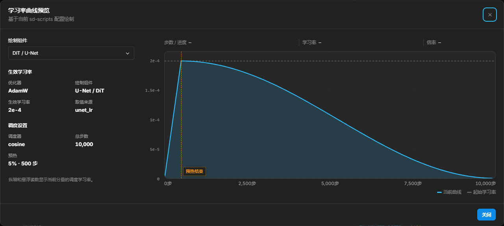

# 优化器选择与参数指南

<!-- doc-anchor: quick-choice -->
## 快速选择

优化器根据梯度更新模型参数，主要影响学习速度、显存占用和稳定性。

初次训练选 AdamW8bit。出现更新尖峰时比较 StableAdamW，优化器状态显存不足时考虑 Paged 版本。更换优化器后，按下方学习率表选择起点。

| 主要需求 | 可比较的选择 | 关注什么 |
| --- | --- | --- |
| 建立通用基准 | AdamW8bit | 学习率、训练长度与数据问题是否容易区分 |
| 降低优化器状态显存 | 8-bit；必要时比较 Paged 版本 | 实际峰值显存和数据传输开销 |
| 处理更新尖峰或低精度更新误差 | StableAdamW | 异常更新是否减少，而不只看最终一张预览 |
| 比较因子化状态与更新裁剪 | CAME | 稳定性、速度与最终生成结果 |
| 减少手动步长调整 | Prodigy 系列 | 自动估计是否及时进入合适范围 |
| 比较矩阵更新方法 | Muon、SOAP | 学习速度与额外计算成本 |
| 比较针对 LoRA 因子设计的方法 | LoRA-Muon、LoRA-RITE | 因子配对支持范围与独立学习率调整 |

<!-- doc-anchor: optimizer-type -->
## 当前可用优化器

| 优化器 | 主要用途 | 限制与注意事项 |
| --- | --- | --- |
| AdamW | 全精度 AdamW 基准 | 优化器状态显存比 8-bit 版本高 |
| AdamW8bit | 通用默认 | 小张量默认保留 FP32 状态，这是正常行为 |
| PagedAdamW8bit | 常规 8-bit 优化器仍放不下显存时 | 与 AdamW8bit 的区别只有分页；发生 CPU/GPU 数据交换时可能降低训练速度 |
| StableAdamW | 梯度尖峰、低精度 LoRA 权重 | 状态显存通常高于 AdamW8bit；不能防止过拟合 |
| Lion | 对比符号动量优化器 | 合理学习率范围与 AdamW 不同，需要重新调整 |
| Lion8bit | 降低 Lion 的状态显存 | 需要独立调整学习率 |
| PagedLion8bit | Lion8bit 同时需要分页时 | 分页不改善生成质量，并可能降低训练速度 |
| Prodigy | 由优化器估计更新尺度 | 基础学习率用 `1.0`；本项目不支持搭配 LoRA+ |
| ProdigyPlusScheduleFree | 自动估计步长并在内部管理调度 | 外部 scheduler 和 warmup 不生效；适合已有基准后的对照 |
| Automagic3 | 项目实验性自适应方案 | 建议在有明确基准时测试；要求梯度累积为 1、禁用 mixed_precision=fp16、仅支持单卡 |
| AdaFactor | 优化器状态显存紧张 | relative step 模式会接管学习率，并限制 LoRA+ |
| CAME | 数据来源混合、更新尺度波动较大时用作对照 | 使用三个 beta 和内部 RMS 裁剪 |
| AdamWScheduleFree | 测试不依赖外部 scheduler 的 AdamW | 支持内部 warmup，但本项目默认 `warmup_steps=0`；短训练不建议作为第一选择 |
| EmoSens | 项目实验性优化器 | 要求梯度累积为 1、禁用 mixed_precision=fp16、仅支持单卡，不支持 LoRA+ |
| Muon | 对二维 LoRA 矩阵执行动量正交化 | 仅 Anima LoRA 可用；当前使用 PyTorch 原生实现；建议与 AdamW8bit 做同条件对照 |
| LoRA-Muon | 针对标准 LoRA 因子分解的低秩谱下降优化器 | 仅支持 `anima-lora` 与 `networks.lora_anima`；不支持 LoRA+、LoKr、LoHa 等 LyCORIS 网络；学习率需要单独校准 |
| Adan | 比较利用梯度变化趋势的更新方式 | 本项目初始学习率为 AdamW 的一半；使用三个 beta |
| AdEMAMix | 长训练或梯度噪声明显时用作对照 | 短训练中慢速状态的收益不确定；alpha 与缓升步数需要和训练总长匹配 |
| AdEMAMix8bit | 使用 AdEMAMix 且优化器状态显存紧张时 | 与全精度版本的差异主要在状态量化 |
| LoRA-RITE | 试验专为 LoRA 结构设计的更新方式 | 仅 Anima LoRA、仅标准 LoRA 结构；不支持 LoRA+；自带梯度裁剪，`max_grad_norm`（全局梯度裁剪阈值）锁定为 0 |
| SOAP | 在旋转坐标系中执行 Adam 式更新 | 预条件矩阵增加显存与计算开销；本项目将最大预条件维度设为 `256` |

表中的显存说明仅针对优化器状态。实际峰值还受分辨率、rank、batch、缓存和预览生成影响。

<!-- doc-anchor: stable-comparison -->
## AdamW8bit、CAME、StableAdamW 的区别

**AdamW8bit 适合做基准。** 状态显存低、用的人多、经验成熟，也便于区分学习率、步数和数据问题。没有明确的稳定性或显存问题时，优先用它。

**CAME 使用因子化状态和内部 RMS 裁剪。** 适合比较不同的状态存储和更新稳定化方式；混合来源数据应先完成清理与标注。

**StableAdamW 限制异常大的参数更新。** 支持常规调度器、预热、`max_grad_norm` 和 LoRA+。Anima 初始配置为 `lr=2e-5`、`betas=(0.9, 0.99)`、`eps=1e-8`、`weight_decay=0`；SDXL 初始学习率为 `1e-4`。状态显存高于 AdamW8bit，主要用于处理更新稳定性问题。

<!-- doc-anchor: parameters -->
## 参数说明

<!-- doc-anchor: learning-rate -->
### 学习率（learning rate）

学习率控制更新幅度。提高后学习更快，但过高容易产生损失尖峰、构图固定或提示词响应下降；降低后更新更温和，但需要更多训练步数。

下表列出本项目的初始配置。不同优化器的更新尺度不同，应分别调节学习率；这些起点尚不等于各数据集的最佳值。

| 优化器 | Anima 初始学习率 | 使用说明 |
| --- | ---: | --- |
| AdamW / AdamW8bit / PagedAdamW8bit | `2e-5` | Anima 官方模型卡的 rank 32 基线；8-bit 与分页不改变 LR 语义 |
| StableAdamW | `2e-5` | 先与 AdamW 同尺度，单独比较稳定化更新 |
| Muon (`match_rms_adamw`) | `2e-5` | 通过矩阵尺寸缩放，使更新 RMS 接近 AdamW 的量级 |
| LoRA-Muon | `0.02` | 实验性起点，需独立调整；构造函数默认 `0.1` |
| CAME | `1.5e-5` | 按 AdamW 基线的 `0.75` 倍起步 |
| Adan | `1e-5` | 按 AdamW 基线的 `0.5` 倍起步，独立比较收敛速度 |
| AdEMAMix / AdEMAMix8bit | `2e-5` | 论文沿用 Adam 量级的学习率；8-bit 不改变学习率语义 |
| LoRA-RITE | `1e-4` | 更新尺度与 Adam 族不同，单独调整学习率 |
| SOAP | `2e-5` | 从 AdamW 基线开始比较 |
| Lion / Lion8bit / PagedLion8bit | `5e-6` | Lion 官方建议 LR 比 AdamW 小约 `3`～`10` 倍 |
| AdamWScheduleFree | `1e-4` | 官方建议常比基准优化器高 `1`～`10` 倍；Anima 缺少充分验证，按实验方案使用 |
| Prodigy / ProdigyPlus | `1.0` | D-adaptation 缩放基准，不能与 `2e-5` 直接比较 |
| AdaFactor relative step | 由优化器接管 | 关闭 relative step 后，Anima 手动模式从 `2e-5` 开始 |
| Automagic3 / EmoSens | `1e-4` / `0.1` | 算法内部动态 LR 的基准值，不是普通固定 LR |

Lion 的 `5e-6` 只沿用了官方给出的“LR 比 AdamW 小约 3～10 倍”这一比例。官方还建议同时把 weight decay 增大 3～10 倍，本项目未沿用，因此这不是完整的官方 Lion 配方。

SDXL 保留独立的通用起点：AdamW/StableAdamW 为 `1e-4`、CAME 为 `1e-4`、Lion 为 `2e-5`、AdamWScheduleFree 为 `3e-4`。切换模型类型或优化器时，界面只替换尚未手动修改的推荐值；导入的配置和自定义值保持原样。

`network_alpha / network_dim` 会缩放 LoRA 分支。上游 sd-scripts 的 `1e-4` 示例对应 `alpha=1`，并明确说明提高 alpha 时应重新降低或验证 LR；因此不能把这个示例直接套到本项目默认的 `rank=32, alpha=32`。

人物过早出现构图僵化、串色或提示词响应下降时，可以降低学习率或减少训练步数。学习不足时，先确认触发词和有效训练步数，再小幅提高学习率。Lion 的合理学习率范围与 AdamW 不同，需要单独测试。

<!-- doc-anchor: scheduler-warmup -->
### 学习率调度器与预热（scheduler 和 warmup）

AdamW、AdamW8bit、StableAdamW、Lion、CAME、Muon 和 LoRA-Muon 都使用外部学习率调度器。Anima 新配置默认用 `constant`，以匹配上游 Anima 示例，并减少短训练中的额外变量。`cosine_with_restarts` 在默认 `num_cycles=1` 时不会在训练中途重启，只有 `num_cycles` 大于 1 才会周期重启。已有的手动配置可以继续使用；想测试预热，可改用 `constant_with_warmup`，并把预热步数控制在总优化器步数的 `5%` 以内。

AdamWScheduleFree 和 ProdigyPlusScheduleFree 自己管理调度，界面会把外部调度器固定为 constant。AdamWScheduleFree 的内部预热与 `lr_warmup_steps` 是两回事；ProdigyPlusScheduleFree 没有暴露对应的可调预热参数。

在“学习率变化方式”下点击“查看学习率曲线”，可检查预热、衰减和重启的实际形状。侧栏显示当前组件的生效学习率与预热步数；同时训练 DiT 和文本编码器时，可切换组件查看各自曲线。总步数尚未确定时，请留意预览中的估算提示。曲线表示调度器输出，不预测优化器内部的自适应更新幅度。

| 参数 | 主要用途 | 过强或过大时需要留意 |
| --- | --- | --- |
| 动量相关系数 | 平滑短期梯度波动，利用近期或长期趋势 | 历史保留过久，跟不上训练方向变化 |
| 权重衰减 | 约束可训练权重持续增大 | 目标特征难以充分拟合 |
| 梯度裁剪 | 缩小偶发的过大梯度 | 阈值过低会压制正常更新 |
| 数值稳定项 | 避免分母过小造成异常放大 | 过大会改变自适应缩放，而不只是“更安全” |

训练稳定时保留这些参数的默认值，优先调整学习率与训练长度。

<!-- doc-anchor: betas -->
### 动量参数（betas）

没有明确的调整依据时，保留默认值：

- AdamW 系列：`0.9, 0.999`
- StableAdamW、Lion：`0.9, 0.99`
- CAME：`0.9, 0.999, 0.9999`

beta 越高，对应统计保留历史越久、响应越慢；越低则更快跟随近期梯度。不同优化器的 beta 分别控制不同统计，具体含义见各优化器小节。

<!-- doc-anchor: eps -->
### 数值稳定项（eps）

`eps` 防止分母过小导致数值放大。StableAdamW 默认 `1e-8`；PyTorch Muon 默认 `1e-7`。没有可复现的数值问题时，不建议修改。

<!-- doc-anchor: weight-decay -->
### 权重衰减（weight decay）

对本文重点介绍的优化器，本训练器提供以下起点：AdamW、AdamW8bit 和 PagedAdamW8bit 为 `0.01`；CAME、StableAdamW、Muon 与 LoRA-Muon 为 `0`。PyTorch Muon 自身默认 `0.1`，本训练器为 LoRA 起步显式覆盖为 `0`，用户仍可修改。

提高权重衰减会加强权重收缩，过大会妨碍目标特征学习；降低会减弱这一约束，`0` 关闭衰减。人物 LoRA 先保留项目默认值，需要比较约束强度时再单独调整。

<!-- doc-anchor: muon-options -->
### Muon 参数

Muon 先累积梯度动量，再对二维矩阵更新做近似正交化。它分别处理 `lora_down` 和 `lora_up`，适合比较矩阵更新方式对学习速度与结果的影响。

Muon 每个参数维护一组动量状态，少于全精度 AdamW 的两组状态，但每步增加矩阵乘法。比较时记录峰值显存和每步耗时。

#### 更新幅度

- **学习率**（`learning_rate`，Anima 默认 `2e-5`）：直接控制更新幅度。过高时可能很快过拟合、loss 波动或更新不稳定；过低时学习缓慢。使用默认缩放时可从 AdamW 基线开始比较。
- **学习率缩放**（`adjust_lr_fn`，默认 `match_rms_adamw`）：按矩阵尺寸缩放更新，便于从 AdamW 学习率起步。更换规则后需重新调节学习率。
- **权重衰减**（`weight_decay`，默认 `0`）：数值增大会使 LoRA 因子进一步收缩，可能抑制过拟合，也可能削弱角色学习。PyTorch Muon 的库默认值为 `0.1`，本训练器会显式传入界面中的值。

#### 动量

- **动量系数**（`momentum`，默认 `0.95`）：数值越高，更新越平滑，但对新梯度的响应越慢；数值越低，对当前 batch 越敏感。
- **Nesterov 动量**（`nesterov`，默认开启）：决定正交化前如何组合当前梯度和历史动量。关闭后会改变优化轨迹，不是单纯的性能开关。

#### 正交化

- **迭代次数**（`ns_steps`，默认 `5`）：越多计算量越大。当前近似算法不以无限迭代收敛到精确正交化为目标，日常训练保持 `5`；仅在比较计算开销时调整。
- **迭代系数**（`ns_coefficients`，默认 `3.4445, -4.775, 2.0315`）：决定 Newton-Schulz 迭代使用的多项式。其他取值可能降低近似效果或带来数值问题，主要用于受控实验。
- **数值稳定项**（`eps`，默认 `1e-7`）：防止归一化时除数过小。它通常不影响正常训练，主要用于排查可复现的 NaN 或异常放大。

第一次比较建议只把 AdamW8bit 换成 Muon，保持数据、rank、alpha、scheduler、步数和学习率不变。确认训练稳定后，再单独测试学习率或 weight decay。同时修改 NS 系数和迭代次数会让结果难以解释，建议一次只调整一个。

<!-- doc-anchor: lora-muon-options -->
### LoRA-Muon 参数

一个 LoRA 的实际作用来自两个因子的乘积。将一个因子放大、另一个同比缩小，可以保持合成结果不变。普通 Muon 分别更新这两个因子，因此这种尺度分配会影响优化过程。

LoRA-Muon 将两个因子配对处理，目的是让更新更符合它们共同表示的权重变化，而不是只看两个矩阵各自的数值。它需要独立调整学习率，不是给普通 Muon 打开一个“LoRA 模式”。

#### 参数表

| 参数 | 传递位置 | 默认值 | 合法范围 | 作用与建议 |
| --- | --- | ---: | --- | --- |
| `learning_rate` | 顶层训练参数，作为构造函数的 `lr` | Anima 自动推荐 `0.02`；构造函数 `0.1` | 有限数且 `≥ 0` | 控制整体更新尺度。它是最值得优先调整的参数；不要直接套用 AdamW 的学习率 |
| `weight_decay` | 通用界面字段，最终作为优化器参数传递 | `0` | 有限数且 `≥ 0`；同时要求 `learning_rate * weight_decay < 1` | 使用论文的分拆式解耦衰减。没有明确对照结果时保持 `0` |
| `momentum` | `optimizer_args` | `0.9` | `0 ≤ momentum < 1` | 梯度的一阶指数移动平均。增大后更平滑，但对新梯度反应更慢 |
| `ns_steps` | `optimizer_args` | `8` | 整数 `1–8` | 矩阵符号的 Polar Express / Newton–Schulz 迭代次数。减少会降低计算量，也会让近似更粗 |
| `inv_sqrt_steps` | `optimizer_args` | `7` | 整数 `1–7` | 常规 Gram 逆平方根路径的迭代次数；冷启动保护和特征值分解回退不使用这些迭代。通常保持默认 |
| `msign_eps` | `optimizer_args` | `1e-20` | 有限数且 `≥ 0` | 矩阵符号归一化时的除零保护。通常不需要修改 |
| `inv_sqrt_eps` | `optimizer_args` | `1e-5` | 有限数且 `≥ 0` | 用于 Gram 正则化，也参与冷启动阈值和特征值下限的计算；会影响更新行为，通常保持默认 |
| `inv_sqrt_gamma` | `optimizer_args` | `1.001` | 有限数且 `> 0` | Gram 逆平方根迭代的阻尼系数。没有数值问题时保持默认 |
| `gauge_rebalance` | `optimizer_args` | `false` | `true` / `false` | 是否定期重新平衡两个 LoRA 因子的尺度。这是数值调理功能，不是防止过拟合的正则化 |
| `gauge_rebalance_alpha` | `optimizer_args` | `1.0` | `0 < alpha ≤ 1` | 重平衡强度的阻尼指数；越接近 `1`，单次调整越充分。仅在启用重平衡后有意义 |
| `gauge_rebalance_interval` | `optimizer_args` | `1` | 整数 `≥ 1` | 每隔多少个优化器步执行一次重平衡 |
| `gauge_power_steps` | `optimizer_args` | `2` | 整数 `≥ 1` | 估计两个因子谱范数时使用的幂迭代次数。次数越多越慢 |
| `max_grad_norm` | 顶层训练参数，不属于 LoRA-Muon 构造函数 | Anima 自动推荐 `0` | `≥ 0` | 在 `optimizer.step` 前执行的全局 L2 梯度裁剪；`0` 表示关闭。论文算法不包含此步骤 |

对大多数用户，只需要优先调整 `learning_rate`。建议保持 `momentum=0.9`、`ns_steps=8`、`inv_sqrt_steps=7` 和数值保护项不变。`gauge_rebalance` 默认关闭；只有在观察到两个因子尺度明显失衡或需要专门比较这一功能时，再单独启用。

学习率从 `0.02` 开始，固定数据、rank、alpha、调度器和步数，按倍数向下或向上比较。先用短训练排除学习不足或损失尖峰，再缩小测试范围。

Anima 主干 LoRA 的 `unet_lr` 若已填写，会覆盖该参数组的 `learning_rate`；使用正则匹配学习率 `reg_lrs` 时，匹配模块也使用自己的学习率。调参前先检查这些覆盖值，避免只修改总学习率却没有改变目标模块的实际学习率。

#### 相关网络设置与兼容性

`network_dim` 和 `network_alpha` 不是 LoRA-Muon 构造参数，也不要求相等：

- `network_dim` 决定 LoRA rank。
- `network_alpha / network_dim` 决定 LoRA 分支的前向缩放。
- 优化器不会显式补偿这个前向缩放；比较不同 rank 时先保持 `alpha / dim` 一致，改变比例后需重新校准学习率。
- `alpha=dim` 只表示前向缩放为 `1`，不是 LoRA-Muon 的算法要求。
- 优化器要求同一模块的 `lora_down` 与 `lora_up` rank 维度匹配，并且以完整参数对传入。

可手动从 `dim=16, alpha=16` 开始，以减少参数量、动量状态和 Gram 计算量。切换到 LoRA-Muon 不会自动改写 rank 或 alpha。

当前实现还有以下限制：

- 仅支持 `model_train_type=anima-lora` 与 `network_module=networks.lora_anima`。
- 不支持 LoRA+，因为拆分参数组会破坏完整的 `lora_down → lora_up` 配对。
- 不支持 LoKr、LoHa、DoRA 等 LyCORIS 网络结构。
- 支持 Linear LoRA 和 Anima 使用的 Conv LoRA 形状。
- FP16/BF16 参数的矩阵运算会在 FP32 中完成，再写回原参数精度；不需要额外设置 `dtype` 参数。
- 一阶动量保持 FP32；恢复优化器状态时直接从检查点恢复到计算精度与当前参数设备，避免先降为 FP16/BF16 再转回 FP32。
- 支持 sd-scripts 的外部学习率调度器；LoRA-Muon 本身不接管 scheduler 或 warmup。

#### 计算原理

| 名词 | 在这里可以怎样理解 |
| --- | --- |
| 因子配对 | 将同一 LoRA 的 down 与 up 一起处理 |
| Gram 矩阵 | 描述因子内部不同方向的大小与相关性 |
| 白化 | 根据另一侧因子的统计，调整当前更新在不同方向上的尺度 |
| 矩阵符号方向 | 保留主要矩阵方向，同时重新组织奇异值尺度；不是逐元素取正负号 |
| 因子平衡 | 避免两个等价因子的数值大小悬殊，属于数值条件调整 |

#### 更新过程

每一步大致包含以下过程：

1. 分别计算两个 LoRA 因子的梯度移动平均，也就是一阶动量。
2. 根据另一侧因子的 Gram 矩阵计算逆平方根，用它调整当前因子不同方向的尺度。文中把这个过程简称为“白化”。
3. 对调整后的动量计算矩阵符号方向，再乘一次 Gram 逆平方根，得到因子更新。
4. 用学习率 `η` 控制合成权重更新的一阶总预算，并把预算平均分给两个因子方向。

论文把 `η` 称为信赖域半径。这里的“半径”约束的是合成权重一阶更新的谱范数，不是任意一个 `lora_down` 或 `lora_up` 元素的最大变化量。

<!-- doc-anchor: adan-options -->
### Adan 参数

Adan 同时跟踪梯度和相邻步骤的梯度变化。Anima 从 `1e-5` 开始，按特征出现速度、损失稳定性和最佳检查点调整。

- **动量参数**（`betas`，默认 `0.98, 0.92, 0.99`）：三个值分别控制梯度平均、梯度差分平均和梯度平方统计。
- **数值稳定项**（`eps`，默认 `1e-8`）：与 AdamW 语义相同。
- **权重衰减**（`weight_decay`，默认 `0.01`）与**解耦开关**（`weight_decouple`，默认开启）：开启时在更新前按 `1 − lr × weight_decay` 收缩权重；关闭时在更新后除以 `1 + lr × weight_decay`。通常保持默认。
- Adan 自带的 `max_grad_norm` 参数在本训练器中保持 `0`，梯度裁剪统一由界面上的 `max_grad_norm`（全局梯度裁剪阈值）字段负责。

<!-- doc-anchor: ademamix-options -->
### AdEMAMix 参数

AdEMAMix 同时参考较短和较长时间范围的梯度趋势。短期趋势能较快响应新变化，长期趋势能减弱短期波动的影响，但也可能保留已经不合适的早期方向。

| 参数 | 控制什么 | 调大后的含义 |
| --- | --- | --- |
| `alpha` | 长期趋势在更新中的权重 | 更重视长期趋势，不会延长历史衰减时间 |
| 第三个 beta | 长期趋势保留历史的速度 | 越接近 1，历史衰减越慢，响应也越慢 |
| `t_alpha` | 长期趋势权重的渐增步数 | 更晚达到设定权重 |
| `t_beta3` | 历史衰减系数的渐变步数 | 更晚达到设定的长期记忆长度 |

这里的 `alpha` 是优化器混合权重，与网络 Alpha 无关。短训练先保留默认值；长期趋势介入太晚时，再缩短缓升步数。

`alpha` 默认 `5.0`；设为 `0` 时不加入慢速平均。`t_alpha`、`t_beta3` 默认留空，启动前自动采用预估总步数；自定义优化器参数已提供对应值时保留该值。填 `0` 表示不缓升，正整数指定从初始值渐变到目标值的步数：alpha 从 0 开始，β3 从 β1 开始。

- **动量参数**（`betas`，默认 `0.9, 0.999, 0.9999`）：分别控制短期梯度平均、梯度平方平均和长期梯度平均。**数值稳定项** `eps` 默认 `1e-8`。**权重衰减** `weight_decay` 默认 `0.01`，力度随学习率缩放。
- 8-bit 变体把三组状态量化存储，显存约为全精度的四分之一；小于 4096 元素的张量不量化，这是正常行为。

<!-- doc-anchor: lorarite-options -->
### LoRA-RITE 参数

LoRA-RITE 用去除因子缩放影响的梯度和低秩矩阵预条件，减少等价 A/B 因子表示对更新的影响。Anima 从 `1e-4` 开始，与 AdamW8bit 比较。

- **学习率**（Anima 默认 `1e-4`）：可先在 `5e-5`～`2e-4` 之间比较；增大加快学习，过高会造成损失尖峰。
- **动量参数**（`betas`，默认 `0.9, 0.999`）：常规两项。
- **数值稳定项**（`eps`，默认 `1e-6`）：语义是"根 eps"，内部会平方后使用，请勿沿用 Adam 习惯的 `1e-8`。
- **梯度裁剪阈值**（`clip_unmagnified_grad`，默认 `1.0`）：抑制个别突然激增的梯度对整步更新的影响，一般保持默认即可；范数按不受 LoRA 因子缩放影响的方式计算。选中本优化器后，界面的 `max_grad_norm`（全局梯度裁剪阈值）锁定为 `0`，由本项接管；`0` 表示不裁剪。
- 限制：仅 Anima LoRA 可用；仅标准 LoRA 结构（LyCORIS 的 LoHa、LoKr、DoRA 等不适用）；不能与 LoRA+ 同用（分组学习率会破坏 A/B 配对假设）。
- 冷启动提示：LoRA 的 up 矩阵零初始化时，最初几步的更新主要落在 up 上，down 随后才加入，这是该方法的正常行为，并非训练停滞。

<!-- doc-anchor: soap-options -->
### SOAP 参数

SOAP 利用梯度方向之间的相关性，先选择一组适合更新的坐标轴，再在这些坐标中执行 Adam 式更新，最后转回原坐标。它不仅逐元素缩放梯度，也会考虑矩阵方向之间的关系。

| 参数 | 默认值 | 作用与调整方向 |
| --- | --- | --- |
| `max_precondition_dim` | `256` | 参与矩阵预条件的最大轴长。提高会增加显存和计算开销，降低会让更多轴仅使用逐元素缩放 |
| `precondition_frequency` | `10` | 每隔多少步重算坐标系。增大节省计算，减小更快跟随梯度变化；`1` 每步重算 |
| `shampoo_beta` | 留空，跟随第二个 beta | 越大保留历史越久、响应越慢 |
| `normalize_gradient` | 关闭 | 按更新张量的均方根归一化整体尺度 |
| `correct_bias` | 开启 | 修正历史平均从零开始产生的偏差 |
| `precondition_1d` | 关闭 | 对符合维度上限的一维参数做预条件，如 `train_norm` 的归一化层权重 |

- **学习率**（Anima 默认 `2e-5`）：先沿用 AdamW 基线。库默认的 `3e-3` 是面向整模型训练的尺度，不要直接搬过来。
- **动量参数**（`betas`，默认 `0.95, 0.95`）：两项。第二项同时是预条件矩阵的滑动平均系数（未单独填写时）。与 AdamW 的 `0.9, 0.999` 不同，做对照时要注意二阶状态的历史长度也一起变了。
- **数值稳定项**（`eps`，默认 `1e-8`）：加在平方梯度开方之后，语义与 AdamW 相同。
- **权重衰减**（`weight_decay`，默认 `0`）：库默认 `0.01`，本项目沿用自己的 `0`，由界面显式写出。实现内部固定为解耦、非固定衰减，没有对应开关。
- **梯度裁剪**：SOAP 没有内部裁剪，界面上的 `max_grad_norm`（全局梯度裁剪阈值）照常生效。其默认 `1.0` 与 sd-scripts 自身默认一致，不写入配置文件，也没有针对 SOAP 的锁定。
- 预条件的统计矩阵与坐标矩阵按轴长平方占用显存：FP32 下，512 维轴两张矩阵合计约 2 MiB，1024 维约 8 MiB。通常保留 `256`，避免为 Anima 的 2048、8192 长轴建立大型矩阵。
- SOAP 的第一次更新只建立预条件状态、不改变权重，有效更新从第二步开始，这是该实现的正常行为，不是训练停滞。

<!-- doc-anchor: prodigyplus-options -->
### ProdigyPlus 参数

Prodigy 系列在训练中估计步长，界面学习率主要作为倍率使用。因此，界面显示 `1.0` 不能理解为普通 AdamW 使用 `1.0` 的步长。

| 数值 | 含义 | 默认值与建议 |
| --- | --- | --- |
| `D` | 优化器估计的步长尺度 | 由训练过程更新，可在日志中观察 |
| 学习率字段 | 步长计算的倍率 | `1.0`，保持默认 |
| `d0` | 初始步长估计 | `1e-6`，通常保持默认 |
| `d_coef` | 步长估计的缩放系数 | `1.0`；需要调整自动步长时优先比较此项，较大值提高估计尺度 |

ProdigyPlusScheduleFree 还维护供评估与保存使用的平均权重。平均可以减少对最后一个训练状态的依赖，但也会使刚学到的变化逐步反映到保存结果中。

`schedulefree_c` 默认 `0`，使用原有平均规则。设为正数后，越大越快响应近期更新，越小平均越平滑；`0` 是回退选项，不是这一正数范围的延续。

日志中的参数组学习率、`D × lr` 与真正的参数更新并不是同一指标。查看曲线时应先确认记录的是什么，再结合多个训练阶段的生成结果判断学习是否充分。

- **D 增长限制**（`d_limiter`，默认开启）：限制步长估计的单步涨幅。默认 `d_coef=1` 时，`D` 每步最多增长约 19%。上升过慢时可测试关闭，但更容易出现单步高估。SPEED 使用自己的涨幅限制，不读取此项。
- **停止调整 D 的步数**（`prodigy_steps`，默认 `0`）：到达该步数后 `D` 冻结在当前值，估计缓存同时释放。适用于 `D` 已确认合适、后半程不再变化的场景；`0` 表示全程持续估计。
- **偏差校正与自动预热**（`use_bias_correction`，默认关闭）：使用 RAdam 变体，加入偏差校正与自动预热，也会减慢 `D` 的调整。启用后若 `D` 长期不增长，可先关闭比较。
- **SPEED 估计器**（`use_speed`，默认关闭）：方向性进展超过历史峰值时才上调 `D`，状态更少，对梯度整体缩放不敏感。属于实验选项，与权重衰减同用时需检查稳定性。
- **谨慎更新**（`use_cautious`，默认关闭）：滤除与当前梯度方向不一致的更新分量。此实现直接屏蔽更新，不处理一阶动量；用于单独比较更新方向筛选。
- **正交梯度更新**（`use_orthograd`，默认关闭）：仅使用与当前权重方向正交的梯度分量。需要比较这一约束时再启用。

- **按参数组分别估计 D**（`split_groups`，默认开启）：文本编码器与 DiT 各自估计步长；关闭后所有组共用一次估计。通常保留默认，比较全局估计时再关闭。
- **多组共用平均 D**（`split_groups_mean`，默认关闭）：仅在 `split_groups` 开启时生效。开启后各组使用 `D` 的调和平均值，再乘各组学习率，适合需要统一自适应尺度的对照。较小的 `D` 会拉低平均值；关闭时各组独立估计和使用 `D`。
- **分解二阶矩**（`factored`，默认开启）：用行、列统计近似完整二阶矩，减少状态显存。排查 NaN 或 `D` 长期不增长时，可关闭以比较完整统计。
- **分解统计保持 FP32**（`factored_fp32`，默认开启）：减少半精度统计误差。仅在梯度为半精度时，关闭才会节省显存；通常保持开启。
- **权重衰减跟随学习率**（`weight_decay_by_lr`，默认开启）：衰减随自适应学习率缩放。关闭后每步直接施加完整衰减，训练初期容易过度压缩权重，通常保持开启。
- **内部更新缩放**（`use_stableadamw`，界面字段为 `prodigyplus_use_stableadamw`，默认开启）：按更新 RMS 限制幅度。开启时，或 `eps=None` 使用 Adam-atan2 时，全局梯度裁剪锁定为 `0`。排查自适应步长异常时可单独比较关闭后的结果。
- **进阶选项**（通过自定义 `optimizer_args` 传入）：`use_grams`、`use_adopt` 为实验性更新变体；`use_focus` 处理大步长下的噪声，并关闭 `factored` 与 Adam-atan2；`beta3` 控制 `D` 估计的移动平均，默认 √β2；`stochastic_rounding` 仅影响 BF16 权重。

<!-- doc-anchor: gradient-clipping -->
### 全局梯度裁剪（max_grad_norm）

`max_grad_norm=1` 是常用起点，`0` 关闭。降低正数阈值会加强裁剪，提高则允许更大的梯度。StableAdamW 可正常搭配；LoRA-Muon 推荐 `0`，LoRA-RITE 锁定为 `0` 并使用内部裁剪。

同时使用 `percentile_clipping=95` 和较低的 `max_grad_norm` 时，同一次更新可能被裁剪两次。没有日志依据时，建议只保留一种温和裁剪。

<!-- doc-anchor: percentile-clipping -->
### 百分位裁剪（percentile clipping）

只对 AdamW8bit、PagedAdamW8bit、Lion8bit、PagedLion8bit 生效。

- `100`：关闭，也是默认值
- `99`：较温和的实验对照值
- `95`：较强的实验对照值，只在确认存在异常梯度后考虑

数值越低裁剪越强。出现可复现的梯度尖峰时先测试 `99`；过强的裁剪也会削弱少见服装、表情等有效特征的更新。

<!-- doc-anchor: min-8bit-size -->
### 8-bit 状态最小张量尺寸（min_8bit_size）

默认 `4096`，小于这个规模的张量保留 FP32 优化器状态。

提高后更多张量保留 FP32 状态，显存增加；降低后量化更多张量。低 rank 训练出现小张量数值问题时可测试 `16384`。它只控制优化器状态，不改变模型参数精度。

<!-- doc-anchor: stableadamw-options -->
### StableAdamW 专用参数

`kahan_sum=True` 用补偿求和减少低精度更新的舍入误差，主要作用于 LoRA 可训练权重本身为 FP16/BF16 的情况。本项目只选择 `mixed_precision=bf16` 时，LoRA 可训练权重仍是 FP32；开启 `full_bf16` 才会把 LoRA 参数也转为 BF16。因此未用 `full_bf16` 时，Kahan 求和通常没有明显差异。

`weight_decouple=True` 使用 AdamW 式解耦权重衰减。`weight_decay=0` 时此开关不改变计算结果，建议保持开启。

<!-- doc-anchor: came-clipping -->
### CAME 内部裁剪

`came_clip_threshold` 默认 `1.0`，传给优化器的 `clip_threshold`，裁剪内部更新的均方根（RMS）。降低阈值加强裁剪，提高则放宽。它与全局 `max_grad_norm` 独立，反复出现尖峰时再调整。

<!-- doc-anchor: schedulefree-warmup -->
### Schedule-Free 预热（warmup）

AdamWScheduleFree 使用内部 `warmup_steps`，外部 `lr_warmup_steps` 无效。项目默认 `0`，即不预热。初期更新不稳定时可测试少量内部预热；增加步数会延长学习率爬升阶段。

<!-- doc-anchor: stochastic-rounding -->
### 随机舍入（stochastic rounding）

随机舍入减少低精度更新长期朝同一方向取整造成的误差。ProdigyPlus 沿用库默认行为，本训练器不另加开关。它属于数值处理，不是数据增强。

### EmoSens v3.9.3

EmoSens 会根据损失的变化自动调整学习率。使用时，在 `learning_rate` 中填写倍率：Anima LoRA 可从 `0.1` 开始，SDXL LoRA 可从 `1.0` 开始。训练中的实际学习率会持续变化，可以在训练日志中查看。

**常用设置**

- **停止信号触发阈值** `stopcoef`：默认 `0.04`。训练趋于稳定，且近期平均损失低于或等于这个值时，提示可以考虑停止。调大更容易触发，可以填写大于 `1` 的值；设为 `0` 不触发。
- **显示收敛提示** `notify`：默认开启。日志中的 `[READY TO STOP]` 表示“可以考虑停止训练”，不会自动结束训练。看到提示后，可以比较附近保存的模型效果，再决定是否停止。关闭此开关只隐藏提示，不影响训练。
- **启用影子权重** `use_shadow`：默认关闭，普通训练通常无需开启。开启后额外保留一份权重，在损失突然变化时与当前权重混合，会增加显存占用。

其余参数默认与上游一致：`betas=(0.9, 0.995)`、`eps=1e-8`、`weight_decay=0.01`。

**使用限制**

当前仅支持单卡，梯度累积固定为 `1`，混合精度请选择 `bf16` 或 `no`。梯度累积和 fp16 会改变 EmoSens 读取到的损失值，多卡则可能让各张卡算出不同的学习率，因此暂不支持这些组合。

学习率调度和预热由界面固定，无需另行设置；全局梯度裁剪仍可使用。EmoSens 对所有参与训练的参数使用同一个学习率，因此不支持 LoRA+，单独设置 U-Net / DiT 或文本编码器学习率也不会改变它们的实际学习率。如需只训练某个组件，请使用对应的训练开关。

**新版变化与恢复训练**

[v3.9.3 上游源码](https://github.com/muooon/EmoSens/blob/e2c7bb3293baeb339a2d4a21f21ccbdc0260d3be/optimizer/emosens.py) 已原样同步。相比之前的 v3.9.1，没有新增参数，主要调整了自动学习率的上限。常用倍率 `0.1` 和 `1.0` 的上限仍分别是 `3e-4` 和 `3e-3`；倍率超过 `1` 后，上限不再继续增加。

恢复训练时，请沿用原来的学习率倍率、收敛提示和影子权重设置，状态文件不会完整恢复这些配置。从旧版状态继续训练，也会使用新版的学习率上限规则。

<!-- doc-anchor: loraplus -->
### LoRA+

大多数优化器都可以搭配 LoRA+，包括 Muon 和 Automagic3；例外是 Prodigy、ProdigyPlus、EmoSens、LoRA-RITE 和 LoRA-Muon（LoRA+ 的分组学习率与 LoRA-RITE 的 A/B 配对、LoRA-Muon 的联合更新路径均不兼容），AdaFactor 则需要先关闭 relative step。

切换优化器后重新检查 LoRA+ 倍率；Automagic3 还要求倍率后的学习率落在 `min_lr` 与 `max_lr` 之间。完整限制见 LoRA+ 文档的“优化器与调度器”。

<!-- doc-anchor: scenarios -->
## 按数据集选择

<!-- doc-anchor: one-image -->
### 只有一张立绘

Anima 用 AdamW8bit 从 `1e-5`～`2e-5` 开始，并提高检查点（checkpoint）保存频率。SDXL 按自己的独立基线调整。这个场景最大的风险是把姿势和构图一起记住；StableAdamW 只能处理更新尖峰，补不出侧面、背面或新表情。

<!-- doc-anchor: few-shot -->
### 2～5 张少图人物

先完成 AdamW8bit 基准训练。图片来源和质量差异明显时，在相同步数下比较 CAME；日志出现尖峰时，再比较 StableAdamW。复杂的内部调度在短训练中可能没有足够步数体现效果。

<!-- doc-anchor: galgame -->
### Galgame 多表情立绘

这类数据构图很固定，AdamW8bit 通常够用。比更换优化器更重要的是正确标注表情，并避免把固定背景、站姿学成人物身份的一部分。表情数量很不均衡时，可以增加一组 CAME 对照。

<!-- doc-anchor: dmm-mixed -->
### DMM 卡面、特效、伙伴角色混合

先标注或移除伙伴角色、文字、水印、特效和不同形态，再比较 AdamW8bit 与 CAME。训练日志仍有稳定性问题时，可增加 StableAdamW 对照。优化器无法识别哪个角色是训练目标。

<!-- doc-anchor: mixed-quality -->
### 图片质量参差

先处理模糊图、压缩截图、重复裁剪和 Live2D 连续帧。保留图片的影响可通过标注、分组和重复次数控制。仍有梯度尖峰时，再比较 CAME 或单独测试 `percentile_clipping=99`。

<!-- doc-anchor: outfits-forms -->
### 多服装、多形态

此场景更依赖准确的服装/形态标签和合理的分组采样。AdamW8bit、CAME、StableAdamW 均可使用。评估时检查服装控制、身份保持和形态串色，而不是只比较单张预览的锐度。

<!-- doc-anchor: style-lora -->
### 风格 LoRA

仍从 AdamW8bit 开始。风格能否泛化，主要取决于题材覆盖，以及标注是否把内容与风格分开。StableAdamW 可以减轻异常批次的影响，但过强的裁剪也可能削弱少见的风格特征。

<!-- doc-anchor: vram -->
### 显存紧张

先使用 AdamW8bit 或 Lion8bit，只在确认存在内存压力时改用 Paged 版本。分页实际触发时，CPU 与 GPU 之间的状态传输可能降低训练速度。`min_8bit_size` 建议保留 `4096`，避免为节省少量状态显存而量化更多小张量。

<!-- doc-anchor: starting-configs -->
## 保守起始配置

| 用途 | 优化器与参数 | 其他设置 |
| --- | --- | --- |
| Anima 通用基准 | AdamW8bit，LR 用上方主表，`weight_decay=0.01` | constant，`max_grad_norm=1`，项目默认 rank/alpha，只训练 DiT |
| Anima 混合来源对照 | CAME，LR 用上方主表；其余保持默认 | constant，`max_grad_norm=1`；结果需用固定条件验证 |
| Anima 梯度尖峰对照 | StableAdamW，LR 用上方主表，保留项目默认稳定性参数 | Kahan 开启，constant，`max_grad_norm=1` |
| Anima LoRA-Muon 实验 | LoRA-Muon，LR 用上方主表，其他参数保持默认 | constant，`max_grad_norm=0`，先使用界面推荐的 rank/alpha；只单独比较学习率 |
| Anima Lion 实验 | Lion / Lion8bit，LR 用上方主表 | constant；这不是完整的官方 Lion 配方 |
| 温和的 8-bit 裁剪 | AdamW8bit，沿用基准参数，`percentile_clipping=99` | 保持其他参数不变 |

训练过久可能使人物与固定姿势、背景或服装绑定。缩短训练应以实际参数更新次数判断，不只看重复次数。

| 调整条件 | 减少 repeats 后会怎样 |
| --- | --- |
| 固定训练轮数 | 通常减少训练图片的总使用次数和参数更新次数 |
| 固定总训练步数 | 不直接减少参数更新总数，可能改变分桶、打乱与子集采样过程 |
| 只减少某个子集的 repeats | 可能改变该子集相对其他子集的训练权重 |

完整累积窗口的有效批次为“批次大小 × 累积步数 × GPU 数”。比较训练方案时保留相同的批次与累积设置，避免分桶尾批和样本组合变化。

减少过拟合可以从缩短总训练长度或降低学习率开始；具体停止位置用多个保存阶段的生成结果判断。

<!-- doc-anchor: troubleshooting -->
## 按现象排查

| 现象 | 优先检查 | 可考虑的优化器调整 |
| --- | --- | --- |
| 损失值平稳，但预览质量差 | 数据、标注、预览提示词、检查点时机 | 通常不应先更换优化器 |
| 孤立且可复现的 loss 或梯度尖峰 | 对应批次、异常图片、学习率 | 对比 StableAdamW，或单独测试 `percentile_clipping=99` |
| 出现 NaN / Inf | 立即停止；检查学习率、精度设置、异常数据和恢复点 | 排除配置或数据问题后再比较 StableAdamW；不要用裁剪掩盖持续性问题 |
| 优化器状态导致显存不足 | 确认峰值来自优化器状态，而不是分辨率、batch 或预览 | 先用 8-bit；仍不足时再用 Paged 版本 |
| 很快记住姿势、背景或服装 | 步数、repeats、学习率、数据重复 | 降低学习率或缩短训练；换优化器通常不能解决 |
| 人物特征长期学不进去 | 触发词、caption、有效步数、rank 和训练目标 | 确认上述项目后，再小幅提高学习率 |

<!-- doc-anchor: ab-testing -->
## 怎么做有效的 A/B

1. 固定数据集、标注（caption）、随机种子（seed）、底模、VAE、rank/alpha、批次大小和总步数。
2. 固定预览提示词、采样参数和生成随机种子。
3. 从学习率表中各自的初始值出发，为每个优化器找到可用范围。固定其余设置，只调整学习率。
4. 比较相同步数的训练检查点，同时记录梯度范数、峰值显存和训练时间。
5. 评估不止看损失值，还要看人物还原、服装控制、背景或姿势绑定以及提示词响应。

更换优化器应从同一底模重新开始。不能把另一种优化器的动量状态直接当成当前优化器的状态继续使用。

Prodigy、Muon、LoRA-Muon 等采用不同更新尺度，比较时使用各自调好的学习率。最终比较的是同一训练预算下的完整配置。

<!-- doc-anchor: limits -->
## 适用边界

优化器处理梯度，不会识别错误标注或自动降低低质量图片的权重。固定姿势、背景绑定等过拟合问题，优先通过数据多样性与停止时机处理。

<!-- doc-anchor: faq -->
## 常见问题

**为什么切换模型类型或优化器后，学习率被替换了？**

界面只在推荐值尚未被手动修改时替换它；手动调整过、导入的配置和自定义值都会保持原样。

**为什么 Prodigy 的学习率被锁定为 1.0？**

Prodigy 属于 D-adaptation 系的自适应优化器，学习率作为缩放基准使用，sd-scripts 文档建议设为 `1.0` 左右，因此界面会锁定并提示。

**为什么 StableAdamW 的 weight_decay 在配置里是 0？**

库默认值为 `0.01`，本项目显式覆盖为 `0`。它与 AdamW8bit 默认的 `0.01` 不同；需要隔离优化器差异时，两组使用相同衰减值。

**为什么切换优化器后 LoRA+ 被关闭了？**

Prodigy、ProdigyPlus、EmoSens、LoRA-RITE 和 LoRA-Muon 不支持 LoRA+；AdaFactor 需关闭 `relative_step` 和 `warmup_init`。界面会显示原因，后端也会拒绝不兼容组合。

**训练出问题时，先换优化器还是先查数据？**

先查数据、标注、重复次数（repeats）、学习率和停止时机。优化器主要影响收敛速度、显存占用和数值稳定性，通常不是人物还原度的首要决定因素。

<!-- doc-anchor: evidence -->
## 依据与参考资料

项目默认值与兼容性见 `backend/training/optimizer_metadata.py`、`optimizer_contracts.py` 和 `field_registry.py`。算法细节以 vendor 和 venv 中实际加载的实现为准；LoRA-Muon 来源见 `vendor/lora_muon/SOURCE.md`。下列论文说明算法，固定提交链接保留为参考：

- [Anima 官方模型卡（固定提交）](https://huggingface.co/circlestone-labs/Anima/blob/f7382c4bf9d7ffe4ceea593a0adbb470c56dd79b/README.md)
- [sd-scripts Anima LoRA 训练文档（固定提交）](https://github.com/kohya-ss/sd-scripts/blob/37a1cbbc5725ed2a3575506e7bd2001c9908ac92/docs/anima_train_network.md)
- [CAME 官方实现与调参说明（固定提交）](https://github.com/yangluo7/CAME/tree/e77c5c022eaf71f1efb82a1433032cdcd5c52610)
- [Lion 官方实现与调参说明（固定提交）](https://github.com/google/automl/tree/6a54c8741e7c3265d4547c4f35f47a0391122dc5/lion)
- [Schedule-Free 官方实现与调参说明（固定提交）](https://github.com/facebookresearch/schedule_free/tree/70785b53e778d0e872c0bbb75ff4ee54ee10c291)
- [Transformers 余弦重启调度器实现（固定提交）](https://github.com/huggingface/transformers/blob/71c6f699ac9b3f8fc42a6a3e9dc59034c349a678/src/transformers/optimization.py)
- [CAME: Confidence-guided Adaptive Memory Efficient Optimization](https://arxiv.org/abs/2307.02047)
- [Symbolic Discovery of Optimization Algorithms (Lion)](https://arxiv.org/abs/2302.06675)
- [Prodigy: An Expeditiously Adaptive Parameter-Free Learner](https://arxiv.org/abs/2306.06101)
- [The Road Less Scheduled](https://arxiv.org/abs/2405.15682)
- [LoRA+: Efficient Low Rank Adaptation of Large Models](https://arxiv.org/abs/2402.12354)
- [Adan: Adaptive Nesterov Momentum Algorithm for Faster Optimizing Deep Models](https://arxiv.org/abs/2208.06677)
- [The AdEMAMix Optimizer: Better, Faster, Older](https://arxiv.org/abs/2409.03137)
- [LoRA Done RITE: Robust Invariant Transformation Equilibration for LoRA Optimization](https://arxiv.org/abs/2410.20625)
- [LoRA-RITE 官方实现（固定提交）](https://github.com/gkevinyen5418/LoRA-RITE/tree/d4186b6fedb39300d23c00ce0334db09719da9fc)
- [LoRA-Muon: Spectral Steepest Descent on the Low-Rank Manifold](https://arxiv.org/abs/2606.12921)
- [pytorch-optimizer 实现（固定提交）](https://github.com/kozistr/pytorch_optimizer/tree/3d08fa02cb6617d4d12365ca0f7d643b72e8cbe8)
- [bitsandbytes 优化器实现（固定提交）](https://github.com/bitsandbytes-foundation/bitsandbytes/tree/a2b90e6eae31a958e6b4d85edf2cfb2b91e9ce29)
