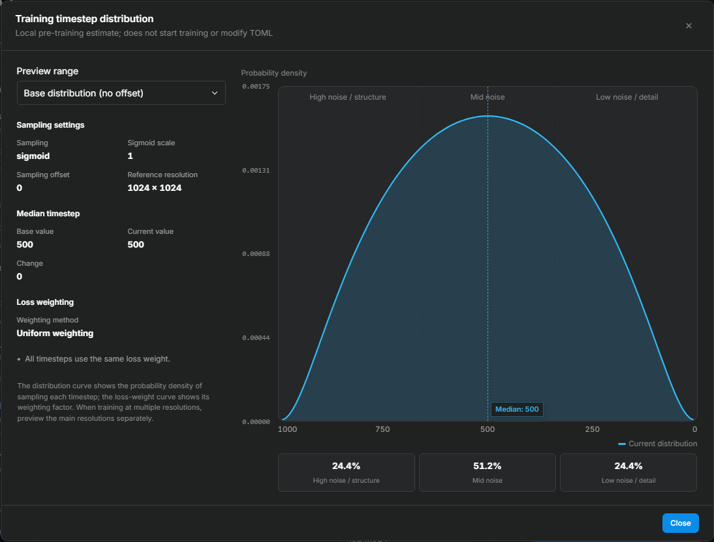

# Timesteps

During training, the model learns to process images at different noise levels. A timestep describes the noise level of a particular input. At high noise levels, little image information remains, so the model must establish more of the overall image. At low noise levels, more of the image is visible, and the task places greater emphasis on local refinement.

The following table provides a useful way to think about these ranges:

| Noise range | Typical emphasis | What to inspect in generated images |
| --- | --- | --- |
| High | Global structure, pose, composition, and silhouette | Body proportions, poses, and overall layout |
| Medium | Connecting the overall image with local features | Consistency of identity, shape, and major features |
| Low | Texture, linework, edges, and facial details | Hair strands, fabric texture, brushwork, and small accessories |

These emphases overlap. Both character and style training need coverage across several noise ranges.

Timestep sampling controls how often each noise level appears. Loss weighting controls how much a sampled prediction error contributes to the training loss. Both can change the emphasis of training, but at different stages.

<!-- doc-anchor: quick-start -->
## Baseline configuration

Use the selected profile's defaults for an initial run. Tune timesteps when a baseline still lacks structure or detail, after checking data quality, captions, learning rate, and stopping point.

<!-- doc-anchor: defaults -->
### Profile defaults

| Training profile | Default sampling | Default distribution parameters | Default loss weighting |
| --- | --- | --- | --- |
| Anima | `sigmoid` | `sigmoid_scale=1.0` | `uniform` |
| Krea 2 | `shift` | `sigmoid_scale=1.0`, `discrete_flow_shift=2.5` | `none` |

In the current implementations, `uniform` and `none` both mean that no extra per-timestep loss weighting is applied. Krea 2 uses `none` for compatibility with its backend and older configurations. After importing an old preset, rely on the values shown in the form and distribution preview.

Both defaults cover several noise ranges and suit initial character, style, and concept runs. Krea 2's fixed shift biases its distribution toward high noise. These controls are in the timestep/sampling section of the training form.

| Goal | Control | Default |
| --- | --- | --- |
| Sample both extremes more often | `sigmoid_scale` | `1.0`; higher values spread samples toward both ends |
| Favor higher or lower noise | `discrete_flow_shift` | Anima `1.0`, Krea 2 `2.5`; applies to `shift` and `sigma` only |
| Give image subsets different noise ranges | `subset_timestep_offsets` | Unset; supported by selected Anima modes only |
| Change the weight of sampled errors | `weighting_scheme` | Anima `uniform`, Krea 2 `none`; both use equal weights |

<!-- doc-anchor: terminology -->
## Types of steps

The trainer uses the word “step” for three unrelated things:

| Name | What it means | Typical parameter |
| --- | --- | --- |
| Training steps | How many times the LoRA parameters have been updated | `max_train_steps` |
| Training timestep | How much noise was added to the current image | `timestep_sampling` |
| Generation steps | How many denoising calculations are used to generate an image | `sample_steps` |

“Training step 500” means 500 optimizer updates. In Anima/Krea 2, noise timestep `t≈500` means the image and noise mixing coefficients are each about one half. Each image in an update gets its own sampled noise timestep.

<!-- doc-anchor: visualizer -->
## Distribution preview



This is a static illustration of an example configuration. Open **View timestep distribution** under the training timestep sampling field to inspect your own settings and switch between the base and overall training distributions. The sidebar shows sampling settings, base and current median timesteps, and loss weighting. Hover the curve to read values at a particular position.

| Preview element | How to read it |
| --- | --- |
| Sampling curve | Over intervals of equal width, more area under the curve means that noise range is sampled more often |
| High-, medium-, and low-noise shares | Help compare opportunities for global reconstruction and local refinement |
| Loss-weight curve | Shows the multiplier applied to a sample’s prediction error after it is sampled |
| Reference resolution | Determines resolution-dependent shifts; it does not represent every bucket in the dataset |

The curves show sampling frequency and loss weights, not update size or image quality. Discrete noise tables are visualized with a continuous approximation.

The horizontal axis follows the physical denoising order of image generation: left is maximum noise `t≈1000` (pure noise, structure & composition stage), while right is clean `t≈0` (low noise, fine detail stage).

The vertical axis shows probability density <var>f</var>(<var>t</var>); the weight curve uses a logarithmic scale. Uniform weighting applies the same multiplier at every timestep. The observed loss still changes with prediction error.

The preview is calculated directly from the sampling and shift formulas, so refreshing produces the same result. Rounding can make the percentages total `99.9%` or `100.1%`. Opening it does not start training or edit the configuration.

<span id="dataset-guidance"></span>
<span id="scenarios"></span>

<!-- doc-anchor: diagnosis -->
## Adjusting from training results

Check that the training images contain the missing features, then choose a direction from the table.

| Observation | Check first | Direction to test |
| --- | --- | --- |
| Weak silhouette or body proportions | Full-body coverage and relevant views | Moderately increase high-noise sampling and compare with the original distribution |
| Missing texture, linework, or accessories | Whether the source and training resolution preserve those details | Moderately increase low-noise sampling while also checking learning rate and training duration |
| Both global and local features are weak | General underfitting or an unsuitable training scope | Keep the distribution fixed while checking learning rate, duration, and scope |
| Repeated pose or background | Duplicate data and signs of overfitting | Check data and stopping point rather than immediately blaming a noise range |
| A style changes colors but not shapes | Variety of subjects and compositions | Once coverage is adequate, compare a distribution with more emphasis on global structure |

Change one timestep setting per run and compare several generated samples. See Controlled comparisons for the full procedure.

<!-- doc-anchor: sampling -->
## `timestep_sampling`: which timesteps appear most often

`timestep_sampling` determines the basic shape of the blue sampling-density curve: which noise levels are sampled most often.

| Option | Sampling behavior | Available for |
| --- | --- | --- |
| `sigmoid` | Emphasizes mid noise while retaining both endpoints | Anima, Krea 2 |
| `uniform` | Samples evenly across the full range | Anima, Krea 2 |
| `shift` | Builds a sigmoid distribution, then moves it toward one side | Anima, Krea 2 |
| `sigma` | Samples from the training scheduler's discrete noise table | Anima, Krea 2 |
| `flux_shift` | Computes a FLUX-style shift from the current resolution | Anima |
| `krea2_shift` | Computes a Krea 2 shift from the current resolution | Krea 2 |
| `logsnr` | Converts a LogSNR distribution into timesteps | Krea 2 |

### `sigmoid`

With `sigmoid_scale=1.0` and no shift, the distribution is symmetric and concentrated around mid noise. Across the preview's three equal-width regions, the low-, mid-, and high-noise shares are about 24.4%, 51.2%, and 24.4%.

Sigmoid sampling takes a standard normal random value and maps it into the `0–1` range:

<div class="doc-equation" role="group" aria-label="Sigmoid timestep sampling equation">
  <div class="doc-equation-kicker">Sigmoid sampling</div>
  <div class="doc-equation-expression"><var>z</var> ∼ N(0, 1)<br><var>t</var> = <span class="doc-math-fn">sigmoid</span>(<var>s</var> · <var>z</var><span class="doc-math-close">)</span></div>
  <p><var>s</var> is <code>sigmoid_scale</code>. Its default value is 1.0.</p>
</div>

### `uniform`

`uniform` samples evenly across the full timestep range. Compared with the default sigmoid distribution, it gives both the low- and high-noise endpoints substantially more training time.

Compare it with sigmoid when both ends need more training coverage.

### `shift`

`shift` applies `discrete_flow_shift` to a sigmoid distribution. Use it to move training emphasis toward lower or higher noise.

### `sigma`

`sigma` selects entries from the training scheduler's discrete noise table, and `discrete_flow_shift` changes that table.

`weighting_scheme=logit_normal` or `mode` changes how table indices are sampled. Other options sample indices uniformly. Since `discrete_flow_shift` changes the table's noise values, uniform indices do not imply uniform timesteps. `sigma_sqrt` and `cosmap` only change loss weights.

### `flux_shift` and `krea2_shift`

These modes compute a shift from the latent grid size. More grid positions bias sampling further toward high noise. Both ignore the fixed `discrete_flow_shift` value.

When buckets are enabled, images with similar resolutions and aspect ratios are grouped together. Each bucket uses its own latent dimensions, so a preview at one reference resolution cannot represent every bucket in the dataset.

### `logsnr`

`logit_mean` defaults to `0`: higher values favor low noise and lower values favor high noise. `logit_std` defaults to `1`: higher values spread samples out and lower values concentrate them. These names are shared with `sigma + logit_normal`, but the conversion formulas differ, so their values are not interchangeable.

SNR is the ratio of signal strength to noise strength, and LogSNR is its logarithmic form. Higher LogSNR means a stronger image signal and less noise.

Krea 2 `logsnr` draws a LogSNR value from the distribution defined by `logit_mean` and `logit_std`, then converts it into a timestep:

<div class="doc-equation" role="group" aria-label="LogSNR timestep conversion equation">
  <div class="doc-equation-kicker">Krea 2 logsnr sampling</div>
  <div class="doc-equation-expression">LogSNR ∼ N(<var>μ</var>, <var>σ</var><span class="doc-math-close">)</span><br><var>t</var> = <span class="doc-math-fn">sigmoid</span>(−LogSNR / 2)</div>
  <p><var>μ</var> is <code>logit_mean</code>; <var>σ</var> is <code>logit_std</code>.</p>
</div>

<!-- doc-anchor: sigmoid-scale -->
## `sigmoid_scale`: how far the distribution spreads

`sigmoid_scale` defaults to `1.0` and controls the spread. Raise it for more samples at both extremes; lower it to concentrate samples near the middle.

| Adjustment | Distribution change | What it means for training |
| --- | --- | --- |
| Decrease | More samples fall near medium noise | Fewer samples at the extremes and more emphasis on the middle of the denoising task |
| Increase | Both low- and high-noise samples become more common | More opportunities to train local refinement and global reconstruction |

This table describes sigmoid sampling without an additional shift. When a fixed, resolution-dependent, or subset shift is applied, use the preview to check the resulting noise proportions.

To favor just one end of the noise range, adjust the timestep shift.

<!-- doc-anchor: flow-shift -->
## `discrete_flow_shift`: moving the whole distribution

`discrete_flow_shift` moves sampling toward one end. It defaults to `1.0` for Anima and `2.5` for Krea 2. Higher values favor high noise; lower values favor low noise. Values must be greater than `0`. Applies only to `shift` and `sigma`.

| `discrete_flow_shift` | Direction | Training emphasis to compare |
| --- | --- | --- |
| Above 1 | More high-noise samples | Global structure, pose, and composition |
| 1 | No fixed shift | The base distribution |
| Between 0 and 1 | More low-noise samples | Texture, linework, and local details |

Let <var>s</var> be the shift value. The transform is:

<div class="doc-equation" role="group" aria-label="Discrete flow shift equation">
  <div class="doc-equation-kicker">Fixed flow shift</div>
  <div class="doc-equation-expression"><var>t</var><sub>shifted</sub> = <span class="doc-frac"><span><var>s</var> · <var>t</var></span><span>1 + (<var>s</var> − 1) · <var>t</var></span></span></div>
  <p><var>s</var> is <code>discrete_flow_shift</code>.</p>
</div>

The fixed shift is used only by the `shift` and `sigma` paths. `flux_shift` and `krea2_shift` compute their own resolution-dependent shifts instead of reading this value.

<!-- doc-anchor: subset-offsets -->
## Per-subset timestep offsets

`subset_timestep_offsets` moves the timestep distribution separately for each training subset, so one run can treat close-up face crops and full-body shots differently. It currently works for **Anima** training only; Krea 2 and SDXL do not support it.

A subset is a subfolder whose name starts with a number followed by an underscore (for example `10_face` and `3_full_body`); the leading number is the repeat count. In the UI and API, the setting is a mapping from subset name to offset, not one global value. A minimal setup takes three steps:

1. Create the subset folders (names starting with a number and an underscore) and organize images into them by content.
2. Enter each subset folder name and its offset value in the UI's subset-offset mapping.
3. Use the distribution preview to confirm the distribution changes as expected.

The mapping looks like this:

```json
{"10_face": -0.25, "3_full_body": 0.20}
```

When training starts, the backend writes a separate `dataset.toml`; the field itself is not part of the main training configuration:

```toml
[[datasets.subsets]]
image_dir = ".../10_face"
[datasets.subsets.custom_attributes]
timestep_sampling = { offset = -0.25 }
```

During training, the offset is carried with each image into the batch. Images from `10_face` use `-0.25`, while images from `3_full_body` use `0.20`; in a mixed batch, each image keeps its own subset's offset. Regularization data does not receive these offsets.

### Supported modes and recommended range

Subset offsets are supported by `sigmoid`, `shift`, and `flux_shift`. `uniform` and `sigma` do not read this value; if the value is passed through the API anyway, training still runs and the offset simply has no effect.

Start within `-0.5` to `+0.5`: test small negative offsets for close-ups and textures, and small positive offsets for full-body or structural images. Larger absolute values push samples further toward one end. Adding a positive offset to an existing high-noise shift further reduces low-noise coverage.

The preview shows the base distribution (all offsets zero), the overall distribution, or an individual subset. Adjust one subset at a time and keep the default run as a control. Offsets affect training sampling only; validation loss remains comparable when the other validation settings stay fixed.

### Where the offset is applied

The offset is added to the normal random sample first. The result is then scaled by `sigmoid_scale` and passed through `sigmoid`; with `shift` or `flux_shift`, an additional overall remapping follows:

```text
timestep = sigmoid( sigmoid_scale × (random sample + offset) )
```

Negative offsets favor low noise, positive offsets favor high noise, and `0` preserves the original distribution. `sigmoid_scale` scales both the random sample and the offset.

<!-- doc-anchor: weighting -->
## Sampling frequency and loss weight are separate controls

Sampling answers “How often is this noise level used?” Loss weighting answers “How much does its prediction error count once it is sampled?” Sampling low-noise inputs more often and assigning them larger loss weights can both increase attention to that part of the task, but they are different controls.

| Scheme | What changes | Meaning |
| --- | --- | --- |
| `uniform` / `none` | No additional loss weighting | Every timestep uses the same loss weight; sampling frequency still comes from the sampling method |
| `sigma_sqrt` | Larger weights at low noise | Emphasizes low-noise tasks, with rapidly increasing weights near zero noise that require attention to update stability |
| `cosmap` | Relatively larger weights at medium noise | Gives the endpoints less relative weight without changing sampling frequency |
| `logit_normal` | Sampling frequency in the `sigma` path | Does not add loss weights or enable logit-normal sampling in other paths |
| `mode` | Sampling frequency in the `sigma` path | Does not add loss weights; `mode_scale` controls the distribution |

Keep `uniform` / `none` for an initial run. Test `sigma_sqrt` to give low-noise errors more weight, or `cosmap` to emphasize mid-noise errors.

### Exact weights for `sigma_sqrt` and `cosmap`

<div class="doc-equation" role="group" aria-label="Sigma sqrt loss weighting equation">
  <div class="doc-equation-kicker">Low-noise weighting</div>
  <div class="doc-equation-expression"><var>w</var> = <span class="doc-frac"><span>1</span><span><var>σ</var><sup>2</sup></span></span></div>
  <p>The weight rises rapidly as <var>σ</var> approaches 0.</p>
</div>

<div class="doc-equation" role="group" aria-label="Cosmap loss weighting equation">
  <div class="doc-equation-kicker">Mid-noise weighting</div>
  <div class="doc-equation-expression"><var>w</var> = <span class="doc-frac"><span>2</span><span><var>π</var> · (1 − 2 · <var>σ</var> + 2 · <var>σ</var><sup>2</sup><span class="doc-math-close">)</span></span></span></div>
  <p>This reduces the relative influence of both endpoints and smoothly emphasizes the middle.</p>
</div>

<!-- doc-anchor: logit-normal -->
### `logit_normal`, `logit_mean`, and `logit_std`

`weighting_scheme=logit_normal` applies only with `timestep_sampling=sigma`. In this mode:

- `logit_mean` defaults to `0`, giving a symmetric distribution of table indices. Higher values favor low noise; lower values favor high noise.
- `logit_std` defaults to `1`. Lower values concentrate samples; higher values spread them toward the endpoints.

The scheduler's fixed shift determines the final distribution's position. With `sigmoid + logit_normal`, the latter changes neither sampling nor loss weights. Krea 2's `logsnr` reads these two values directly; see its sampling description.

<!-- doc-anchor: mode -->
### `mode` and `mode_scale`

`mode` changes sampling only when `timestep_sampling=sigma`. It does not add loss weighting.

- `mode_scale=0` samples noise-table indices uniformly.
- Increasing it from `0` to the default `1.29` concentrates indices around the table's middle.
- The fixed shift still changes the noise level represented by that middle. Keep `1.29` for an initial run.

<!-- doc-anchor: compatibility -->
## Parameter activation matrix

| Parameter | sigmoid | uniform | shift | sigma | flux/krea shift | logsnr |
| --- | --- | --- | --- | --- | --- | --- |
| `sigmoid_scale` | Used | Ignored | Used | Ignored | Used | Ignored |
| `discrete_flow_shift` | Ignored | Ignored | Used | Used | Ignored | Ignored |
| `logit_mean/std` | Ignored | Ignored | Ignored | `logit_normal` density only | Ignored | Used directly |
| `mode_scale` | Ignored | Ignored | Ignored | `mode` density only | Ignored | Ignored |
| `subset_timestep_offsets` | Used | Ignored | Used | Ignored | Only `flux_shift` | Ignored |
| `sigma_sqrt/cosmap` weight | Used | Used | Used | Used | Used | Used |

“Ignored” means the training code does not read that value. Leaving it in a configuration is harmless — it is simply not read. The form hides or annotates inactive fields, and the preview warns about ignored combinations.

<!-- doc-anchor: sdxl-range -->
## SDXL `min_timestep` and `max_timestep`

SDXL does not use the Anima/Krea 2 flow-matching sampling options described above. The trainer provides two separate range controls for SDXL:

- `min_timestep`: the lowest allowed noise timestep; blank uses `0`.
- `max_timestep`: the exclusive upper bound; blank uses `1000`, giving the default range `0–999`.
- Raising `min_timestep` removes the cleanest low-noise samples.
- Lowering `max_timestep` removes the noisiest samples.

These parameters crop the allowed range. They are not equivalents of `sigmoid_scale` or `discrete_flow_shift`. The default configuration keeps the full range; range limits are meant for experiments that deliberately exclude one end of the noise range.

`min_snr_gamma`, `v_parameterization`, and `zero_terminal_snr` are also related to SDXL noise training, but they control loss reweighting, the prediction target, and scheduler behavior rather than the flow-matching distribution covered here.

<!-- doc-anchor: common-mistakes -->
## Common misconceptions

- `sample_flow_shift` controls generation previews and does not change training timestep sampling.
- The seed changes the sampled sequence, not the theoretical distribution shown in the preview. Batch size and GPU count affect short-run sampling variation.
- Timestep settings do not change the LoRA file format or require a matching sampler at inference.

<!-- doc-anchor: testing -->
## Controlled comparisons

1. **Baseline:** one run uses the defaults for the selected profile.
2. **Fixed controls:** the dataset, random seed, rank, alpha, learning rate, and total training steps remain unchanged.
3. **Single change:** each run changes one parameter, such as `sigmoid_scale` from `1.0` to `1.25`.
4. **Matched comparison:** checkpoints use the same training step, prompts, generation seeds, resolution, and inference LoRA weight.
5. **Evaluation criteria:** fidelity, background leakage, composition rigidity, prompt adherence, and performance on subjects or compositions absent from the dataset.

Training loss is a supporting signal, not a sufficient evaluation on its own. Whether a timestep configuration is better should be decided by controlled samples and the requirements of your actual use case.

<!-- doc-anchor: flow-matching -->
## How timesteps work

Before training, the VAE encodes each image into a latent — the representation the model actually operates on. Let <var>x</var> be the image latent, <var>ε</var> random noise, and <var>t</var> a normalized timestep. The noisy input is:

<div class="doc-equation" role="group" aria-label="Flow-matching noisy input equation">
  <div class="doc-equation-kicker">Input after adding noise</div>
  <div class="doc-equation-expression"><var>x</var><sub>t</sub> = (1 − <var>t</var><span class="doc-math-close">)</span> · <var>x</var> + <var>t</var> · <var>ε</var></div>
  <p>Smaller <var>t</var> stays closer to the image. Larger <var>t</var> moves closer to pure noise.</p>
</div>

The current Anima and Krea 2 implementations train the model to predict the direction from data toward noise:

<div class="doc-equation doc-equation-compact" role="group" aria-label="Flow-matching training target">
  <div class="doc-equation-kicker">Prediction target</div>
  <div class="doc-equation-expression"><var>v</var> = <var>ε</var> − <var>x</var></div>
  <p>Generation follows the learned path in reverse, starting from high noise and moving toward a clean image.</p>
</div>

Training code also uses <var>σ</var> for the noise mixing ratio — this is the sigma in weight names such as `sigma_sqrt` and `cosmap`. In the flow-matching paths covered here <var>σ</var> moves in the same direction as <var>t</var>: values near `0` are clean, values near `1` are close to pure noise. The UI presents this range as approximately `0–1000` timesteps.

<!-- doc-anchor: evidence -->
## Evidence and references

The formulas and parameter relationships are implemented in the following local files. Pinned links below are retained as references:

- The sd-scripts fork's `library/flux_train_utils.py`: `sigmoid`, `shift`, and `flux_shift` sampling, the `sigma_sqrt` and `cosmap` weighting formulas, and the `discrete_flow_shift` transform.
- The Anima trainer's `anima_train_network.py`: reads per-sample subset offsets from batch `custom_attributes` and applies them only during training.
- The backend's `backend/training/sd_dataset_config.py` and `backend/server/routes/training.py`: validates subset offsets, writes the separate `dataset.toml`, and passes it to the trainer through `--dataset_config`.
- `library/anima_train_utils.py`: Anima's sampling and loss-weighting dispatch.
- The musubi-tuner fork's `src/musubi_tuner/training/trainer_base.py`: Krea 2's `krea2_shift` and `logsnr` sampling implementations.
- The musubi-tuner fork's `src/musubi_tuner/training/timesteps.py`: the shared density and loss-weighting formulas.
- `frontend/js/training-core.js`: analytical probability density and, where applicable, a separate loss-weight curve.

References:

- [This project's sd-scripts fork: `library/flux_train_utils.py` (pinned revision)](https://github.com/amenorira/lora-scripts-anima/blob/11d0f7a348721b8688240dada0e172980b20a3b7/vendor/sd-scripts/library/flux_train_utils.py)
- [This project's Anima trainer: `anima_train_network.py` (pinned revision)](https://github.com/amenorira/lora-scripts-anima/blob/11d0f7a348721b8688240dada0e172980b20a3b7/vendor/sd-scripts/anima_train_network.py)
- [This project's dataset configuration adapter: `backend/training/sd_dataset_config.py` (pinned revision)](https://github.com/amenorira/lora-scripts-anima/blob/11d0f7a348721b8688240dada0e172980b20a3b7/backend/training/sd_dataset_config.py)
- [This project's sd-scripts fork: `library/anima_train_utils.py` (pinned revision)](https://github.com/amenorira/lora-scripts-anima/blob/11d0f7a348721b8688240dada0e172980b20a3b7/vendor/sd-scripts/library/anima_train_utils.py)
- [This project's musubi-tuner fork: `src/musubi_tuner/training/timesteps.py` (pinned revision)](https://github.com/amenorira/lora-scripts-anima/blob/11d0f7a348721b8688240dada0e172980b20a3b7/vendor/musubi-tuner/src/musubi_tuner/training/timesteps.py)
- [This project's musubi-tuner fork: `src/musubi_tuner/training/trainer_base.py` (pinned revision)](https://github.com/amenorira/lora-scripts-anima/blob/11d0f7a348721b8688240dada0e172980b20a3b7/vendor/musubi-tuner/src/musubi_tuner/training/trainer_base.py)
- [This project's frontend: `frontend/js/training-core.js` (pinned revision)](https://github.com/amenorira/lora-scripts-anima/blob/11d0f7a348721b8688240dada0e172980b20a3b7/frontend/js/training-core.js)
- [Official Anima model card (pinned revision)](https://huggingface.co/circlestone-labs/Anima/blob/f7382c4bf9d7ffe4ceea593a0adbb470c56dd79b/README.md)
- [Official Anima example style LoRA: Greg Rutkowski Style - Anima (Civitai, published by Circlestone Labs, the Anima model authors)](https://civitai.com/models/2536147/greg-rutkowski-style-anima)
- [Scaling Rectified Flow Transformers for High-Resolution Image Synthesis](https://arxiv.org/abs/2403.03206)
- [Flow Matching for Generative Modeling](https://arxiv.org/abs/2210.02747)
