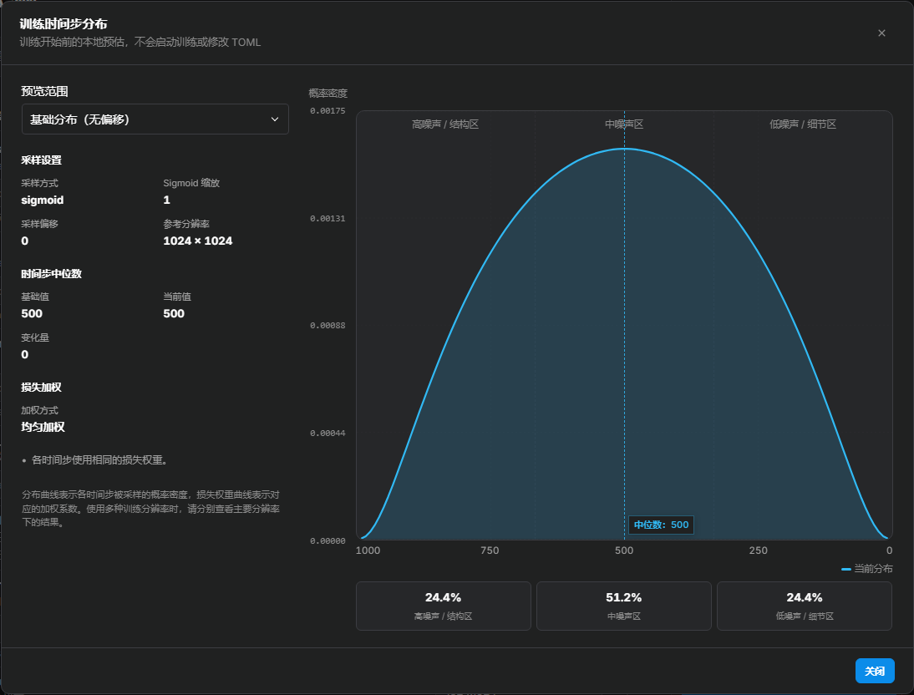

# 时间步

训练时，模型会在不同噪声强度下学习处理同一张图片。时间步表示这次输入有多少噪声：高噪声时，原图信息较少，模型需要更多地建立整体形象；低噪声时，原图信息保留较多，模型更侧重修正局部细节。

不同噪声范围可以这样理解：

| 噪声范围 | 更侧重的内容 | 观察生成结果时可关注 |
| --- | --- | --- |
| 高噪声 | 整体结构、姿势、构图和主体轮廓 | 全身比例、动作和画面布局 |
| 中等噪声 | 将整体形象与局部特征衔接起来 | 人物身份、形体和主要特征的一致性 |
| 低噪声 | 纹理、线条、边缘和五官等局部细节 | 发丝、服装纹理、笔触和小装饰 |

这些侧重点互有重叠，人物和画风训练都需要覆盖多个噪声范围。

时间步采样决定这些噪声强度出现的频率，损失加权决定抽到样本后，预测误差在训练损失中占多大权重。两者都能改变训练侧重点，但作用环节不同。

<!-- doc-anchor: quick-start -->
## 基础设置

初次训练使用当前训练类型的默认值。已有结果仍缺少结构或细节时，再调整时间步；数据质量、标注、学习率和停止时机应优先检查。

<!-- doc-anchor: defaults -->
### 当前训练类型的默认值

| 训练类型 | 默认采样方式 | 默认分布参数 | 默认 Loss 权重 |
| --- | --- | --- | --- |
| Anima | `sigmoid` | `sigmoid_scale=1.0` | `uniform` |
| Krea 2 | `shift` | `sigmoid_scale=1.0`、`discrete_flow_shift=2.5` | `none` |

在当前实现中，`uniform` 和 `none` 都表示不额外改变不同时间步的 Loss 权重。Krea 2 保留 `none` 是为了兼容训练后端和旧配置。导入旧预设后，以界面实际显示的参数和分布图为准。

两组默认值都覆盖多个噪声范围，适合作为人物、画风和概念训练的起点；Krea 2 的固定偏移使分布更偏向高噪声。参数位于训练表单的“时间步/采样”区域。

| 调整目标 | 优先查看的参数 | 默认选择 |
| --- | --- | --- |
| 同时增加高、低噪声采样 | `sigmoid_scale` | `1.0`；增大后分布向两端展开 |
| 整体偏向高噪声或低噪声 | `discrete_flow_shift` | Anima `1.0`，Krea 2 `2.5`；仅 `shift`、`sigma` 生效 |
| 为不同图片组分配不同噪声范围 | `subset_timestep_offsets` | 不设置；仅 Anima 的指定模式支持 |
| 调整抽样后的误差权重 | `weighting_scheme` | Anima `uniform`，Krea 2 `none`，均为等权重 |

<!-- doc-anchor: terminology -->
## 三种“步”的区别

训练界面里有三种名字相近、含义完全不同的“步”：

| 名称 | 实际含义 | 常见参数 |
| --- | --- | --- |
| 训练步数 | LoRA 参数被更新了多少次 | `max_train_steps` |
| 训练时间步 | 当前图片被加入了多少噪声 | `timestep_sampling` |
| 生成采样步数 | 生成图片时执行多少次去噪计算 | `sample_steps` |

例如，“训练到第 500 步”表示 LoRA 已更新 500 次；Anima/Krea 2 的噪声时间步 `t≈500` 表示原图与噪声的混合系数各约为一半。同一次更新中的图片会分别抽取噪声时间步。

<!-- doc-anchor: visualizer -->
## 分布预览说明



上图为示例配置的静态插图。在训练表单的“训练时间步采样方式”下点击“查看时间步分布”，可按自己的参数查看实时预览，并切换基础分布与整体训练分布。侧栏列出采样设置、中位时间步的基准值与当前值，以及 Loss 加权方式；鼠标悬浮可读取曲线上对应位置的数值。

| 图中内容 | 怎样阅读 |
| --- | --- |
| 采样曲线 | 在相同宽度的区间内，曲线下的面积越大，该噪声范围越常被抽到 |
| 高、中、低噪声占比 | 便于比较整体结构相关任务与局部细化任务的训练机会如何变化 |
| 损失权重曲线 | 样本被抽到后，它的预测误差还会乘上多大权重 |
| 当前参考分辨率 | 用来计算分辨率相关偏移；不能代表所有分桶的实际分布 |

曲线表示采样频率与损失权重，不表示参数更新量或画质。离散噪声表以连续曲线近似展示。

横轴按照生图的去噪物理过程排列：左侧为最大噪声时间步 `t≈1000`（纯噪声、构图与大结构阶段），右侧为 `t≈0`（低噪声、画面细节微调阶段）。

纵轴展示概率密度 <var>f</var>(<var>t</var>)，权重折线使用对数刻度。均匀加权表示每个时间步的误差乘以相同权重，实际损失仍随预测误差变化。

预览按采样算法与偏移公式直接计算，刷新结果相同。百分比因四舍五入合计可为 `99.9%` 或 `100.1%`。打开预览不会启动训练或修改配置。

<span id="dataset-guidance"></span>
<span id="scenarios"></span>

<!-- doc-anchor: diagnosis -->
## 根据训练结果调整

先确认训练图中包含缺失的特征，再按下表选择调整方向。

| 观察到的情况 | 先确认 | 可测试的方向 |
| --- | --- | --- |
| 轮廓和全身比例不足 | 是否有足够的全身图与必要视角 | 适度增加高噪声采样，与原分布比较 |
| 纹理、线条或小装饰不足 | 原图与训练分辨率是否保留这些细节 | 适度增加低噪声采样，同时检查学习率和训练长度 |
| 局部与整体都未学充分 | 是否整体欠拟合，或训练范围设置不合适 | 先保留时间步分布，检查学习率、训练长度与训练范围 |
| 固定姿势或背景反复出现 | 数据是否重复，是否已经过拟合 | 先检查数据与停止时机，不直接把问题归因于某个噪声范围 |
| 画风只有配色，缺少形体特点 | 数据是否覆盖不同主体与构图 | 在保证数据覆盖后，对比更重视整体结构的分布 |

每组实验只改变一个时间步设置，并比较多组生成结果；完整流程见“对照实验方法”。

<!-- doc-anchor: sampling -->
## `timestep_sampling`：决定哪些时间步更常出现

`timestep_sampling` 决定蓝色采样密度曲线的基本形状，也就是训练更常抽到哪些噪声强度。

| 选项 | 它会怎样抽取时间步 | 可用训练类型 |
| --- | --- | --- |
| `sigmoid` | 以中噪声为主，同时保留两端 | Anima、Krea 2 |
| `uniform` | 在完整范围内均匀抽取 | Anima、Krea 2 |
| `shift` | 在 sigmoid 分布基础上整体向一侧平移 | Anima、Krea 2 |
| `sigma` | 按训练 scheduler 的离散噪声表抽取 | Anima、Krea 2 |
| `flux_shift` | 根据当前分辨率计算 FLUX 风格的 shift | Anima |
| `krea2_shift` | 根据当前分辨率计算 Krea 2 的 shift | Krea 2 |
| `logsnr` | 从 LogSNR 分布转换出时间步 | Krea 2 |

### `sigmoid`

默认 `sigmoid_scale=1.0` 且无偏移时，分布左右对称，集中在中噪声。按预览的三等分区间计算，低、中、高噪声占比约为 24.4%、51.2%、24.4%。

`sigmoid` 先抽取一个标准正态随机数，再把它映射到 `0～1`：

<div class="doc-equation" role="group" aria-label="Sigmoid 时间步采样公式">
  <div class="doc-equation-kicker">sigmoid 采样</div>
  <div class="doc-equation-expression"><var>z</var> ∼ N(0, 1)<br><var>t</var> = <span class="doc-math-fn">sigmoid</span>(<var>s</var> · <var>z</var><span class="doc-math-close">)</span></div>
  <p><var>s</var> 对应 <code>sigmoid_scale</code>。默认值为 1.0。</p>
</div>

### `uniform`

`uniform` 在完整时间范围内均匀抽取。和默认 sigmoid 相比，它会明显增加低噪声与高噪声两端的训练次数。

需要同时增加两端训练机会时，可与默认 sigmoid 比较。

### `shift`

`shift` 在 sigmoid 分布上应用 `discrete_flow_shift`，适合将训练重点移向低噪声或高噪声。

### `sigma`

`sigma` 从训练 scheduler（预先定义的离散噪声表）中选择时间步，`discrete_flow_shift` 会改变这张噪声表。

`weighting_scheme=logit_normal` 或 `mode` 会改变噪声表索引的抽样分布；其余选项均匀抽取索引。表中的噪声值还受 `discrete_flow_shift` 影响，因此索引均匀不等于最终时间步均匀。`sigma_sqrt` 和 `cosmap` 只改变损失权重。

### `flux_shift` 与 `krea2_shift`

这两种方式根据当前 latent 网格大小计算 shift：网格中的位置越多，分布越偏向高噪声。它们不读取固定的 `discrete_flow_shift`。

开启 bucket 后，相近分辨率和宽高比的图片会分组训练。每个 bucket 都按自己的 latent 尺寸计算分布，因此文档图表中的参考分辨率不能代表数据集里的所有 bucket。

### `logsnr`

`logit_mean` 默认 `0`，增大后偏向低噪声，减小后偏向高噪声。`logit_std` 默认 `1`，增大后分布更分散，减小后更集中。这两个参数也用于 `sigma + logit_normal`，但转换公式不同，数值不能直接互换。

SNR 表示信号与噪声的强度比，LogSNR 是它的对数形式。LogSNR 越高，代表原图信号越强、噪声越少。

Krea 2 的 `logsnr` 先根据 `logit_mean` 和 `logit_std` 生成 LogSNR，再转换成时间步：

<div class="doc-equation" role="group" aria-label="LogSNR 时间步转换公式">
  <div class="doc-equation-kicker">Krea 2 logsnr 采样</div>
  <div class="doc-equation-expression">LogSNR ∼ N(<var>μ</var>, <var>σ</var><span class="doc-math-close">)</span><br><var>t</var> = <span class="doc-math-fn">sigmoid</span>(−LogSNR / 2)</div>
  <p><var>μ</var> 对应 <code>logit_mean</code>，<var>σ</var> 对应 <code>logit_std</code>。</p>
</div>

<!-- doc-anchor: sigmoid-scale -->
## `sigmoid_scale`：控制分布向两端展开多少

`sigmoid_scale` 默认 `1.0`，控制分布的分散程度。需要同时增加两端采样时提高，需要集中在中间噪声时降低。

| 调整 | 分布怎样变化 | 对训练侧重点的含义 |
| --- | --- | --- |
| 调小 | 更多采样集中在中等噪声附近 | 减少两端训练，更集中地学习中间噪声下的预测任务 |
| 调大 | 低噪声和高噪声的采样比例同时增加 | 同时增加局部细节与整体结构相关任务的训练机会 |

上表描述没有额外偏移的 sigmoid 分布。叠加固定偏移、分辨率相关偏移或子集偏移后，应查看分布预览，确认高、中、低噪声的实际占比。

需要只偏向高噪声或低噪声时，调整时间步偏移。

<!-- doc-anchor: flow-shift -->
## `discrete_flow_shift`：把整组分布向一侧平移

`discrete_flow_shift` 将采样重点移向一侧。Anima 默认 `1.0`，Krea 2 默认 `2.5`。增大偏向高噪声，减小偏向低噪声；值必须大于 `0`。仅在 `shift` 和 `sigma` 中生效。

| `discrete_flow_shift` | 变化方向 | 可用于比较的侧重点 |
| --- | --- | --- |
| 大于 1 | 更常抽到高噪声 | 整体结构、姿势与构图 |
| 等于 1 | 不施加固定偏移 | 保留基础分布 |
| 大于 0、小于 1 | 更常抽到低噪声 | 纹理、线条与局部细节 |

设 shift 为 <var>s</var>，它对时间步的变换为：

<div class="doc-equation" role="group" aria-label="Discrete flow shift 公式">
  <div class="doc-equation-kicker">固定 flow shift</div>
  <div class="doc-equation-expression"><var>t</var><sub>shifted</sub> = <span class="doc-frac"><span><var>s</var> · <var>t</var></span><span>1 + (<var>s</var> − 1) · <var>t</var></span></span></div>
  <p><var>s</var> 对应 <code>discrete_flow_shift</code>。</p>
</div>

固定偏移只在 `shift` 和 `sigma` 路径中使用。`flux_shift` 和 `krea2_shift` 根据分辨率计算自己的偏移，不读取这个固定值。

<!-- doc-anchor: subset-offsets -->
## 按子集设置时间步偏移

`subset_timestep_offsets` 可以按训练数据子集分别平移时间步分布，适合在同一组训练中区分脸部特写、全身图等不同内容。它目前只在 **Anima** 训练中生效，Krea 2 和 SDXL 不适用。

训练目录中每个以“数字_”开头的子文件夹（例如 `10_face`、`3_full_body`）会被识别为一个子集，开头的数字是重复次数。界面和 API 中，这个设置是“子集名称 → 偏移值”的映射，而不是一个全局值。最小操作流程：

1. 在训练目录下建立以“数字_”开头的子集目录，并按内容把图片放入对应目录。
2. 在界面的“子集偏移”映射里填入子集目录名和偏移值。
3. 打开分布预览，确认分布变化符合预期。

映射的写法如下：

```json
{"10_face": -0.25, "3_full_body": 0.20}
```

启动训练时，后端会为它单独生成一份 `dataset.toml`；这个界面字段本身不写进主训练配置：

```toml
[[datasets.subsets]]
image_dir = ".../10_face"
[datasets.subsets.custom_attributes]
timestep_sampling = { offset = -0.25 }
```

训练时，偏移值会跟着每张图片进入 batch。来自 `10_face` 的图片使用 `-0.25`，来自 `3_full_body` 的图片使用 `0.20`；同一个 batch 混合多个子集时也不会互相覆盖。正则化数据不会应用这个设置。

### 支持的模式与推荐范围

子集偏移只在 `sigmoid`、`shift` 和 `flux_shift` 中生效。`uniform` 和 `sigma` 不读取这个偏移；即使通过 API 传入该值，训练也会正常运行，只是它不会生效。

先在 `-0.5～+0.5` 范围内测试：脸部特写、纹理图试小幅负值，全身图、结构图试小幅正值。绝对值越大，分布越偏向一端；已有高噪声 shift 时，再加正偏移会进一步减少低噪声样本。

分布预览支持基础分布（所有偏移为 0）、整体训练分布和单个子集分布。一次调整一个子集，并保留默认配置作为对照。偏移只作用于训练采样；其他验证设置不变时，验证损失可直接比较。

### 偏移加在哪里

偏移先加在正态随机采样值上，再乘以 `sigmoid_scale` 并经过 `sigmoid` 变换；使用 `shift` 或 `flux_shift` 时，之后还会做一次整体映射：

```text
时间步 = sigmoid( sigmoid_scale × (随机采样值 + 偏移) )
```

负偏移增加低噪声采样，正偏移增加高噪声采样，`0` 保持原分布。`sigmoid_scale` 同时缩放随机采样值和偏移量。

<!-- doc-anchor: weighting -->
## 采样频率与 Loss 权重

采样回答“这个噪声强度多久出现一次”，损失加权回答“出现以后，这次误差占多大权重”。例如，让低噪声样本更常出现和增大低噪声样本的误差权重，都能增加对这类任务的关注，但不是同一种设置。

| 方案 | 改变什么 | 含义 |
| --- | --- | --- |
| `uniform` / `none` | 不增加额外损失权重 | 各时间步按相同权重计算误差；采样频率仍由采样方式决定 |
| `sigma_sqrt` | 增大低噪声的损失权重 | 更重视低噪声任务，但接近零噪声时权重会快速增大，需要留意更新稳定性 |
| `cosmap` | 相对提高中等噪声的损失权重 | 相对降低两端的权重，不改变被抽到的频率 |
| `logit_normal` | 改变 `sigma` 路径的采样频率 | 不额外改变损失权重；其他采样路径不会因此启用 logit-normal 抽样 |
| `mode` | 改变 `sigma` 路径的采样频率 | 不额外改变损失权重；分布由 `mode_scale` 控制 |

初次训练保留 `uniform` / `none`。需要增加低噪声误差的影响时测试 `sigma_sqrt`，需要侧重中噪声时测试 `cosmap`。

### `sigma_sqrt` 与 `cosmap` 的精确权重

<div class="doc-equation" role="group" aria-label="Sigma sqrt Loss 权重公式">
  <div class="doc-equation-kicker">低噪声权重</div>
  <div class="doc-equation-expression"><var>w</var> = <span class="doc-frac"><span>1</span><span><var>σ</var><sup>2</sup></span></span></div>
  <p><var>σ</var> 越接近 0，权重增长越快。</p>
</div>

<div class="doc-equation" role="group" aria-label="Cosmap Loss 权重公式">
  <div class="doc-equation-kicker">中噪声权重</div>
  <div class="doc-equation-expression"><var>w</var> = <span class="doc-frac"><span>2</span><span><var>π</var> · (1 − 2 · <var>σ</var> + 2 · <var>σ</var><sup>2</sup><span class="doc-math-close">)</span></span></span></div>
  <p>它会相对削弱两个端点，温和地侧重中噪声。</p>
</div>

<!-- doc-anchor: logit-normal -->
### `logit_normal`、`logit_mean` 与 `logit_std`

`weighting_scheme=logit_normal` 仅在 `timestep_sampling=sigma` 时生效。此时：

- `logit_mean` 默认 `0`：噪声表索引的分布对称。增大偏向低噪声，减小偏向高噪声。
- `logit_std` 默认 `1`：越小越集中，越大越向两端展开。

scheduler 的固定偏移决定最终分布的位置。选择 `sigmoid + logit_normal` 时，后者不改变采样或损失权重。Krea 2 的 `logsnr` 直接读取这两个数值，见其采样说明。

<!-- doc-anchor: mode -->
### `mode` 与 `mode_scale`

`mode` 只会在 `timestep_sampling=sigma` 时改变抽样分布，不会增加 Loss 权重。

- `mode_scale=0`：均匀抽取噪声表索引。
- 从 `0` 增至默认 `1.29`：索引向表的中段集中。
- 固定偏移仍会改变该中段对应的噪声强度。初次使用保留 `1.29`。

<!-- doc-anchor: compatibility -->
## 参数生效关系

| 参数 | sigmoid | uniform | shift | sigma | flux/krea shift | logsnr |
| --- | --- | --- | --- | --- | --- | --- |
| `sigmoid_scale` | 生效 | 忽略 | 生效 | 忽略 | 生效 | 忽略 |
| `discrete_flow_shift` | 忽略 | 忽略 | 生效 | 生效 | 忽略 | 忽略 |
| `logit_mean/std` | 忽略 | 忽略 | 忽略 | 仅影响 `logit_normal` 分布 | 忽略 | 直接生效 |
| `mode_scale` | 忽略 | 忽略 | 忽略 | 仅影响 `mode` 分布 | 忽略 | 忽略 |
| `subset_timestep_offsets` | 生效 | 忽略 | 生效 | 忽略 | 仅 `flux_shift` 生效 | 忽略 |
| `sigma_sqrt/cosmap` 权重 | 生效 | 生效 | 生效 | 生效 | 生效 | 生效 |

“忽略”表示训练代码不会读取这个参数，配置文件里即使保留了数值也不会暗中生效。界面会隐藏或标注当前组合中无效的字段，分布预览也会提示被忽略的设置。

<!-- doc-anchor: sdxl-range -->
## SDXL 的 `min_timestep` 与 `max_timestep`

SDXL 不使用前面介绍的 Anima/Krea 2 流匹配采样选项，本训练器为 SDXL 提供两个独立的范围参数：

- `min_timestep`：允许抽取的最低噪声时间步，留空时使用 `0`。
- `max_timestep`：抽样范围的上限（不包含该值），留空时使用 `1000`，即默认抽取 `0～999`。
- 提高 `min_timestep`：排除最干净的低噪声样本。
- 降低 `max_timestep`：排除噪声最高的样本。

它们只是裁剪允许抽取的范围，不等同于 `sigmoid_scale` 或 `discrete_flow_shift`。默认配置使用完整范围，只有需要排除特定噪声端点的实验才需要调整。

`min_snr_gamma`、`v_parameterization` 和 `zero_terminal_snr` 也与 SDXL 的噪声训练有关，但分别控制 Loss 重加权、预测目标和 scheduler 行为，不属于本文介绍的流匹配分布参数。

<!-- doc-anchor: common-mistakes -->
## 常见误区

- `sample_flow_shift` 控制生成预览，不改变训练时间步分布。
- seed 改变实际抽样顺序，不改变预览中的理论分布；batch size 和 GPU 数量会影响短训练的抽样波动。
- 时间步设置不改变 LoRA 文件格式，推理时无需使用同名采样方式。

<!-- doc-anchor: testing -->
## 对照实验方法

1. **基准组：** 采用当前训练类型的默认值。
2. **固定条件：** 数据集、随机种子、rank、alpha、学习率和总训练步数保持一致。
3. **单一变量：** 每组实验仅改变一个参数，例如将 `sigmoid_scale` 从 `1.0` 改为 `1.25`。
4. **同条件对比：** 取相同训练步数处的检查点，并使用相同的提示词、生成种子、分辨率和推理 LoRA 权重。
5. **评估维度：** 身份或画风还原、背景泄漏、构图僵化、提示词服从度，以及在未见场景中的表现。

训练 Loss 只能作为辅助信息。某组时间步设置是否更好，最终应由固定条件下的多组生成图和实际使用目标决定。

<!-- doc-anchor: flow-matching -->
## 时间步的工作原理

图片进入模型之前，会先由 VAE 压缩成 latent，也就是模型实际处理的图像特征。设原图 latent 为 <var>x</var>，随机噪声为 <var>ε</var>，归一化时间步为 <var>t</var>，加入噪声后的输入可以写成：

<div class="doc-equation" role="group" aria-label="Flow matching 加噪公式">
  <div class="doc-equation-kicker">加入噪声后的训练输入</div>
  <div class="doc-equation-expression"><var>x</var><sub>t</sub> = (1 − <var>t</var><span class="doc-math-close">)</span> · <var>x</var> + <var>t</var> · <var>ε</var></div>
  <p><var>t</var> 越小，输入越接近原图；<var>t</var> 越大，输入越接近纯噪声。</p>
</div>

当前 Anima 和 Krea 2 的训练目标都是预测从原图指向噪声的流动方向：

<div class="doc-equation doc-equation-compact" role="group" aria-label="Flow matching 训练目标">
  <div class="doc-equation-kicker">模型需要预测的方向</div>
  <div class="doc-equation-expression"><var>v</var> = <var>ε</var> − <var>x</var></div>
  <p>生成图片时过程反过来：模型从高噪声出发，逐步走向清晰图像。</p>
</div>

训练代码里还常用 <var>σ</var> 表示噪声混合比例，`sigma_sqrt`、`cosmap` 这些权重名称里的 sigma 指的就是它。在本文讨论的流匹配路径中，它的方向与 <var>t</var> 一致：越接近 `0` 越干净，越接近 `1` 越接近纯噪声。界面会把这个范围显示为大约 `0～1000` 的时间步。

<!-- doc-anchor: evidence -->
## 依据与参考资料

公式和参数关系对应以下本地实现；下方固定提交链接保留为参考：

- sd-scripts fork 的 `library/flux_train_utils.py`：`sigmoid`、`shift`、`flux_shift` 采样，`sigma_sqrt` 与 `cosmap` 权重公式，`discrete_flow_shift` 变换。
- Anima 训练器的 `anima_train_network.py`：从 batch 的 `custom_attributes` 读取逐样本子集偏移，并且只在训练阶段应用。
- 后端的 `backend/training/sd_dataset_config.py` 与 `backend/server/routes/training.py`：校验子集偏移、生成独立 `dataset.toml`，并通过 `--dataset_config` 传给训练器。
- `library/anima_train_utils.py`：Anima 的采样与损失权重分发。
- musubi-tuner fork 的 `src/musubi_tuner/training/trainer_base.py`：Krea 2 的 `krea2_shift`、`logsnr` 等采样实现。
- `src/musubi_tuner/training/timesteps.py`：共享密度与损失权重公式。
- 前端分布预览见 `frontend/js/training-core.js`：计算解析概率密度，并在适用时单独绘制损失权重曲线。

参考资料：

- [本项目 sd-scripts fork：`library/flux_train_utils.py`（固定提交）](https://github.com/amenorira/lora-scripts-anima/blob/11d0f7a348721b8688240dada0e172980b20a3b7/vendor/sd-scripts/library/flux_train_utils.py)
- [本项目 Anima 训练器：`anima_train_network.py`（固定提交）](https://github.com/amenorira/lora-scripts-anima/blob/11d0f7a348721b8688240dada0e172980b20a3b7/vendor/sd-scripts/anima_train_network.py)
- [本项目数据集配置适配器：`backend/training/sd_dataset_config.py`（固定提交）](https://github.com/amenorira/lora-scripts-anima/blob/11d0f7a348721b8688240dada0e172980b20a3b7/backend/training/sd_dataset_config.py)
- [本项目 sd-scripts fork：`library/anima_train_utils.py`（固定提交）](https://github.com/amenorira/lora-scripts-anima/blob/11d0f7a348721b8688240dada0e172980b20a3b7/vendor/sd-scripts/library/anima_train_utils.py)
- [本项目 musubi-tuner fork：`src/musubi_tuner/training/timesteps.py`（固定提交）](https://github.com/amenorira/lora-scripts-anima/blob/11d0f7a348721b8688240dada0e172980b20a3b7/vendor/musubi-tuner/src/musubi_tuner/training/timesteps.py)
- [本项目 musubi-tuner fork：`src/musubi_tuner/training/trainer_base.py`（固定提交）](https://github.com/amenorira/lora-scripts-anima/blob/11d0f7a348721b8688240dada0e172980b20a3b7/vendor/musubi-tuner/src/musubi_tuner/training/trainer_base.py)
- [本项目前端：`frontend/js/training-core.js`（固定提交）](https://github.com/amenorira/lora-scripts-anima/blob/11d0f7a348721b8688240dada0e172980b20a3b7/frontend/js/training-core.js)
- [Anima 官方模型卡（固定提交）](https://huggingface.co/circlestone-labs/Anima/blob/f7382c4bf9d7ffe4ceea593a0adbb470c56dd79b/README.md)
- [Anima 官方示例画风 LoRA：Greg Rutkowski Style - Anima（Civitai，发布者为 Anima 模型作者 Circlestone Labs）](https://civitai.com/models/2536147/greg-rutkowski-style-anima)
- [Scaling Rectified Flow Transformers for High-Resolution Image Synthesis](https://arxiv.org/abs/2403.03206)
- [Flow Matching for Generative Modeling](https://arxiv.org/abs/2210.02747)
